# 1. Product introduction

## 1.1 Kit Introduction

Arduino advanced study kit walks you through the basics of using the Arduino in a hands-on way. You'll learn through building several creative projects. The kit includes a selection of the most common and useful electronic components with a book of 28 projects. Starting the basics of electronics, to more complex projects, the kit will help you control the physical world with sensor and actuators.

## 1.2 Components List

| No.  | Product Name                           | Quantity | Picture                         |
| ---- | -------------------------------------- | -------- | ------------------------------- |
| 1    | LED - Blue                             | 5        |             |
| 2    | LED - Red                              | 5        |             |
| 3    | LED - Yellow                           | 5        | 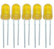            |
| 4    | LED - RGB                              | 1        |             |
| 5    | 220 Ω resistor                         | 8        | 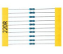            |
| 6    | 10K Ω resistor                         | 5        |             |
| 7    | 1K Ω resistor                          | 5        |             |
| 8    | 10K Ω Pot                              | 1        |             |
| 9    | Buzzer (active)                        | 1        |             |
| 10   | Buzzer (passive)                       | 1        | 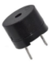           |
| 11   | Large button switch                    | 4        | 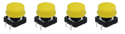 |
| 12   | Ball tilt sensor                       | 2        |            |
| 13   | Photo Resistor                         | 3        |           |
| 14   | Flame sensor                           | 1        |            |
| 15   | LM35 Temp Sensor                       | 1        | 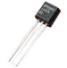           |
| 16   | IC 74HC595N 16-pin DIP                 | 1        |            |
| 17   | IC 74HC595N 16-pin DIP                 | 1        |            |
| 18   | 7-seg LED 4x module                    | 1        |            |
| 19   | 8*8 LED Matrix                         | 1        |            |
| 20   | 2x16 LCD display                       | 1        | 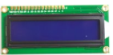           |
| 21   | IR receiver                            | 1        | 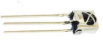           |
| 22   | IR remote control                      | 1        | 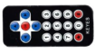           |
| 23   | Servo Motor                            | 1        | 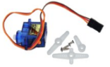           |
| 24   | Stepper driver module                  | 1        |            |
| 25   | Stepper Motor                          | 1        | 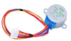           |
| 26   | Joystick module                        | 1        | 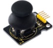           |
| 27   | Relay module                           | 1        |            |
| 28   | PIR Motion Sensor                      | 1        | 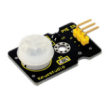           |
| 29   | Analog Gas Sensor                      | 1        | 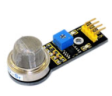           |
| 30   | ADXL345 Three Axis Acceleration Module | 1        | 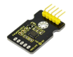           |
| 31   | HC-SR04 Ultrasonic Sensor              | 1        | 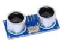           |
| 32   | Pin headers                            | 40       | 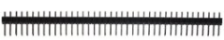           |
| 33   | 830 hole Breadboard                    | 1        |            |
| 34   | Dupont connector wires                 | 10       | 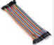           |
| 35   | Jumper Wire                            | 30       | 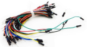           |
| 36   | 6-cell AA Battery pack                 | 1        | 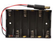           |
| 37   | USB cable                              | 1        |            |
| 38   | Resistance color ring meter            | 1        | 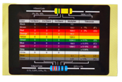           |

## 1.3 Introduction of keyestudio REV4 Board

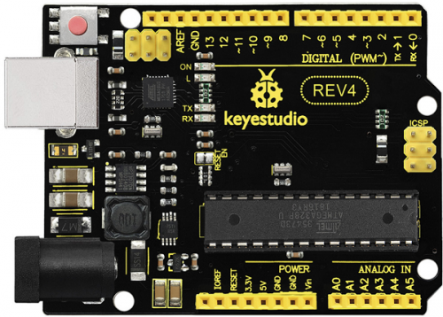

**Overview**

Keyestudio REV4 is a microcontroller board based on the ATmega328. It has 14 digital input/output pins (of which 6 can be used as PWM outputs), 6 analog inputs, a 16 MHz ceramic resonator, a USB connection, a power jack, an ICSP header, and a reset button. It contains everything needed to support the microcontroller; simply connect it to a computer with a USB cable or power it with a AC-to-DC adapter or battery to get started.

The REV4 differs from all preceding boards in that it does not use the FTDI USB-to-serial driver chip. Instead, it features the Atmega16U2 programmed as a USB-to-serial converter.

**Parameters**

-  Microcontroller core: AVRmega328P-PU ( Processing speed 20MIPS)
-  Working voltage: +5V
-  External input voltage：+7V~+12V（suggest）
-  External input voltage ( extremum ): +6V≤ Vin ≤ ＋20V
-  Digital signal I/O interface: 14 ( 6 PWM input interface)
-  Analog signal input interface: 6
-  DC I/O interface current: 40mA
-  Flash capacity: 32KB( other 2k used in hootloader)
-  SRAM static storage capacity
-  EEPROM storage capacity: 512bytes
-  Clock frequency：16MHZ

**User**

1.Download the Arduino Environment

Get the latest version from the [download page](https://www.arduino.cc/en/Main/Software).

When the download finishes, unzip the downloaded file. Make sure to preserve the folder structure. Double-click the folder to open it. There should be a few files and sub-folders inside.

2.Connect the Board

The Arduino Uno, Mega, Duemilanove and Arduino Nano automatically draw power from either the USB connection to the computer or an external power supply. If you're using an Arduino Diecimila, you'll need to make sure that the board is configured to draw power from the USB connection. The power source is selected with a jumper, a small piece of plastic that fits onto two of the three pins between the USB and power jacks. Check that it's on the two pins closest to the USB port.

Connect the Arduino board to your computer using the USB cable. The green power LED (labelled PWR) should go on.

3.Install the drivers

Installing drivers for the [Arduino Uno](https://www.arduino.cc/en/Main/ArduinoBoardUno) or [Arduino Mega 2560](https://www.arduino.cc/en/Main/ArduinoBoardMega2560) with Windows 7, Vista, or XP:

Plug in your board and wait for Windows to begin it's driver installation process. After a few moments, the process will fail, despite its best efforts Click on the Start Menu, and open up the Control Panel.

While in the Control Panel, navigate to System and Security. Next, click on System. Once the System window is up, open the Device Manager.

Look under Ports (COM & LPT). You should see an open port named "Arduino UNO (COMxx)". If there is no COM & LPT section, look under "Other Devices" for "Unknown Device".

Right click on the "Arduino UNO (COmxx)" port and choose the "Update Driver Software" option.

Next, choose the "Browse my computer for Driver software" option.

Finally, navigate to and select the driver file named "arduino.inf", located in the "Drivers" folder of the Arduino Software download (not the "FTDI USB Drivers" sub-directory). If you are using an old version of the IDE (1.0.3 or older), choose the Uno driver file named "Arduino UNO.inf"

Windows will finish up the driver installation from there.

See also: [step-by-step screenshots for installing the Uno under Windows XP](https://www.arduino.cc/en/Guide/UnoDriversWindowsXP). Installing drivers for the [Arduino Duemilanove](https://www.arduino.cc/en/Main/ArduinoBoardDuemilanove), [Nano](https://www.arduino.cc/en/Main/ArduinoBoardNano), or [Diecimila](https://www.arduino.cc/en/Main/ArduinoBoardDiecimila) with Windows7, Vista, or XP: When you connect the board, Windows should initiate the driver installation process (if you haven't used the computer with an Arduino board before). On Windows Vista, the driver should be automatically downloaded and installed. (Really, it works!) On Windows XP, the Add New Hardware wizard will open: When asked Can Windows connect to Windows Update to search for software? select No, not this time. Click next. Select Install from a list or specified location (Advanced) and click next. Make sure that Search for the best driver in these locations is checked; uncheck Search removable media; check Include this location in the search and browse to the drivers/FTDI USB Drivers directory of the Arduino distribution. (The latest version of the drivers can be found on the [FTDI website](http://www.ftdichip.com/Drivers/VCP.htm).) Click next. The wizard will search for the driver and then tell you that a "USB Serial Converter" was found. Click finish. The new hardware wizard will appear again. Go through the same steps and select the same options and location to search. This time, a "USB Serial Port" will be found. You can check that the drivers have been installed by opening the Windows Device Mananger (in the Hardware tab of System control panel). Look for a "USB Serial Port" in the Ports section; that's the Arduino board.

4.Launch the Arduino application

Double-click the Arduino application. (Note: if the Arduino software loads in the wrong language, you can change it in the preferences dialog. See the [environment page](https://www.arduino.cc/en/Guide/Environment) for details.)

5.Open the blink example

Open the LED blink example sketch: File > Examples > 1.Basics > Blink.

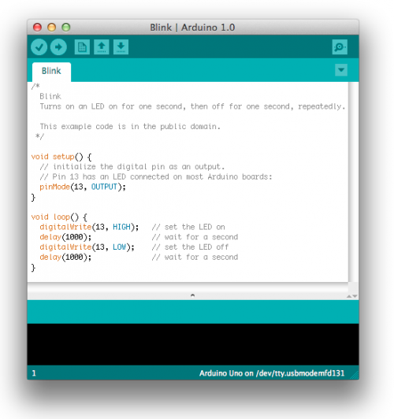

6.Select your board

You'll need to select the entry in the Tools > Board menu that corresponds to your Arduino.

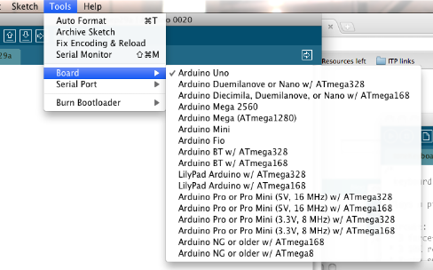

**Selecting an Arduino Uno**

For Duemilanove Arduino boards with an ATmega328 (check the text on the chip on the board), select Arduino Duemilanove or Nano w/ ATmega328. Previously, Arduino boards came with an ATmega168; for those, select Arduino Diecimila, Duemilanove, or Nano w/ ATmega168. (Details of the board menu entries are available on the [environment page](https://www.arduino.cc/en/Guide/Environment).)

7.Select your serial port

Select the serial device of the Arduino board from the Tools | Serial Port menu. This is likely to be COM3 or higher (COM1and COM2 are usually reserved for hardware serial ports). To find out, you can disconnect your Arduino board and re-open the menu; the entry that disappears should be the Arduino board. Reconnect the board and select that serial port.

8.Upload the program

Now, simply click the "Upload" button in the environment. Wait a few seconds - you should see the RX and TX leds on the board flashing. If the upload is successful, the message "Done uploading." will appear in the status bar. (Note: If you have an Arduino Mini, NG, or other board, you'll need to physically present the reset button on the board immediately before pressing the upload button.)

A few seconds after the upload finishes, you should see the pin 13 (L) LED on the board start to blink (in orange). If it does, congratulations! You've gotten Arduino up-and-running. If you have problems, please see the [troubleshooting suggestions](https://www.arduino.cc/en/Guide/Troubleshooting). You might also want to look at: the [examples](https://www.arduino.cc/en/Tutorial/HomePage) for using various sensors and actuators the [reference](https://www.arduino.cc/en/Reference/HomePage) for the Arduino language The text of the Arduino getting started guide is licensed under a [Creative Commons Attribution-ShareAlike 3.0 License](https://creativecommons.org/licenses/by-sa/3.0/). Code samples in the guide are released into the public domain.

## 1.4 Introduction of keyestudio Mega 2560 R3 board

**Introduction**

Keyestudio Mega (core to ATmega2560) is a development board (used with16MHz crystal oscillator ) of microcontroller. There 54 groups of  I/O (input/output ) digital ends (of which 14 group to do PWM output), 16 groups of simulation analogy input ends and 4 groups of UART (hardwareserial ports) in it . Because its bootloader, process can be downloaded directly with the USB and you don’t need to use other external programmer. And its power can be supplied by the USB, or the AC-to-DC adapter and battery can be also as an external power supply.

Opening source code and using C language developed status in Java concept (cross platform) make a rapid growth of Arduino peripheral module and application. The main reason to attract Artist to use Arduino is that they can quickly use all kinds of software communication such as Arduino language and Flash or Processing and so on. and make multimedia interactive works. Development interface of Arduino IDE is based on the principle of opening source code, which you can download freely used in the thematic making, school teaching, television controlling, interactive works and so on.

**Design of Power Supply**

There are two choices (direct power supply trough USB or external power supply) for the power supply system of Arduino Mega, and they can be Automatic switched. External power supply can be AC-to-DC adapter or battery. Lit rang of voltage of this control board is 6V~12V, but if the supplied voltage is greater than 12V, the voltage stabilizing device will be likely overheated and overheat protection and damaging Arduino MEGA will be more likely to occur. So we suggest the power supply should be 6.5~12V in operation and recommended supply is 7.5 or 9V.

**Summary**

- Microcontroller:ATmega2560
- Operating Voltage:5V
- Input Voltage (recommended):7-12V
- Input Voltage (limits):6-20V
- Digital I/O Pins:54 (of which 15 provide PWM output)
- Analog Input Pins:16
- DC Current per I/O Pin: 40 mA
- DC Current for 3.3V Pin:50 mA
- Flash Memory:256 KB of which 8 KB used by bootloader
- SRAM:8 KB
- EEPROM:4 KB
- Clock Speed:16 MHz

**Procedure for Installing Arduino Driver**

To download the Arduino developing software on the web address: [http:/arduino.cc/en/Main/Software](https://www.arduino.cc/en/Main/Software). The downloaded file is arduino-1.0.zip,a compressed folder, to decompress it to the hard disk.

When 2560R3 Developing Board is connected to the Windows through the USB line, Windows will prompt a new USB device is found, then it will lead us into the "found new hardware wizard" window.

The next step is to install 2560R3 driver required, selecting the option of "install from a list or specific location (Senior)" and click "next" button:

To put the driver into the driver directory of Arduino 1.0 installation directory, and we need to specify this directory to be the searched directory when installing the driver.

Click "next" button, Windows begins to find and install Arduino driving procedure.

If all goes well, we will see the success interface as follows.

After the installation of Arduino driver is successful, we can find the corresponding Arduino serial port in the Windows device manager.

Well, the next is to test driver installation.

Testing code:

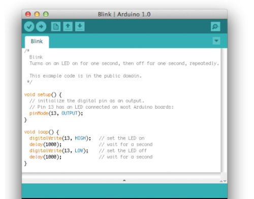

Copy the code above to Arduino status , select the model 2560 and port, and then upload the code. To wait a moment and the results came out, then you will see the LED flashing at D13 of your 2560r3 board and the time interval is 1s, and then we know that is ok.