# 2. Project Details

### Project 1: Hello World

**Introduction**

As for starters, we will begin with something simple. In this project, you only need an Arduino and a USB cable to start the "Hello World!" experiment. This is a communication test of your Arduino and PC, also a primer project for you to have your first try of the Arduino world!

**Hardware Required**

1. Arduino board x1
2. USB cable x1

**Sample Code**

After installing driver for Arduino, let's open Arduino software and compile code that enables Arduino to print "Hello World!" under your instruction. Of course, you can compile code for Arduino to continuously echo "Hello World!" without instruction. A simple If () statement will do the instruction trick. With the onboard LED connected to pin 13, we can instruct the LED to blink first when Arduino gets an instruction and then print "Hello World!”.

```
int val;//define variable val
int ledpin=13;// define digital interface 13

void setup()
{
  Serial.begin(9600);// set the baud rate at 9600 to match the software set up. When connected to a specific device, (e.g. bluetooth), the baud rate needs to be the same with it.
  pinMode(ledpin,OUTPUT);// initialize digital pin 13 as output. When using I/O ports on an Arduino, this kind of set up is always needed.
}

void loop()
{
  val=Serial.read();// read the instruction or character from PC to Arduino, and assign them to Val.
  if(val=='R')// determine if the instruction or character received is “R”.
  {  // if it’s “R”,    
    digitalWrite(ledpin,HIGH);// set the LED on digital pin 13 on. 
    delay(500);
    digitalWrite(ledpin,LOW);// set the LED on digital pin 13 off.    
    delay(500);
    Serial.println("Hello World!");// display“Hello World！”string.
  }
}
```

**Result**


Click serial port monitor,Input R,LED 13 will blink once,PC will receive information from Arduino: Hello World


After you choosing the right port，the experiment should be easy for you!

### Project 2: LED blinking

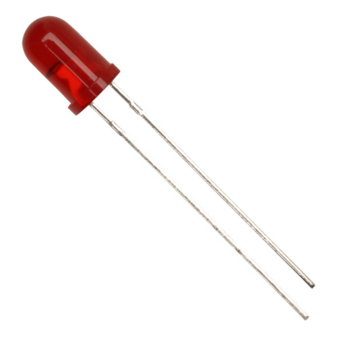

**Introduction**

Blinking LED experiment is quite simple. In the "Hello World!" program, we have come across LED. This time, we are going to connect an LED to one of the digital pins rather than using LED13, which is soldered to the board. Except an Arduino and an USB cable, we will need extra parts as below:

**Hardware Required**

1. Red M5 LED*1
2. 220Ω resistor*1
3. Breadboard*1
4. Breadboard jumper wires* several

We follow below diagram from the experimental schematic link. Here we use digital pin 10. We connect LED to a 220 ohm resistor to avoid high current damaging the LED.

**Connection for REV4**

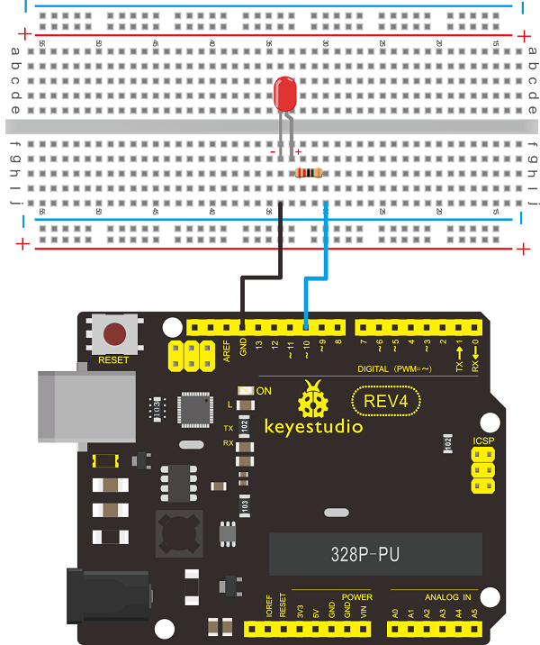

**Connection for 2560 R3**

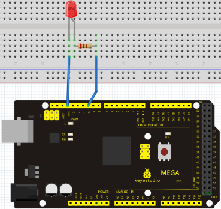

**Sample Code**

```
int ledPin = 10; // define digital pin 10.
void setup()
{
	pinMode(ledPin, OUTPUT);// define pin with LED connected as output.
}

void loop()
{
    digitalWrite(ledPin, HIGH); // set the LED on.
    delay(1000); // wait for a second.
    digitalWrite(ledPin, LOW); // set the LED off.
    delay(1000); // wait for a second
}
```

**Result**

After downloading this program, in the experiment, you will see the LED connected to pin 10 turning on and off, with an interval approximately one second. The blinking LED experiment is now completed. Thank you!

### Project 3: PWM


**Introduction**

PWM, short for Pulse Width Modulation, is a technique used to encode analog signal level into digital ones. A computer cannot output analog voltage but only digital voltage values such as 0V or 5V. So we use a high resolution counter to encode a specific analog signal level by modulating the duty cycle of PMW. The PWM signal is also digitalized because in any given moment, fully on DC power supply is either 5V (ON), or 0V (OFF). The voltage or current is fed to the analog load (the device that uses the power) by repeated pulse sequence being ON or OFF. Being on, the current is fed to the load; being off, it's not. With adequate bandwidth, any analog value can be encoded using PWM. The output voltage value is calculated via the on and off time. Output voltage = (turn on time/pulse time) * maximum voltage value

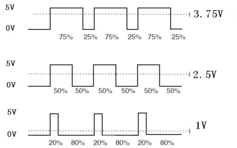

PWM has many applications: lamp brightness regulating, motor speed regulating, sound making, etc. The following are the three basic parameters of PMW:

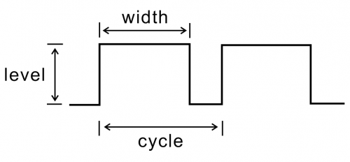

1. The amplitude of pulse width (minimum / maximum)
2. The pulse period (The reciprocal of pulse frequency in 1 second)
3. The voltage level（such as：0V-5V）

There are 6 PMW interfaces on Arduino, namely digital pin 3, 5, 6, 9, 10, and 11. In previous experiments, we have done "button-controlled LED", using digital signal to control digital pin, also one about potentiometer. This time, we will use a potentiometer to control the brightness of the LED.

**Hardware Required**

1. Potentiometer*1
2. Red M5 LED*1
3. 220Ω resistor
4. Breadboard*1
5. Breadboard jumper wires*several

The input of potentiometer is analog, so we connect it to analog port, and LED to PWM port. Different PWM signal can regulate the brightness of the LED.

**Connection for REV4**

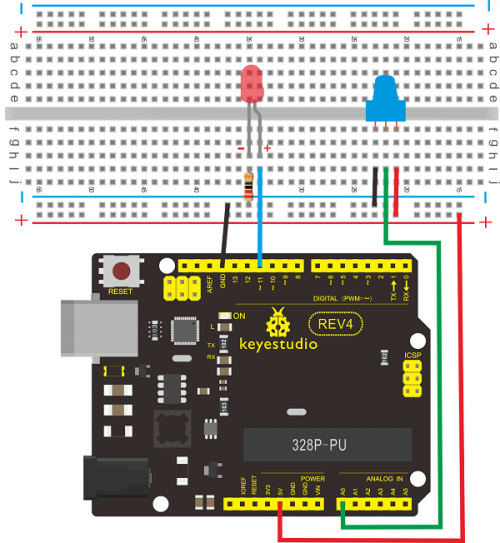

**Connection for 2560 R3**

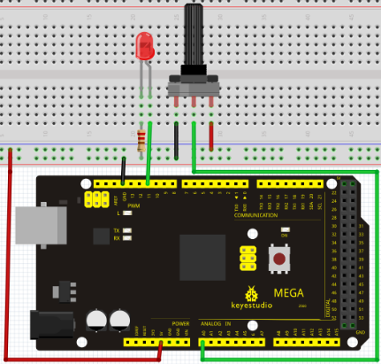

**Sample Code**

In the program compiling process, we will use the analogWrite (PWM interface, analog value) function. In this experiment, we will read the analog value of the potentiometer and assign the value to PWM port, so there will be corresponding change to the brightness of the LED. One final part will be displaying the analog value on the screen. You can consider this as the "analog value reading" project adding the PWM analog value assigning part. Below is a sample program for your reference.

```
int potpin=0;// initialize analog pin 0
int ledpin=11;//initialize digital pin 11（PWM output）
int val=0;// Temporarily store variables' value from the sensor

void setup()
{
	pinMode(ledpin,OUTPUT);// define digital pin 11 as “output”
	Serial.begin(9600);// set baud rate at 9600  attention: for analog ports, they are automatically set up as “input”
}

void loop()
{
	val=analogRead(potpin);// read the analog value from the sensor and assign it to val
	Serial.println(val);// display value of val
	analogWrite(ledpin,val/4);// turn on LED and set up brightness（maximum output of PWM is 255）
	delay(10);// wait for 0.01 second
}
```


**Result**

After downloading the program, when we rotate the potentiometer knob, we can see changes of the displaying value, also obvious change of the LED brightness on the breadboard.

### Project 4: Traffic light

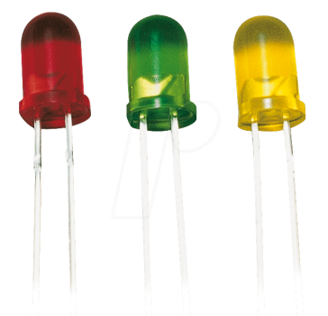

**Introduction**

In the previous program, we have done the LED blinking experiment with one LED. Now, it’s time to up the stakes and do a bit more complicated experiment-traffic lights. Actually, these two experiments are similar. While in this traffic lights experiment, we use 3 LEDs with different color other than 1 LED.

**Hardware Required**

1. Arduino board *1
2. USB cable *1
3. Red M5 LED*1
4. Yellow M5 LED*1
5. Green M5 LED*1
6. 220Ω resistor *3
7. Breadboard*1
8. Breadboard jumper wires* several

**Connection for REV4**

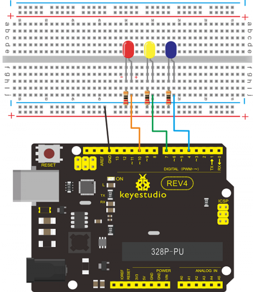

**Connection for 2560 R3**


**Sample Code**

Since it is a simulation of traffic lights, the blinking time of each LED should be the same with those in traffic lights system. In this program, we use Arduino delay () function to control delay time, which is much simpler than C language.

```
int redled =10; // initialize digital pin 8.
int yellowled =7; // initialize digital pin 7.
int greenled =4; // initialize digital pin 4.

void setup()
{
    pinMode(redled, OUTPUT);// set the pin with red LED as “output”
    pinMode(yellowled, OUTPUT); // set the pin with yellow LED as “output”
    pinMode(greenled, OUTPUT); // set the pin with green LED as “output”
}

void loop()
{
    digitalWrite(greenled, HIGH);//// turn on green LED
    delay(5000);// wait 5 seconds
    digitalWrite(greenled, LOW); // turn off green LED
    for(int i=0;i<3;i++)// blinks for 3 times
    {
        delay(500);// wait 0.5 second
        digitalWrite(yellowled, HIGH);// turn on yellow LED
        delay(500);// wait 0.5 second
        digitalWrite(yellowled, LOW);// turn off yellow LED
    } 
    delay(500);// wait 0.5 second
    digitalWrite(redled, HIGH);// turn on red LED
    delay(5000);// wait 5 second
    digitalWrite(redled, LOW);// turn off red LED
}
```

**Result**

When the uploading process is completed, we can see traffic lights of our own design. Note: this circuit design is very similar with the one in LED chase effect. The green light will be on for 5 seconds, and then off., followed by the yellow light blinking for 3 times, and then the red light on for 5 seconds, forming a cycle. Cycle then repeats. Experiment is now completed, thank you.

### Project 5: LED chasing effect

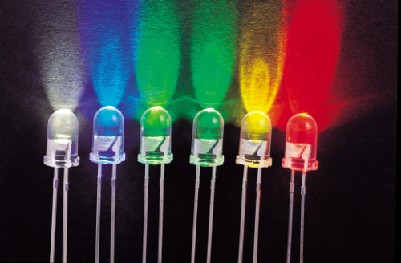

**Introduction**

We often see billboards composed of colorful LEDs. They are constantly changing to form various effects. In this experiment, we compile a program to simulate chase effect.

**Hardware Required**

1. Led x6
2. 220Ω resistor x6
3. Colorful breadboard wires

**Connection for REV4**


**Connection for 2560 R3**

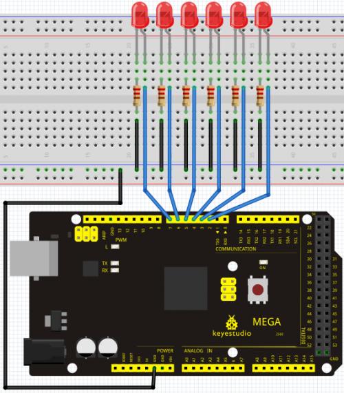

**Sample Code**

```
int BASE = 2 ;  // the I/O pin for the first LED
int NUM = 6;   // number of LEDs

void setup()
{
   for (int i = BASE; i < BASE + NUM; i ++) 
   {
     pinMode(i, OUTPUT);   // set I/O pins as output
   }
}

void loop()
{
   for (int i = BASE; i < BASE + NUM; i ++) 
   {
     digitalWrite(i, LOW);    // set I/O pins as “low”, turn off LEDs one by one.
     delay(200);        // delay
   }
   for (int i = BASE; i < BASE + NUM; i ++) 
   {
     digitalWrite(i, HIGH);    // set I/O pins as “high”, turn on LEDs one by one
     delay(200);        // delay
   }  
}
```

**Result**

You can see the LEDs blink by sequence.

### Project 6: Button-controlled LED

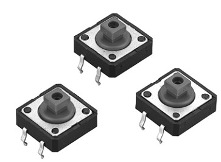

**Introduction**

I/O port means interface for INPUT and OUTPUT. Up until now, we have only used its OUTPUT function. In this experiment, we will try to use the input function, which is to read the output value of device connecting to it. We use 1 button and 1 LED using both input and output to give you a better understanding of the I/O function. Button switches, familiar to most of us, are a switch value (digital value) component. When it's pressed, the circuit is in closed (conducting) state.

**Hardware Required**

1. Button switch*1
2. Red M5 LED*1
3. 220Ω resistor*1
4. 10KΩ resistor*1
5. Breadboard*1
6. Breadboard jumper wires*several

**Connection for REV4**


**Connection for 2560 R3**


**Sample Code**

Now, let's begin the compiling. When the button is pressed, the LED will be on. After the previous study, the coding should be easy for you. In this program, we add a statement of judgment. Here, we use an if () statement. Arduino IDE is based on C language, so statements of C language such as while, switch etc. can certainly be used for Arduino program. When we press the button, pin 7 will output high level. We can program pin 11 to output high level and turn on the LED. When pin 7 outputs low level, pin 11 also outputs low level and the LED remains off.

```
int ledpin=11;// initialize pin 11
int inpin=7;// initialize pin 7
int val;// define val

void setup()
{
    pinMode(ledpin,OUTPUT);// set LED pin as “output”
    pinMode(inpin,INPUT);// set button pin as “input”
}

void loop()
{
    val=digitalRead(inpin);// read the level value of pin 7 and assign if to val
    if(val==LOW)// check if the button is pressed, if yes, turn on the LED
    	digitalWrite(ledpin,LOW);
    else
    	digitalWrite(ledpin,HIGH);
}
```

**Result**

When the button is pressed, LED is on, otherwise, LED remains off. After the above process, the button controlled LED experiment is completed. The simple principle of this experiment is widely used in a variety of circuit and electric appliances. You can easily come across it in your every day life. One typical example is when you press a certain key of your phone, the backlight will be on.

### Project 7: Active buzzer

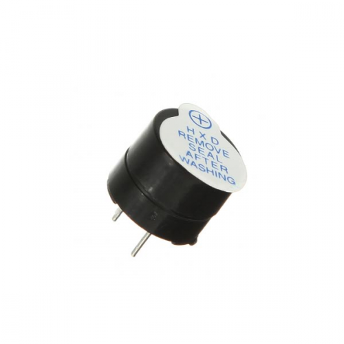

**Introduction**

 Active buzzer is widely used on computer, printer, alarm, electronic toy, telephone, timer etc as a sound making element. It has an inner vibration source. Simply connect it with 5V power supply, it can buzz continuously. 

**Hardware Required**

1. Buzzer*1
2. Key *1
3. Breadboard*1
4. Breadboard jumper wires*several

**Connection for REV4**


**Connection for 2560 R3**


When connecting the circuit, pay attention to the positive & the negative poles of the buzzer. In the photo, you can see there are red and black lines. When the circuit is finished, you can begin programming.

**Sample Code**

Program is simple. You control the buzzer by outputting high/low level. 

```
int buzzer=8;// initialize digital IO pin that controls the buzzer

void setup() 
{ 
  pinMode(buzzer,OUTPUT);// set pin mode as “output”
} 

void loop() 
{
  digitalWrite(buzzer, HIGH); // produce sound
}
```

**Result**

After downloading the program, the buzzer experiment is completed. You can see the buzzer is ringing.

### Project 8: Passive Buzzer

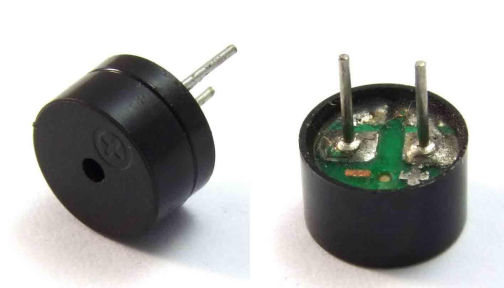

**Introduction**

We can use Arduino to make many interactive works of which the most commonly used is acoustic-optic display. All the previous experiment has something to do with LED. However, the circuit in this experiment can produce sound. Normally, the experiment is done with a buzzer or a speaker while buzzer is simpler and easier to use. The buzzer we introduced here is a passive buzzer. It cannot be actuated by itself, but by external pulse frequencies. Different frequencies produce different sounds. We can use Arduino to code the melody of a song, which is actually quite fun and simple.

**Hardware Required**

1. Passive buzzer*1

2. Key *1
3. Breadboard*1
4. Breadboard jumper wires* several

**Connection for REV4**

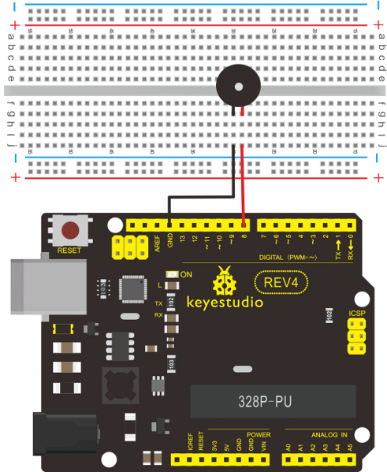

**Connection for 2560 R3**


**Sample Code**

```
int buzzer=8;// select digital IO pin for the buzzer

void setup() 
{ 
	pinMode(buzzer,OUTPUT);// set digital IO pin pattern, OUTPUT to be output 
} 
void loop() 
{ 
    unsigned char i,j;//define variable
    while(1) 
    { 
    	for(i=0;i<80;i++)// output a frequency sound
        { 
            digitalWrite(buzzer,HIGH);// sound
            delay(1);//delay1ms 
            digitalWrite(buzzer,LOW);//not sound
            delay(1);//ms delay 
        } 
        for(i=0;i<100;i++)// output a frequency sound
        { 
            digitalWrite(buzzer,HIGH);// sound
            digitalWrite(buzzer,LOW);//not sound
            delay(2);//2ms delay 
        }
	} 
} 
```

**Result**

After downloading the program, buzzer experiment is finished.

### Project 9: RGB LED


**Introduction**

Tricolor principle to display various colors
PWM controlling ports to display full color
Can be driven directly by Arduino PWM interfaces

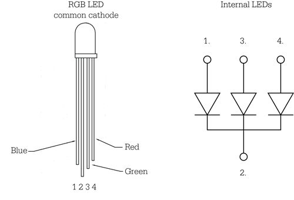

**Hardware Required**

Arduino controller × 1
USB cable × 1
Full-color LED module × 1

**Connection for REV4**


**Connection for 2560 R3**


**Sample Code**

```
int redpin = 11; //select the pin for the red LED
int bluepin =10; // select the pin for the blue LED
int greenpin =9;// select the pin for the green LED

int val;

void setup() 
{
  pinMode(redpin, OUTPUT);
  pinMode(bluepin, OUTPUT);
  pinMode(greenpin, OUTPUT);
  Serial.begin(9600);
}

void loop() 
{
  for(val=255; val>0; val--)
  {
    analogWrite(11, val);
    analogWrite(10, 255-val);
    analogWrite(9, 128-val);
    delay(1); 
  }
  for(val=0; val<255; val++)
  {
    analogWrite(11, val);
    analogWrite(10, 255-val);
    analogWrite(9, 128-val);
    delay(1); 
  }
  Serial.println(val, DEC);
}
```

**Result**

Directly copy the above code into arduino IDE, and click upload [](https://wiki.keyestudio.com/File:7438.png), wait a few seconds, you can see a full-color LED.

### Project 10: Photo resistor


**Introduction**

After completing all the previous experiments, we acquired some basic understanding and knowledge about Arduino application. We have learned digital input and output, analog input and PWM. Now, we can begin the learning of sensors applications. Photo resistor (Photovaristor) is a resistor whose resistance varies according to different incident light strength. It's made based on the photoelectric effect of semiconductor. If the incident light is intense, its resistance reduces; if the incident light is weak, the resistance increases. Photovaristor is commonly applied in the measurement of light, light control and photovoltaic conversion (convert the change of light into the change of electricity). Photo resistor is also being widely applied to various light control circuit, such as light control and adjustment, optical switches etc.


We will start with a relatively simple experiment regarding photovaristor application. Photovaristor is an element that changes its resistance as light strenth changes. So we will need to read the analog values. We can refer to the PWM experiment, replacing the potentiometer with photovaristor. When there is change in light strength, there will be corresponding change on the LED.

**Hardware Required**

Photo resistor *1
Red M5 LED 1
10KΩresisto r *1
220Ωresistor  *1
Bread board * 1
Bread board jumper wires*several

**Connection for REV4**

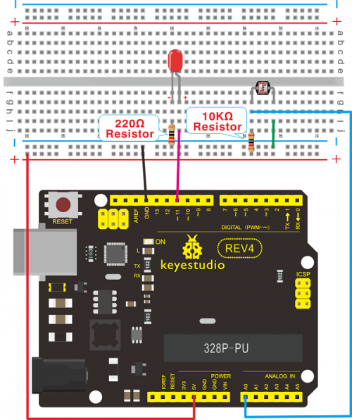

**Connection for 2560 R3**


**Sample Code**

After the connection, let's begin the program compiling. The program is similar to the one of PWM. For change detail, please refer to the sample program below. 

```
int potpin=0;// initialize analog pin 0, connected with photovaristor
int ledpin=11;// initialize digital pin 11, output regulating the brightness of LED
int val=0;// initialize variable val

void setup()
{
    pinMode(ledpin,OUTPUT);// set digital pin 11 as “output”
    Serial.begin(9600);// set baud rate at “9600”
}
void loop()
{
    val=analogRead(potpin);// read the analog value of the sensor and assign it to val
    Serial.println(val);// display the value of val
    analogWrite(ledpin,val);// turn on the LED and set up brightness（maximum output value 255）
    delay(10);// wait for 0.01 
}
```

**Result**

After downloading the program, you can change the light strength around the photovaristor and see corresponding brightness change of the LED. Photovaristors has various applications in our everyday life. You can make other interesting interactive projects base on this one.

### Project 11: Flame Sensor

**Introduction**

Flame sensor (Infrared receiving triode) is specially used on robots to find the fire source. This sensor is of high sensitivity to flame. Below is a photo of it.


**Working principle**

Flame sensor is made based on the principle that infrared ray is highly sensitive to flame. It has a specially designed infrared receiving tube to detect fire, and then convert the flame brightness to fluctuating level signal. The signals are then input into the central processor and be dealt with accordingly.

**Sensor connection**

The shorter lead of the receiving triode is for negative, the other one for positive. Connect negative to 5V pin, positive to resistor; connect the other end of the resistor to GND, connect one end of a jumper wire to a clip which is electrically connected to sensor positive, the other end to analog pin. As shown below:

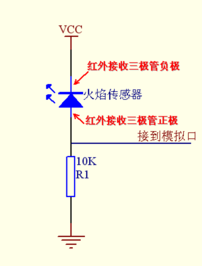

**Hardware Required**

1. Flame sensor *1
2. Buzzer *1
3. 10K resistor x1
4. Breadboard jumper wires: several

**Experiment connection**

1. Connecting buzzer:

Connect the controller board, prototype board, breadboard and USB cable according to the Arduino tutorial.

Connect the buzzer to digital pin 8.

2. Connecting flame sensor:

Connect the sensor to analog pin 0.

**Connection for REV4**

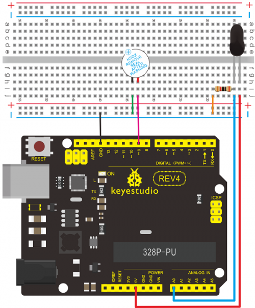

**Connection for 2560 R3**

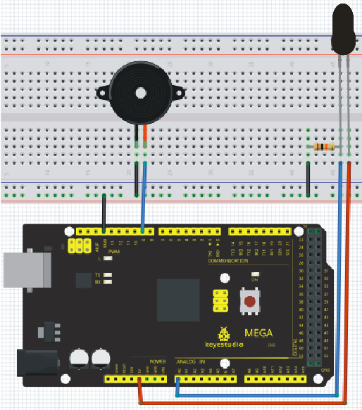

**Experiment principle**

When it's approaching a fire, the voltage value the analog port reads differs. If you use a multimeter, you can know when there is no fire approaching, the voltage it reads is around 0.3V; when there is fire approaching, the voltage it reads is around 1.0V, tthe nearer the fire, the higher the voltage. So in the beginning of the program, you can initialize voltage value i (no fire value); Then, continuously read the analog voltage value j and obtain difference value k=j-i; compare k with 0.6V (123 in binary) to determine whether or not there is a fire approaching; if yes, the buzzer will buzz.

**Sample Code**

```
int flame=0;// select analog pin 0 for the sensor
int Beep=9;// select digital pin 9 for the buzzer
int val=0;// initialize variable

void setup() 
{
  pinMode(Beep,OUTPUT);// set LED pin as “output”
  pinMode(flame,INPUT);// set buzzer pin as “input”
  Serial.begin(9600);// set baud rate at “9600”
} 

void loop() 
{ 
  val=analogRead(flame);// read the analog value of the sensor 
  Serial.println(val);// output and display the analog value
  if(val>=600)// when the analog value is larger than 600, the buzzer will buzz
  {  
     digitalWrite(Beep,HIGH); 
  }
  else 
  {  
     digitalWrite(Beep,LOW); 
  }
  delay(500); 
}
```

**Result**

This program can simulate an alarm when there is a fire. Everything is normal when there is no fire; when there is, the alarm will be set off immediately.

### Project 12: LM35 temperature sensor


**Introduction**

LM35 is a common and easy-to-use temperature sensor. It does not require other hardware. You just need an analog port to make it work. The difficulty lies in compiling the code to convert the analog value it reads to celsius temperature.

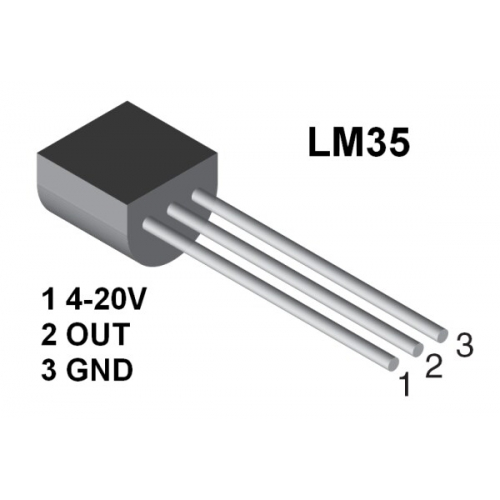

**Hardware Required**

1. LM35*1
2. Breadboard*1
3. Breadboard jumper wires*several

**Connection for REV4**

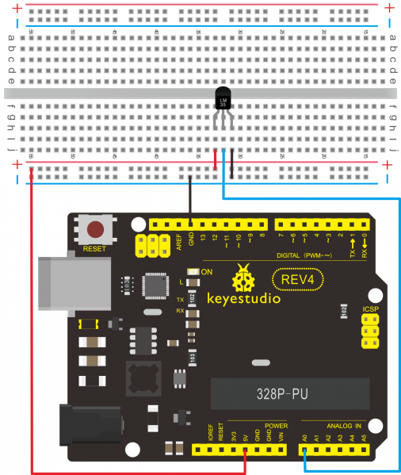

**Connection for 2560 R3**

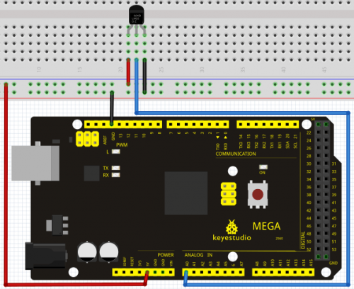

**Sample Code**

```
int potPin = 0; // initialize analog pin 0 for LM35 temperature sensor

void setup()
{
	Serial.begin(9600);// set baud rate at”9600”
}
void loop()
{
    int val;// define variable
    int dat;// define variable
    val=analogRead(0);// read the analog value of the sensor and assign it to val
    dat=(125*val)>>8;// temperature calculation formula
    Serial.print("Tep:");// output and display characters beginning with Tep
    Serial.print(dat);// output and display value of dat
    Serial.println("C");// display “C” characters
    delay(500);// wait for 0.5 second
}
```

**Result**

After downloading the program, you can open the monitoring window to see current temperature.


### Project 13: Tilt switch

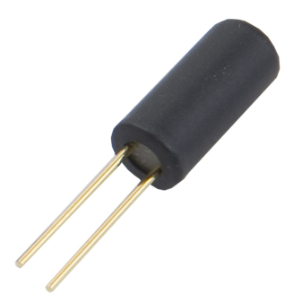

**Introduction**

Tilt switch controlling the ON and OFF of LED

**Hardware Required**

1. Ball switch*1 2. Led *1
2. 220Ω resistor*1
3. 10kΩ resistor*1
4. Breadboard jumper wires:several

**Connection for REV4**


**Connection for 2560 R3**


Connect the controller board, shield, breadboard and USB cable according to Arduino tutorial. Connect the LED to digital pin 8, ball switch to analog pin 5. 

**Experiment principle**
When one end of the switch is below horizontal position, the switch is on. The voltage of the analog port is about 5V (1023 in binary). The LED will be on. When the other end of the switch is below horizontal position, the switch is off. The voltage of the analog port is about 0V (0 in binary). The LED will be off. In the program, we determine whether the switch is on or off according to the voltage value of the analog port, whether it's above 2.5V (512 in binary) or not.

**Sample Code**

```
void setup() 
{ 
  pinMode(8,OUTPUT);// set digital pin 8 as “output” 
} 
void loop() 
{ 
	int i;// define variable i 
    while(1) 
    { 
      	i=analogRead(5);// read the voltage value of analog pin 5 
      	if(i>512)// if larger that 512（2.5V） 
      	{ 
        	digitalWrite(8,LOW);// turn on LED 
     	} 
      	else// otherwise 
      	{ 
        	digitalWrite(8,HIGH);// turn off LED 
      	} 
    } 
}
```

**Result**

Hold the breadboard with your hand. Tilt it to a certain extent, the LED will be on. If there is no tilt, the LED will be off. The principle of this experiment can be applied to relay control. Experiment completed. Thank you!

### Project 14: IR remote control


**Introduction**

What is an infrared receiver? The signal from the infrared remote controller is a series of binary pulse code. To avoid interference from other infrared signals during the wireless transmission, the signal is pre-modulate at a specific carrier frequency and then send out by a infrared emission diode. The infrared receiving device needs to filter out other wave and receive signal at that specific frequency and modulate it back to binary pulse code, known as demodulation. Working principal The built-in receiver converts the light signal it received from the sender into feeble electrical signal. The signal will be amplified by the IC amplifier.

After automatic gain control, band-pass filtering, demodulation, wave shaping, it returns to the original code. The code is then input to the code identification circuit by the receiver's signal output pin.

The pin and the connection of the infrared receiving head Pin and wiring of infrared receiver.


Infrared receiver has 3 pins.

When you use it, connect VOUT to analog pin, GND to GND, VCC to +5V.

Infrared remote control experiment

**Hardware Required**

- Infrared remote controller x1
- Infrared receiver x1
- LED x6
- 220Ω resistor x6
- Multi-color breadboard wires x several

**Connection**

First, connect the controller board; then connect the infrared receiver as the above mentioned, connect VOUT to digital pin 11, connect the LEDs with resistors and connect the resisters to pin 2,3,4,5,6,7. 

**Connection for REV4**


**Connection for 2560 R3**

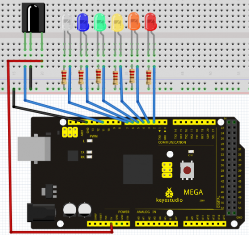

**Experiment principle**

If you want to decode code of a remote controller, you must first know how it's coded. The coding method we use here is NEC protocol. Below is a brief introduction. ·NEC protocol.
Features：
(1) 8 bit address and 8 bit command length
(2) address and command are transmitted twice for reliability
(3) pulse distance modulation
(4) carrier frequency of 38 KHZ 
(5) bit time of 1.125ms or 2.25ms

Protocol is as below:

-  Definition of logical 0 and 1 is as below


-  Pulse transmitted when button is pressed and immediately released

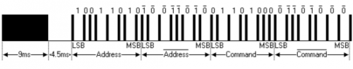

The picture above shows a typical pulse train of the NEC protocol. With this protocol the LSB is transmitted first. In this case Address $59 and Command $16 is transmitted. A message is started by a 9ms AGC burst, which was used to set the gain of the earlier IR receivers. This AGC burst is then followed by a 4.5ms space, which is then followed by the address and command. Address and Command are transmitted twice. The second time all bits are inverted and can be used for verification of the received message. The total transmission time is constant because every bit is repeated with its inverted length. If you are not interested in this reliability, you can ignore the inverted values, or you can expend the Address and Command to 16 bits each!

- Pulse transmitted when button is pressed and released after a period of time.

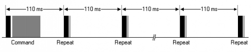

A command is transmitted only once, even when the key on the remote control remains pressed. Every 110ms a repeat code is transmitted for as long as the key remains down. This repeat code is simply a 9ms AGC pulse followed by a 2.25ms space and a 560µs burst. 

- Repeat pulse


Note: when the pulse enters the integrated receiver, there will be decoding, signal amplifying and wave shaping process. So you need to make sure the level of the output is just the opposite from that of the signal sending end. That is when there is no infrared signal, the output end is in high level; when there is infrared signal, the output end is in low level. You can see the pulse of the receiving end in the oscilloscope. Try to better understand the program base on what you see.

**Sample Code**

```
#include <IRremote.h>
int RECV_PIN = 11;
int LED1 = 2;
int LED2 = 3;
int LED3 = 4;
int LED4 = 5;
int LED5 = 6;
int LED6 = 7;
long on1  = 0x00FFA25D;
long off1 = 0x00FFE01F;
long on2 = 0x00FF629D;
long off2 = 0x00FFA857;
long on3 = 0x00FFE21D;
long off3 = 0x00FF906F;
long on4 = 0x00FF22DD;
long off4 = 0x00FF6897;
long on5 = 0x00FF02FD;
long off5 = 0x00FF9867;
long on6 = 0x00FFC23D;
long off6 = 0x00FFB047;
IRrecv irrecv(RECV_PIN);
decode_results results;
// Dumps out the decode_results structure.
// Call this after IRrecv::decode()
// void * to work around compiler issue
//void dump(void*v) 
//  decode_results *results = (decode_results *)v

void dump(decode_results *results) 
{
  int count = results->rawlen;
  if (results->decode_type == UNKNOWN) 
  {
     Serial.println("Could not decode message");
  } 
  else 
  {
    if (results->decode_type == NEC) 
    {
       Serial.print("Decoded NEC: ");
    } 
    else if (results->decode_type == SONY) 
    {
       Serial.print("Decoded SONY: ");
    } 
    else if (results->decode_type == RC5) 
    {
       Serial.print("Decoded RC5: ");
    } 
    else if (results->decode_type == RC6) 
    {
       Serial.print("Decoded RC6: ");
    }
    Serial.print(results->value, HEX);
    Serial.print(" (");
    Serial.print(results->bits, DEC);
    Serial.println(" bits)");
  }
  Serial.print("Raw (");
  Serial.print(count, DEC);
  Serial.print("): ");
  for (int i = 0; i < count; i++) 
  {
    if ((i % 2) == 1)
    {
      Serial.print(results->rawbuf[i]*USECPERTICK, DEC);
    } 
    else  
    {
      Serial.print(-(int)results->rawbuf[i]*USECPERTICK, DEC);
    }
    Serial.print(" ");
  }
  Serial.println("");
}

void setup()
{
  pinMode(RECV_PIN, INPUT);   
  pinMode(LED1, OUTPUT);
  pinMode(LED2, OUTPUT);
  pinMode(LED3, OUTPUT);
  pinMode(LED4, OUTPUT);
  pinMode(LED5, OUTPUT);
  pinMode(LED6, OUTPUT);  
  pinMode(13, OUTPUT);
  Serial.begin(9600);
  irrecv.enableIRIn(); // Start the receiver
}

int on = 0;
unsigned long last = millis();

void loop() 
{
  if (irrecv.decode(&results)) 
   {
    // If it's been at least 1/4 second since the last
    // IR received, toggle the relay
     if (millis() - last > 250) 
     {
       on = !on;// digitalWrite(8, on ? HIGH : LOW);
       digitalWrite(13, on ? HIGH : LOW);
       dump(&results);
     }
    if (results.value == on1 )
       digitalWrite(LED1, HIGH);
    if (results.value == off1 )
       digitalWrite(LED1, LOW); 
    if (results.value == on2 )
       digitalWrite(LED2, HIGH);
    if (results.value == off2 )
       digitalWrite(LED2, LOW); 
    if (results.value == on3 )
       digitalWrite(LED3, HIGH);
    if (results.value == off3 )
       digitalWrite(LED3, LOW);
    if (results.value == on4 )
       digitalWrite(LED4, HIGH);
    if (results.value == off4 )
       digitalWrite(LED4, LOW); 
    if (results.value == on5 )
       digitalWrite(LED5, HIGH);
    if (results.value == off5 )
       digitalWrite(LED5, LOW); 
    if (results.value == on6 )
       digitalWrite(LED6, HIGH);
    if (results.value == off6 )
       digitalWrite(LED6, LOW);        
    last = millis();      
    irrecv.resume(); // Receive the next value
  }
}
```

**Program function** 

Decode the coded pulse signal emitted by the remote controller; execute corresponding action according to the results of the decoding. In this way, you will be able to control your device with remote controller. 

**Result**


Note：add IRremote folder into installation directory \Arduino\compiler libraries, or you will not be able to compile. Infrared remote library:

[https://github.com/z3t0/Arduino-IRremote](https://github.com/shirriff/Arduino-IRremote)

### Project 15: Analog value reading

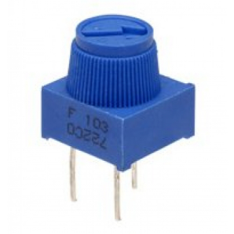

**Introduction**

Introduction In this experiment, we will begin the learning of analog I/O interfaces. On an Arduino, there are 6 analog interfaces numbered from 0 to 5. These 6 interfaces can also be used as digital ones numbered as 14-19. After a brief introduction, let's begin our project. Potentiometer used here is a typical output component of analog value that is familiar to us. 

**Hardware Required**

Potentiometer * 1
Breadboard *1
Breadboard jumper wires * several

**Connection**

In this experiment, we will convert the resistance value of the potentiometer to analog ones and display it on the screen. This is an application we need to master well for our future experiments. Connection circuit as below: 

**Connection for REV4**

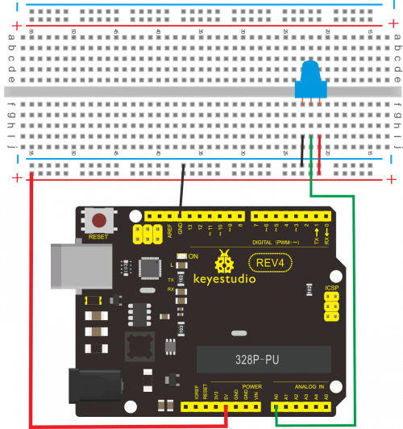

**Connection for 2560 R3**


We use the analog interface 0.
The analog interface we use here is interface 0.

**Sample Code**

The program compiling is simple. An analogRead () Statement can read the value of the interface. The A/D acquisition of Arduino 328 is in 10 bits, so the value it reads is among 0 to 1023. One difficulty in this project is to display the value on the screen, which is actually easy to learn. First, we need to set the baud rate in voidsetup (). Displaying the value is a communication between Arduino and PC, so the baud rate of the Arduino should match the the one in the PC's software set up. Otherwise, the display will be messy codes or no display at all. In the lower right corner of the Arduino software monitor window, there is a button for baud rate set up. The set up here needs to match the one in the program. The statement in the program is Serial.begin(); enclosed is the baud rate value, followed by statement for displaying. You can either use Serial.print() or Serial.println() statement. 

```
int potpin=0;// initialize analog pin 0
int ledpin=13;// initialize digital pin 13
int val=0;// define val, assign initial value 0

void setup()
{
    pinMode(ledpin,OUTPUT);// set digital pin as “output”
    Serial.begin(9600);// set baud rate at 9600
}

void loop()
{
    digitalWrite(ledpin,HIGH);// turn on the LED on pin 13
    delay(50);// wait for 0.05 second
    digitalWrite(ledpin,LOW);// turn off the LED on pin 13
    delay(50);// wait for 0.05 second
    val=analogRead(potpin);// read the analog value of analog pin 0, and assign it to val 
    Serial.println(val);// display val’s value
}
```

**Result**

The sample program uses the built-in LED connected to pin 13. Each time the device reads a value, the LED blinks. Below is the analog value it reads.


When you rotate the potentiometer knob, you can see the displayed value changes. The reading of analog value is a very common function since most sensors output analog value. After calculation, we can have the corresponding value we need. The experiment is now completed, thank you.

### Project 16: 74HC595


**Introduction**

To put it simply, 74HC595 is a combination of 8-digit shifting register, memorizer and equipped with tri-state output. Here, we use it to control 8 LEDs. You may wonder why use a 74HC595 to control LED? Well, think about how many I/O it takes for an Arduino to control 8 LEDs? Yes, 8. For an Arduino 168, it has only 20 I/O including analog ports. So, to save port resources, we use 74HC595 to reduce the number of ports it needs. Using 74HC595 enables us to use 3 digital I/O port to control 8 LEDs!

**Hardware Required**

- 74HC595 chip*1
- Red M5 LED*4
- Green M5 LED*4
- 220Ω resistor*8
- Breadboard*1
- Breadboard jumper wires*several
- Note: for pin 13 OE port of 74HC595, it needs to connect to GND

**Connection for REV4**


**Connection for 2560 R3**


The circuit may seem complicated, but once you give it a good look, you will find it easy!

**Sample Code**

The program compiling is simple. An analogRead () Statement can read the value of the interface. The A/D acquisition of Arduino 328 is in 10 bits, so the value it reads is among 0 to 1023. One difficulty in this project is to display the value on the screen, which is actually easy to learn. First, we need to set the baud rate in voidsetup (). Displaying the value is a communication between Arduino and PC, so the baud rate of the Arduino should match the the one in the PC's software set up. Otherwise, the display will be messy codes or no display at all. In the lower right corner of the Arduino software monitor window, there is a button for baud rate set up. The set up here needs to match the one in the program. The statement in the program is Serial.begin(); enclosed is the baud rate value, followed by statement for displaying. You can either use Serial.print() or Serial.println() statement. 

```
int data = 2;// set pin 14 of 74HC595as data input pin SI 
int clock = 5;// set pin 11 of 74hc595 as clock pin SCK
int latch = 4;// set pin 12 of 74hc595 as output latch RCK 
int ledState = 0;
const int ON = HIGH;
const int OFF = LOW;

void setup()
{
    pinMode(data, OUTPUT);
    pinMode(clock, OUTPUT);
    pinMode(latch, OUTPUT);
}

void loop()
{
    for(int i = 0; i < 256; i++)
    {
        updateLEDs(i);
        delay(500);
    }
}

void updateLEDs(int value)
{
    digitalWrite(latch, LOW);//
    shiftOut(data, clock, MSBFIRST, ~value);// serial data “output”, high level first
    digitalWrite(latch, HIGH);// latch
}
```

**Result**

After downloading the program, you can see 8 LEDs displaying 8-bit binary number.

### Project 17: 1-digit LED segment display


**Introduction**

LED segment displays are common for displaying numerical information. It's widely applied on displays of electromagnetic oven, full automatic washing machine, water temperature display, electronic clock etc. It is necessary that we learn how it works.

LED segment display is a semiconductor light-emitting device. Its basic unit is a light-emitting diode (LED). LED segment display can be divided into 7-segment display and 8-segment display according to the number of segments. 8-segment display has one more LED unit ( for decimal point display) than 7-segment one. In this experiment, we use a 8-segment display. According to the wiring method of LED units, LED segment displays can be divided into display with common anode and display with common cathode. Common anode display refers to the one that combine all the anodes of LED units into one common anode (COM).

For the common anode display, connect the common anode (COM) to +5V. When the cathode level of a certain segment is low, the segment is on; when the cathode level of a certain segment is high, the segment is off. For the common cathode display, connect the common cathode (COM) to GND. When the anode level of a certain segment is high, the segment is on; when the anode level of a certain segment is low, the segment is off.

Common cathode 7-segment display


Each segment of the display consists of an LED.  So when you use it, you also need use a current-limiting resistor. Otherwise, LED will be burnt out. In this experiment, we use a common cathode display. As we mentioned above, for common cathode display, connect the common cathode (COM) to GND. When the anode level of a certain segment is high, the segment is on; when the anode level of a certain segment is low, the segment is off.

**Hardware Required**

Eight-segment display *1
220Ω resistor *8
Breadboard *1
Breadboard jumper wires * several

**Connection for REV4**


**Connection for 2560 R3**


**Sample Code**

There are seven segments for numerical display, one for decimal point display. Corresponding segments will be turned on when displaying certain numbers. For example, when displaying number 1, b and c segments will be turned on. We compile a subprogram for each number, and compile the main program to display one number every 2 seconds, cycling display number 0 ~ 9. The displaying time for each number is subject to the delay time, the longer the delay time, the longer the displaying time. 

```
// set the IO pin for each segment
int a=7;// set digital pin 7 for segment a
int b=6;// set digital pin 6 for segment b
int c=5;// set digital pin 5 for segment c
int d=10;// set digital pin 10 for segment d
int e=11;// set digital pin 11 for segment e
int f=8;// set digital pin 8 for segment f
int g=9;// set digital pin 9 for segment g
int dp=4;// set digital pin 4 for segment dp

void digital_0(void) // display number 5
{
    unsigned char j;
    digitalWrite(a,HIGH);
    digitalWrite(b,HIGH);
    digitalWrite(c,HIGH);
    digitalWrite(d,HIGH);
    digitalWrite(e,HIGH);
    digitalWrite(f,HIGH);
    digitalWrite(g,LOW);
    digitalWrite(dp,LOW);
}

void digital_1(void) // display number 1
{
    unsigned char j;
    digitalWrite(c,HIGH);// set level as “high” for pin 5, turn on segment c
    digitalWrite(b,HIGH);// turn on segment b
    for(j=7;j<=11;j++)// turn off other segments
    	digitalWrite(j,LOW);
    digitalWrite(dp,LOW);// turn off segment dp
}

void digital_2(void) // display number 2
{
    unsigned char j;
    digitalWrite(b,HIGH);
    digitalWrite(a,HIGH);
    for(j=9;j<=11;j++)
    	digitalWrite(j,HIGH);
    digitalWrite(dp,LOW);
    digitalWrite(c,LOW);
    digitalWrite(f,LOW);
}

void digital_3(void) // display number 3
{
    digitalWrite(g,HIGH);
    digitalWrite(a,HIGH);
    digitalWrite(b,HIGH);
    digitalWrite(c,HIGH);
    digitalWrite(d,HIGH);
    digitalWrite(dp,LOW);
    digitalWrite(f,LOW);
    digitalWrite(e,LOW);
}

void digital_4(void) // display number 4
{
    digitalWrite(c,HIGH);
    digitalWrite(b,HIGH);
    digitalWrite(f,HIGH);
    digitalWrite(g,HIGH);
    digitalWrite(dp,LOW);
    digitalWrite(a,LOW);
    digitalWrite(e,LOW);
    digitalWrite(d,LOW);
}

void digital_5(void) // display number 5
{
    unsigned char j;
    digitalWrite(a,HIGH);
    digitalWrite(b, LOW);
    digitalWrite(c,HIGH);
    digitalWrite(d,HIGH);
    digitalWrite(e, LOW);
    digitalWrite(f,HIGH);
    digitalWrite(g,HIGH);
    digitalWrite(dp,LOW);
}

void digital_6(void) // display number 6
{
    unsigned char j;
    for(j=7;j<=11;j++)
    	digitalWrite(j,HIGH);
    digitalWrite(c,HIGH);
    digitalWrite(dp,LOW);
    digitalWrite(b,LOW);
}

void digital_7(void) // display number 7
{
    unsigned char j;
    for(j=5;j<=7;j++)
    	digitalWrite(j,HIGH);
    digitalWrite(dp,LOW);
    for(j=8;j<=11;j++)
    	digitalWrite(j,LOW);
}

void digital_8(void) // display number 8
{
    unsigned char j;
    for(j=5;j<=11;j++)
    	digitalWrite(j,HIGH);
    digitalWrite(dp,LOW);
}

void digital_9(void) // display number 5
{
    unsigned char j;
    digitalWrite(a,HIGH);
    digitalWrite(b,HIGH);
    digitalWrite(c,HIGH);
    digitalWrite(d,HIGH);
    digitalWrite(e, LOW);
    digitalWrite(f,HIGH);
    digitalWrite(g,HIGH);
    digitalWrite(dp,LOW);
}
void setup()
{
    int i;// set variable
    for(i=4;i<=11;i++)
    	pinMode(i,OUTPUT);// set pin 4-11as “output”
}

void loop()
{
    while(1)
    {
        digital_0();// display number 0
        delay(1000);// wait for 1s
        digital_1();// display number 1
        delay(1000);// wait for 1s
        digital_2();// display number 2
        delay(1000); // wait for 1s
        digital_3();// display number 3
        delay(1000); // wait for 1s
        digital_4();// display number 4
        delay(1000); // wait for 1s
        digital_5();// display number 5
        delay(1000); // wait for 1s
        digital_6();// display number 6
        delay(1000); // wait for 1s
        digital_7();// display number 7
        delay(1000); // wait for 1s
        digital_8();// display number 8
        delay(1000); // wait for 1s
        digital_9();// display number 9
        delay(1000); // wait for 1s
    }
}
```

**Result**

LED segment display displays number 0 to 9.

### Project 18: 4-digit LED segment display

**Introduction**

In this experiment, we use an Arduino to drive a common anode, 4-digit, 7-segment LED display. For LED display, current-limiting resistors are indispensable. There are two wiring method for Current-limiting resistor. One is to connect one resistor for each anode, 4 in totals for d1-d4 anode. An advantage for this method is that it requires fewer resistors, only 4. But it cannot maintain consistent brightness, 1 the brightest, 8, the least bright. Another method is to connect one resistor to each pin. It guarantees consistent brightness, but requires more resistors. In this experiment, we use 8 220Ω resistors (we use 220Ω resistors because no 100Ω resistor available. If you use 100Ω, the displaying will be brighter).

**Connection**


For 4-digit displays, there are 12 pins in total. When you place the decimal point downward , the pin on the lower left part is refer to as 1, the upper left part 12. 


Manual for LED segment display

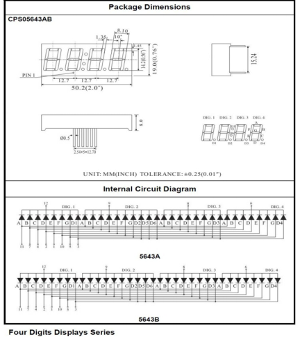

**Connection for REV4**

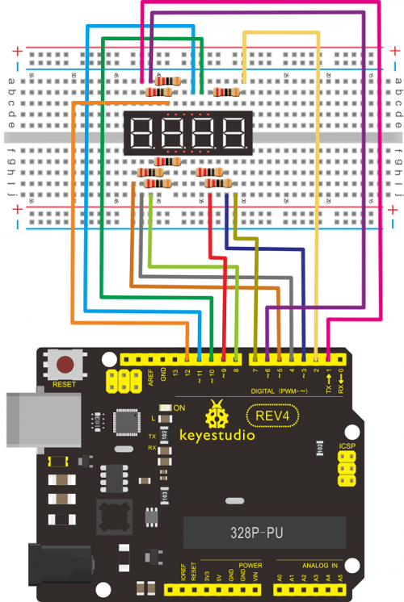

**Connection for 2560 R3**


**Sample Code**

There are seven segments for numerical display, one for decimal point display. Corresponding segments will be turned on when displaying certain numbers. For example, when displaying number 1, b and c segments will be turned on. We compile a subprogram for each number, and compile the main program to display one number every 2 seconds, cycling display number 0 ~ 9. The displaying time for each number is subject to the delay time, the longer the delay time, the longer the displaying time. 

```
// display 1234 
// select pin for cathode
int a = 1;
int b = 2;
int c = 3;
int d = 4;
int e = 5;
int f = 6;
int g = 7;
int dp = 8;
// select pin for anode
int d4 = 9;
int d3 = 10;
int d2 = 11;
int d1 = 12;
// set variable
long n = 1230;
int x = 100;
int del = 55;  // fine adjustment for clock
	 
void setup()
{
	pinMode(d1, OUTPUT);
	pinMode(d2, OUTPUT);
	pinMode(d3, OUTPUT);
	pinMode(d4, OUTPUT);
	pinMode(a, OUTPUT);
	pinMode(b, OUTPUT);
	pinMode(c, OUTPUT);
	pinMode(d, OUTPUT);
	pinMode(e, OUTPUT);
	pinMode(f, OUTPUT);
	pinMode(g, OUTPUT);
	pinMode(dp, OUTPUT);
}

void loop()
{
    Display(1, 1);
    Display(2, 2);
    Display(3, 3);
    Display(4, 4);
}

void WeiXuan(unsigned char n)
{
    switch(n)
    {
        case 1: 
          digitalWrite(d1,LOW);
          digitalWrite(d2, HIGH);
          digitalWrite(d3, HIGH);
          digitalWrite(d4, HIGH);   
          break;
        case 2: 
          digitalWrite(d1, HIGH);
          digitalWrite(d2, LOW);
          digitalWrite(d3, HIGH);
          digitalWrite(d4, HIGH); 
          break;
        case 3: 
          digitalWrite(d1,HIGH);
          digitalWrite(d2, HIGH);
          digitalWrite(d3, LOW);
          digitalWrite(d4, HIGH); 
          break;
        case 4: 
          digitalWrite(d1, HIGH);
          digitalWrite(d2, HIGH);
          digitalWrite(d3, HIGH);
          digitalWrite(d4, LOW); 
          break;
        default :
          digitalWrite(d1, HIGH);
          digitalWrite(d2, HIGH);
          digitalWrite(d3, HIGH);
          digitalWrite(d4, HIGH);
          break;
	}
}

void Num_0()
{
    digitalWrite(a, HIGH);
    digitalWrite(b, HIGH);
    digitalWrite(c, HIGH);
    digitalWrite(d, HIGH);
    digitalWrite(e, HIGH);
    digitalWrite(f, HIGH);
    digitalWrite(g, LOW);
    digitalWrite(dp,LOW);
}

void Num_1()
{
    digitalWrite(a, LOW);
    digitalWrite(b, HIGH);
    digitalWrite(c, HIGH);
    digitalWrite(d, LOW);
    digitalWrite(e, LOW);
    digitalWrite(f, LOW);
    digitalWrite(g, LOW);
    digitalWrite(dp,LOW);
}

void Num_2()
{
    digitalWrite(a, HIGH);
    digitalWrite(b, HIGH);
    digitalWrite(c, LOW);
    digitalWrite(d, HIGH);
    digitalWrite(e, HIGH);
    digitalWrite(f, LOW);
    digitalWrite(g, HIGH);
    digitalWrite(dp,LOW);
}

void Num_3()
{
    digitalWrite(a, HIGH);
    digitalWrite(b, HIGH);
    digitalWrite(c, HIGH);
    digitalWrite(d, HIGH);
    digitalWrite(e, LOW);
    digitalWrite(f, LOW);
    digitalWrite(g, HIGH);
    digitalWrite(dp,LOW);
}

void Num_4()
{
    digitalWrite(a, LOW);
    digitalWrite(b, HIGH);
    digitalWrite(c, HIGH);
    digitalWrite(d, LOW);
    digitalWrite(e, LOW);
    digitalWrite(f, HIGH);
    digitalWrite(g, HIGH);
    digitalWrite(dp,LOW);
}

void Num_5()
{
    digitalWrite(a, HIGH);
    digitalWrite(b, LOW);
    digitalWrite(c, HIGH);
    digitalWrite(d, HIGH);
    digitalWrite(e, LOW);
    digitalWrite(f, HIGH);
    digitalWrite(g, HIGH);
    digitalWrite(dp,LOW);
}

void Num_6()
{
    digitalWrite(a, HIGH);
    digitalWrite(b, LOW);
    digitalWrite(c, HIGH);
    digitalWrite(d, HIGH);
    digitalWrite(e, HIGH);
    digitalWrite(f, HIGH);
    digitalWrite(g, HIGH);
    digitalWrite(dp,LOW);
}

void Num_7()
{
    digitalWrite(a, HIGH);
    digitalWrite(b, HIGH);
    digitalWrite(c, HIGH);
    digitalWrite(d, LOW);
    digitalWrite(e, LOW);
    digitalWrite(f, LOW);
    digitalWrite(g, LOW);
    digitalWrite(dp,LOW);
}

void Num_8()
{
    digitalWrite(a, HIGH);
    digitalWrite(b, HIGH);
    digitalWrite(c, HIGH);
    digitalWrite(d, HIGH);
    digitalWrite(e, HIGH);
    digitalWrite(f, HIGH);
    digitalWrite(g, HIGH);
    digitalWrite(dp,LOW);
}

void Num_9()
{
    digitalWrite(a, HIGH);
    digitalWrite(b, HIGH);
    digitalWrite(c, HIGH);
    digitalWrite(d, HIGH);
    digitalWrite(e, LOW);
    digitalWrite(f, HIGH);
    digitalWrite(g, HIGH);
    digitalWrite(dp,LOW);
}

void Clear()  // clear the screen
{
    digitalWrite(a, LOW);
    digitalWrite(b, LOW);
    digitalWrite(c, LOW);
    digitalWrite(d, LOW);
    digitalWrite(e, LOW);
    digitalWrite(f, LOW);
    digitalWrite(g, LOW);
    digitalWrite(dp,LOW);
}

void pickNumber(unsigned char n)// select number
{
   switch(n)
   {
       case 0:Num_0();
       break;
       case 1:Num_1();
       break;
       case 2:Num_2();
       break;
       case 3:Num_3();
       break;
       case 4:Num_4();
       break;
       case 5:Num_5();
       break;
       case 6:Num_6();
       break;
       case 7:Num_7();
       break;
       case 8:Num_8();
       break;
       case 9:Num_9();
       break;
       default:Clear();
       break; 
   }
}

void Display(unsigned char x, unsigned char Number)//  take x as coordinate and display number
{
   WeiXuan(x);
   pickNumber(Number);
   delay(1);
   Clear() ; // clear the screen
}
```

**Result**

Download the above code to the controller board and see the result. The experiment result displays 1234 on the display. Note: if it’s not displaying correctly, check the wiring. Thank you.

### Project 19: 8*8 LED matrix


**Introduction**

With low-voltage scanning, LED dot-matrix displays have advantages such as power saving, long service life, low cost, high brightness, wide angle of view, long visual range, waterproof, and numerous specifications. LED dot-matrix displays can meet the needs of different applications and thus have a broad development prospect. This time, we will conduct an LED dot-matrix experiment to experience its charm firsthand.

**Hardware required**

- 1 * REV4 board
- 1 * 8*8 dot-matrix
- 8 * Resistor (220Ω)
- 1 * Breadboard
- 2 * 74HC595
- 1 * USB cable
- Jumper wires

**Circuit connection**

The external view of a dot-matrix is shown as follows:


The display principle of the 8 * 8 dot-matrix:
The 8*8 dot-matrix is made up of sixty-four LEDs, and each LED is placed at the cross point of a row and a column. When the electrical level of a certain row is 1 and the electrical level of acertain column is 0, the corresponding LED will light up. If you want to light the LED on the first dot, you should set pin 9 to high level and pin 13 to low level. If you want to light LEDs on the first row, you should set pin 9 to high level and pins 13, 3, 4, 10, 6, 11, 15 and 16 to low level. If you want to light the LEDs on the first column, set pin 13 to low level and pins 9, 14, 8, 12, 1, 7, 2 and 5 to high level.

The internal view of a dot-matrix is shown as follows:


The principle of 74HC595 has been previously illustrated. One chip is used to control the rows of the dot-matrix while the other chip is used to control the columns.

Connect circuit as shown in the following diagram.

**Connection for REV4**

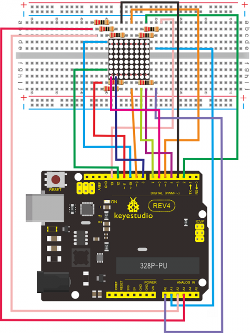

**Connection for 2560 R3**


**Sample Code for displaying “0”**

```
// set an array to store character of “0”
unsigned char Text[]={0x00,0x1c,0x22,0x22,0x22,0x22,0x22,0x1c};

void Draw_point(unsigned char x,unsigned char y)// point drawing function
{ 
   clear_();
   digitalWrite(x+2, HIGH);
   digitalWrite(y+10, LOW);
   delay(1);
}

void show_num(void)// display function, call point drawing function
{
  unsigned char i,j,data;
  for(i=0;i<8;i++)
  {
    data=Text[i];
    for(j=0;j<8;j++)
    {
      if(data & 0x01)Draw_point(j,i);
      data>>=1;
    }  
  }
}

void setup()
{ 
    int i = 0 ; 
    for(i=2;i<18;i++) 
    { 
       pinMode(i, OUTPUT); 
    }  
  	clear_(); 
}

void loop()
{ 
	show_num();    
}

void clear_(void)// clear screen
{
	for(int i=2;i<10;i++)
    digitalWrite(i, LOW);
    for(int i=0;i<8;i++)
    digitalWrite(i+10, HIGH);
}
```

**Result**

Burn the program into REV4 board The dot-matrix will display 0.

### Project 20: 1602 LCD


**Introduction**

In this experiment, we use an Arduino to drive the 1602 LCD. 1602 LCD has wide applications. In the beginning, 1602 LCD uses a HD44780 controller. Now, almost all 1602 LCD module uses a compatible IC, so their features are basically the same. 

1602LCD main parameters:

- Display capacity: 16 × 2 characters.
- Chip operating voltage: 4.5 ~ 5.5V.
- Working current: 2.0mA (5.0V).
- Optimum working voltage of the module is 5.0V.
- Character size: 2.95 * 4.35 (W * H) mm.

Pin description of 1602 LCD

| No.  | Mark | Pin description           |
| ---- | ---- | ------------------------- |
| 1    | VSS  | Power GND                 |
| 2    | VDD  | Power positive            |
| 3    | VL   | LCD voltage bias signal   |
| 4    | RS   | Select data/command(V/L)  |
| 5    | R/W  | Select read/write(H/L)    |
| 6    | E    | Enable signal             |
| 7    | D0   | Date I/O                  |
| 8    | D1   | Date I/O                  |
| 9    | D2   | Date I/O                  |
| 10   | D3   | Date I/O                  |
| 11   | D4   | Date I/O                  |
| 12   | D5   | Date I/O                  |
| 13   | D6   | Date I/O                  |
| 14   | D7   | Date I/O                  |
| 15   | BLA  | Back light power positive |
| 16   | BLK  | Back light power negative |

Interface description:

1. two power sources, one for module power, another one for back light, generally use 5V. In this project, we use 3.3V for back light.
2. VL is the pin for adjusting contrast ratio; it usually connects a potentiometer(no more than 5KΩ) in series for its adjustment. In this experiment, we use a 1KΩ resistor. For its connection, it has 2 methods, namely high potential and low potential. Here, we use low potential method; connect the resistor and then the GND.
3. RS is a very common pin in LCD. It's a selecting pin for command/data. When the pin is in high level, it's in data mode; when it's in low level, it's in command mode.
4. RW pin is also very common in LCD. It's a selecting pin for read/write. When the pin is in high level, it's in read operation; when it's in low level, it's in write operation.
5. E pin is also very common in LCD. Usually, when the signal in the bus is stabilized, it sends out a positive pulse requiring read operation. When this pin is in high level, the bus is not allowed to have any change.
6. D0-D7 is 8-bit bidirectional parallel bus, used for command and data transmission.
7. BLA is anode for back light; BLK, cathode for back light.

basic operations of 1602LCD:

| Read status   | input | RS=L, R/W=H, E=H                              | output | D0-D7=status word |
| ------------- | ----- | --------------------------------------------- | ------ | ----------------- |
| Write command | input | RS=L, R/W=H, D0-D7=command code, E=high pulse | output | none              |
| Read data     | input | RS=H, R/W=H, E=H                              | output | D0-D7=data        |
| Write data    | input | RS=H, R/W=L, D0-D7=data, E=high pulse)        | output | none              |

**Hardware required**

- 1 * Controller board
- 1 * 1602 LCD
- 1 * potentiometer
- 1 * Breadboard
- 1 * USB cable
- Jumper wires

**Connection & sample program**

1602 can directly communicate with Arduino. According to the product manual, it has two connection methods, namely 8-bit connection and 4-bit connection.

**8-bit connection method:**


**Connection for REV4**


**Connection for 2560 R3**


**Sample code A**

```
int DI = 12;
int RW = 11;
int DB[] = {3, 4, 5, 6, 7, 8, 9, 10};// use array to select pin for bus
int Enable = 2;

void LcdCommandWrite(int value) // define all pins
{
    int i = 0;
    for (i=DB[0]; i <= DI; i++) // assign value for bus
    {
       digitalWrite(i,value & 01);// for 1602 LCD, it uses D7-D0( not D0-D7) for signal identification; here, it’s used for signal inversion. 
       value >>= 1;
    }
    digitalWrite(Enable,LOW);
    delayMicroseconds(1);
    digitalWrite(Enable,HIGH);
    delayMicroseconds(1);  // wait for 1ms
    digitalWrite(Enable,LOW);
    delayMicroseconds(1);  // wait for 1ms
}

void LcdDataWrite(int value) // initialize all pins
{
    int i = 0;
    digitalWrite(DI, HIGH);
    digitalWrite(RW, LOW);
    for (i=DB[0]; i <= DB[7]; i++) 
    {
       digitalWrite(i,value & 01);
       value >>= 1;
    }
    digitalWrite(Enable,LOW);
    delayMicroseconds(1);
    digitalWrite(Enable,HIGH);
    delayMicroseconds(1);
    digitalWrite(Enable,LOW);
    delayMicroseconds(1);  // wait for 1ms
}

void setup (void) 
{
    int i = 0;
    for (i=Enable; i <= DI; i++) 
    {
       pinMode(i,OUTPUT);
    }
    delay(100);
    // initialize LCD after a brief pause
    // for LCD control
    LcdCommandWrite(0x38);  // select as 8-bit interface, 2-line display, 5x7 character size 
    delay(64);                      
    LcdCommandWrite(0x38);  // select as 8-bit interface, 2-line display, 5x7 character size 
    delay(50);                      
    LcdCommandWrite(0x38);  // select as 8-bit interface, 2-line display, 5x7 character size             
    delay(20);                      
    LcdCommandWrite(0x06);  // set input mode
                             // auto-increment, no display of shifting
    delay(20);                      
    LcdCommandWrite(0x0E);  // display setup
                             // turn on the monitor, cursor on, no flickering
    delay(20);                      
    LcdCommandWrite(0x01);  // clear the scree, cursor position returns to 0
    delay(100);                      
    LcdCommandWrite(0x80);  //  display setup
                             //  turn on the monitor, cursor on, no flickering

    delay(20);                      
}

void loop (void) 
{
  LcdCommandWrite(0x01);  // clear the scree, cursor position returns to 0  
  delay(10); 
  LcdCommandWrite(0x80+3); 
  delay(10);                     
  // write in welcome message 
  LcdDataWrite('W');
  LcdDataWrite('e');
  LcdDataWrite('l');
  LcdDataWrite('c');
  LcdDataWrite('o');
  LcdDataWrite('m');
  LcdDataWrite('e');
  LcdDataWrite(' ');
  LcdDataWrite('t');
  LcdDataWrite('o');
  delay(10);
  LcdCommandWrite(0xc0+1);  // set cursor position at second line, second position
  delay(10); 
  LcdDataWrite('g');
  LcdDataWrite('e');
  LcdDataWrite('e');
  LcdDataWrite('k');
  LcdDataWrite('-');
  LcdDataWrite('w');
  LcdDataWrite('o');
  LcdDataWrite('r');
  LcdDataWrite('k');
  LcdDataWrite('s');
  LcdDataWrite('h');
  LcdDataWrite('o');
  LcdDataWrite('p');
  delay(5000);
  LcdCommandWrite(0x01);  // clear the screen, cursor returns to 0  
  delay(10);
  LcdDataWrite('I');
  LcdDataWrite(' ');
  LcdDataWrite('a');
  LcdDataWrite('m');
  LcdDataWrite(' ');
  LcdDataWrite('h');
  LcdDataWrite('o');
  LcdDataWrite('n');
  LcdDataWrite('g');
  LcdDataWrite('y');
  LcdDataWrite('i');
  delay(3000);
  LcdCommandWrite(0x02); // set mode as new characters replay old ones, where there is no new ones remain the same
  delay(10);
  LcdCommandWrite(0x80+5); // set cursor position at first line, sixth position
  delay(10);  
  LcdDataWrite('t');
  LcdDataWrite('h');
  LcdDataWrite('e');
  LcdDataWrite(' ');
  LcdDataWrite('a');
  LcdDataWrite('d');
  LcdDataWrite('m');
  LcdDataWrite('i');
  LcdDataWrite('n');
  delay(5000);
}
```

**4-bit connection method**

When using this module, 8-bit connection uses all the digital pins of the Arduino, leaving no pin for sensors. What then? We can use 4-bit connection. Connection circuit: Connection for R3:


Connection for 2560 R3:

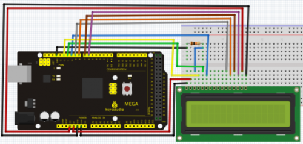

After the connection, upload below code to the controller board and see how it goes.

```
int LCD1602_RS=12;   
int LCD1602_RW=11;   
int LCD1602_EN=10;   
int DB[] = { 6, 7, 8, 9};
char str1[]="Welcome to";
char str2[]="geek-workshop";
char str3[]="this is the";
char str4[]="4-bit interface";

void LCD_Command_Write(int command)
{
    int i,temp;
    digitalWrite( LCD1602_RS,LOW);
    digitalWrite( LCD1602_RW,LOW);
    digitalWrite( LCD1602_EN,LOW);

    temp=command & 0xf0;
    for (i=DB[0]; i <= 9; i++)
    {
       digitalWrite(i,temp & 0x80);
       temp <<= 1;
    }

    digitalWrite( LCD1602_EN,HIGH);
    delayMicroseconds(1);
    digitalWrite( LCD1602_EN,LOW);

    temp=(command & 0x0f)<<4;
    for (i=DB[0]; i <= 10; i++)
    {
       digitalWrite(i,temp & 0x80);
       temp <<= 1;
    }
    digitalWrite( LCD1602_EN,HIGH);
    delayMicroseconds(1); 
    digitalWrite( LCD1602_EN,LOW);
}

void LCD_Data_Write(int dat)
{
    int i=0,temp;
    digitalWrite( LCD1602_RS,HIGH);
    digitalWrite( LCD1602_RW,LOW);
    digitalWrite( LCD1602_EN,LOW);

    temp=dat & 0xf0;
    for (i=DB[0]; i <= 9; i++)
    {
       digitalWrite(i,temp & 0x80);
       temp <<= 1;
    }

    digitalWrite( LCD1602_EN,HIGH);
    delayMicroseconds(1);
    digitalWrite( LCD1602_EN,LOW);

    temp=(dat & 0x0f)<<4;
    for (i=DB[0]; i <= 10; i++)
    {
       digitalWrite(i,temp & 0x80);
       temp <<= 1;
    }

    digitalWrite( LCD1602_EN,HIGH);
    delayMicroseconds(1); 
    digitalWrite( LCD1602_EN,LOW);
}

void LCD_SET_XY( int x, int y )
{
    int address;
    if (y ==0)    address = 0x80 + x;
    else          address = 0xC0 + x;
    LCD_Command_Write(address); 
}

void LCD_Write_Char( int x,int y,int dat)
{
    LCD_SET_XY( x, y ); 
    LCD_Data_Write(dat);
}

void LCD_Write_String(int X,int Y,char *s)
{
    LCD_SET_XY( X, Y );    // address setup 
    while (*s)             // write character string
    {
      LCD_Data_Write(*s);   
      s ++;
    }
}

void setup (void) 
{
    int i = 0;
    for (i=6; i <= 12; i++) 
    {
      pinMode(i,OUTPUT);
    }
    delay(100);
    LCD_Command_Write(0x28);// 4 wires, 2 lines 5x7
    delay(50); 
    LCD_Command_Write(0x06);
    delay(50); 
    LCD_Command_Write(0x0c);
    delay(50); 
    LCD_Command_Write(0x80);
    delay(50); 
    LCD_Command_Write(0x01);
    delay(50); 
}

void loop (void)
{
    LCD_Command_Write(0x01);
    delay(50);
    LCD_Write_String(3,0,str1);// line 1, start at the fourth address
    delay(50);
    LCD_Write_String(1,1,str2);// line 2, start at the second address
    delay(5000);
    LCD_Command_Write(0x01);
    delay(50);
    LCD_Write_String(0,0,str3);
    delay(50);
    LCD_Write_String(0,1,str4);
    delay(5000); 
}
```

### Project 21: 9g servo control


**Introduction**

Servomotor is a position control rotary actuator. It mainly consists of housing, circuit board, core-less motor, gear and position sensor. The receiver or MCU outputs a signal to the servomotor. The motor has a built-in reference circuit that gives out reference signal, cycle of 20ms and width of 1.5ms. The motor compares the acquired DC bias voltage to the voltage of the potentiometer and outputs a voltage difference. The IC on the circuit board will decide the rotate direction accordingly and drive the core-less motor. The gear then pass the force to the shaft. The sensor will determine if it has reached the commanded position according to the feedback signal. Servomotors are used in control systems that requires to have and maintain different angles. When the motor speed is definite, the gear will  cause the potentiometer to  rotate. When the voltage difference reduces to zero, the motor stops. Normally, the rotation angle range is among 0-180 degrees.

Servomotor comes with many specifications. But all of them have three connection wires, distinguished by brown, red, orange colors(different brand may have different color). Brown one is for GND, red one for power positive, orange one for signal line.

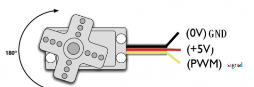

The rotate angle of the servo motor is controlled by regulating the duty cycle of the PWM(Pulse-Width Modulation) signal. The standard cycle of the PWM signal is 20ms（50Hz）. Theoretically, the width is distributed between 1ms-2ms, but in fact, it's between 0.5ms-2.5ms. The width corresponds the rotate angle from 0° to 180°. But note that for different brand motor, the same signal may have different rotate angle. 


After some basic knowledge, let's learn how to control a servomotor. For this experiment, you only need a servomotor and several jumper wires.

**Hardware required**

9G servo motor * 1
Breadboard jumper wire*several

**Connection & sample program**

There are two ways to control a servomotor with Arduino. One is to use a common digital sensor port of Arduino to produce square wave with different duty cycle to simulate PWM signal and use that signal to control the positioning of the motor. Another way is to directly use the Servo function of the Arduino to control the motor. In this way, the program will be easier but it can only control two-contact motor because for the servo function, only digital pin 9 ang 10 can be used. The Arduino drive capacity is limited. So if you need to control more than one motor, you will need external power.

**Method 1**

**Connection for REV4**

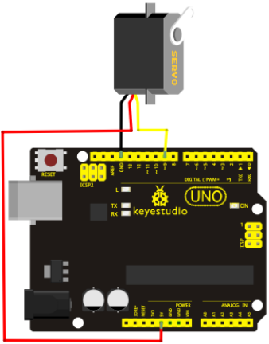

**Connection for 2560 R3**

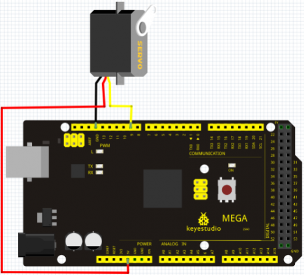

Connect the motor to digital pin 9. Compile a program to control the motor to rotate to the commanded angle input by the user and display the angle on the screen.

**Sample code A**

```
int servopin=9;// select digital pin 9 for servomotor signal line
int myangle;// initialize angle variable
int pulsewidth;// initialize width variable
int val;

void servopulse(int servopin,int myangle)// define a servo pulse function
{
    pulsewidth=(myangle*11)+500;// convert angle to 500-2480 pulse width
    digitalWrite(servopin,HIGH);// set the level of servo pin as “high”
    delayMicroseconds(pulsewidth);// delay microsecond of pulse width
    digitalWrite(servopin,LOW);// set the level of servo pin as “low”
    delay(20-pulsewidth/1000);
}

void setup()
{
    pinMode(servopin,OUTPUT);// set servo pin as “output”
    Serial.begin(9600);// connect to serial port, set baud rate at “9600”
    Serial.println("servo=o_seral_simple ready" ) ;
}


void loop()// convert number 0 to 9 to corresponding 0-180 degree angle, LED blinks corresponding number of time
{
    val=Serial.read();// read serial port value
    if(val>='0'&&val<='9')
    {
        val=val-'0';// convert characteristic quantity to numerical variable
        val=val*(180/9);// convert number to angle
        Serial.print("moving servo to ");
        Serial.print(val,DEC);
        Serial.println();
        for(int i=0;i<=50;i++) // giving the servo time to rotate to commanded position
        {
            servopulse(servopin,val);// use the pulse function
        }
    }
}
```

**Method 2:**

Let's first take a look at the Arduino built-in servo function and some of its common statements.

1. attach（interface）——select pin for servo, can only use pin 9 or 10.
2. write（angle）——used to control the rotate angle of the servo, can set the angle among 0 degree to 180 degree.
3. read（）——used to read the angle of the servo, consider it a function to read the value in the write() function.

4. attached（）——determine whether the parameter of the servo is sent to the servo pin.
5. detach（）—— disconnect the servo and the pin, and the pin(digital pin 9 or 10) can be used for PWM port.
6. Note: the written form of the above statements are " servo variable name. specific statement ()", e.g. myservo. Attach (9).

Still, connect the servo to pin 9.

```
#include <Servo.h>

/* 
define a header file. Special attention here, you can call the servo function directly from Arduino's software menu  bar Sketch>Importlibrary>Servo, or input #include <Servo.h>. Make sure there is a space between #include and  <Servo.h>. Otherwise, it will cause compile error.
*/

Servo myservo;// define servo variable name

void setup()
{
	myservo.attach(9);// select servo pin(9 or 10)
}

void loop()
{
	myservo.write(90);// set rotate angle of the motor
}
```

Above are the two methods to control the servo. You can choose either one according to your liking or actual need. 

### Project 22: 5V Stepper Motor


**Introduction**

A stepper motor is an electromechanical device which converts electrical pulses into discrete mechanical movements. The shaft or spindle of a stepper motor rotates in discrete step increments when electrical command pulses are applied to it in the proper sequence. The motors rotation has several direct relationships to these applied input pulses. The sequence of the applied pulses is directly related to the direction of motor shafts rotation. The speed of the motor shafts rotation is directly related to the frequency of the input pulses and the length of rotation is directly related to the number of input pulses applied.One of the most significant advantages of a stepper motor is its ability to be accurately controlled in an open loop system. Open loop control means no feedback information about position is needed. This type of control eliminates the need for expensive sensing and feedback devices such as optical encoders. Your position is known simply by keeping track of the input step pulses.

**Features**

The rotation angle of the motor is proportional to the input pulse.

The motor has full torque at standstill(if the windings are energized)

Precise positioning and repeatability of movement since good stepper motors have an accuracy of – 5% of a step and this error is non cumulative from one step to the next.

Excellent response to starting/stopping/reversing.

Very reliable since there are no contact brushes in the motor. Therefore the life of the motor is simply dependant on the life of the bearing.

The motors response to digital input pulses provides open-loop control, making the motor simpler and less costly to control.

It is possible to achieve very low speed synchronous rotation with a load that is directly coupled to the shaft.

A wide range of rotational speeds can be realized as the speed is proportional to the frequency of the input pulses.

Stepper motor 28BYJ-48 Parameters

Model: 28BYJ-48

Rated voltage: 5VDC

Number of Phase: 4

Speed Variation Ratio: 1/64

Stride Angle: 5.625° /64

Frequency : 100Hz

DC resistance: 50Ω±7%(25℃)

Idle In-traction Frequency : > 600Hz

Idle Out-traction Frequency : > 1000Hz

In-traction Torque >34.3mN.m(120Hz)

Self-positioning Torque >34.3mN.m

Friction torque : 600-1200 gf.cm

Pull in torque : 300 gf.cm

Insulated resistance >10MΩ(500V)

Insulated electricity power: 600VAC/1mA/1s

Insulation grade: A

Rise in Temperature <40K(120Hz)

Noise <35dB(120Hz,No load,10cm)

**Circuit connection**

**Connection for REV4**


**Connection for 2560 R3**


**Sample code**

```
#include <Stepper.h>   
#define STEPS 100  
Stepper stepper(STEPS, 8, 9, 10, 11);  
int previous = 0;  
void setup()
{
  stepper.setSpeed(90);
} 

void loop()
{    
   int val = analogRead(0);      
   stepper.step(val - previous);     
   previous = val;
}
```

### Project 23: PIR Motion Sensor

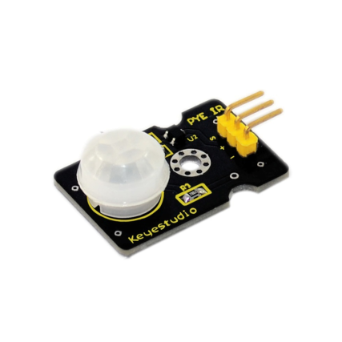

**Introduction**

Pyroelectric infrared motion sensor can detect infrared signals from a moving person or moving animal, and output switching signals. It can be applied to a variety of occasions to detect the movement of human body. Conventional pyroelectric infrared sensors require body pyroelectric infrared detector, professional chip, complex peripheral circuit, so the size is bigger, with complex circuit, and lower reliability. Now we launch this new pyroelectric infrared motion sensor, specially designed for Arduino. It uses an integrated digital body pyroelectric infrared sensor, has smaller size, higher reliability, lower power consumption and simpler peripheral circuit. 

**Specification**

Input Voltage: 3.3 ~ 5V, 6V Maximum Working Current: 15uA Working Temperature: -20 ~ 85 ℃ Output Voltage: High 3V, low 0V Output Delay Time (High Level): About 2.3 to 3 Seconds Detection angle: 100 ° Detection distance: 7 meters Output Indicator LED (When output HIGH, it will be ON) Pin limit current: 100mA Size: 30*20mm Weight: 4g

**Circuit connection**

**Connection for REV4**

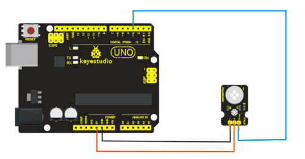

**Connection for 2560 R3**

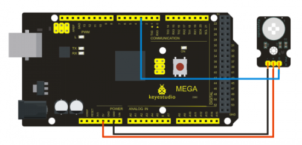

**Sample code**

```
byte sensorPin = 3;
byte indicator = 13;

void setup()
{
  pinMode(sensorPin,INPUT);
  pinMode(indicator,OUTPUT);
  Serial.begin(9600);
}

void loop()
{
  byte state = digitalRead(sensorPin);
  digitalWrite(indicator,state);
  if(state == 1)
  	Serial.println("Somebody is in this area!");
  else(state == 0)
  	Serial.println("No one!");
  delay(500);
}
```

## Contents


- [1keyestudio Advanced Study Kit for Arduino](https://wiki.keyestudio.com/Ks0074(75,_76)_keyestudio_Advanced_Study_Kit_for_Arduino#keyestudio_Advanced_Study_Kit_for_Arduino)
- [2Kit Introduction](https://wiki.keyestudio.com/Ks0074(75,_76)_keyestudio_Advanced_Study_Kit_for_Arduino#Kit_Introduction)
- 3Introduction of keyestudio REV4 Board
  - [3.1Overview](https://wiki.keyestudio.com/Ks0074(75,_76)_keyestudio_Advanced_Study_Kit_for_Arduino#Overview)
  - [3.2Parameters](https://wiki.keyestudio.com/Ks0074(75,_76)_keyestudio_Advanced_Study_Kit_for_Arduino#Parameters)
  - [3.3User](https://wiki.keyestudio.com/Ks0074(75,_76)_keyestudio_Advanced_Study_Kit_for_Arduino#User)
- 4Introduction of keyestudio Mega 2560 R3 board
  - [4.1Introduction](https://wiki.keyestudio.com/Ks0074(75,_76)_keyestudio_Advanced_Study_Kit_for_Arduino#Introduction)
  - [4.2Design of Power Supply](https://wiki.keyestudio.com/Ks0074(75,_76)_keyestudio_Advanced_Study_Kit_for_Arduino#Design_of_Power_Supply)
  - [4.3Summary](https://wiki.keyestudio.com/Ks0074(75,_76)_keyestudio_Advanced_Study_Kit_for_Arduino#Summary)
  - [4.4Procedure for Installing Arduino Driver](https://wiki.keyestudio.com/Ks0074(75,_76)_keyestudio_Advanced_Study_Kit_for_Arduino#Procedure_for_Installing_Arduino_Driver)
- [5Components List](https://wiki.keyestudio.com/Ks0074(75,_76)_keyestudio_Advanced_Study_Kit_for_Arduino#Components_List)
- 6Project Details
  - [6.1Project 1: Hello World](https://wiki.keyestudio.com/Ks0074(75,_76)_keyestudio_Advanced_Study_Kit_for_Arduino#Project_1:_Hello_World)
  - [6.2Project 2: LED blinking](https://wiki.keyestudio.com/Ks0074(75,_76)_keyestudio_Advanced_Study_Kit_for_Arduino#Project_2:_LED_blinking)
  - [6.3Project 3: PWM](https://wiki.keyestudio.com/Ks0074(75,_76)_keyestudio_Advanced_Study_Kit_for_Arduino#Project_3:_PWM)
  - [6.4Project 4: Traffic light](https://wiki.keyestudio.com/Ks0074(75,_76)_keyestudio_Advanced_Study_Kit_for_Arduino#Project_4:_Traffic_light)
  - [6.5Project 5: LED chasing effect](https://wiki.keyestudio.com/Ks0074(75,_76)_keyestudio_Advanced_Study_Kit_for_Arduino#Project_5:_LED_chasing_effect)
  - [6.6Project 6: Button-controlled LED](https://wiki.keyestudio.com/Ks0074(75,_76)_keyestudio_Advanced_Study_Kit_for_Arduino#Project_6:_Button-controlled_LED)
  - [6.7Project 7: Active buzzer](https://wiki.keyestudio.com/Ks0074(75,_76)_keyestudio_Advanced_Study_Kit_for_Arduino#Project_7:_Active_buzzer)
  - [6.8Project 8: Passive Buzzer](https://wiki.keyestudio.com/Ks0074(75,_76)_keyestudio_Advanced_Study_Kit_for_Arduino#Project_8:_Passive_Buzzer)
  - [6.9Project 9: RGB LED](https://wiki.keyestudio.com/Ks0074(75,_76)_keyestudio_Advanced_Study_Kit_for_Arduino#Project_9:_RGB_LED)
  - [6.10Project 10: Photo resistor](https://wiki.keyestudio.com/Ks0074(75,_76)_keyestudio_Advanced_Study_Kit_for_Arduino#Project_10:_Photo_resistor)
  - [6.11Project 11: Flame Sensor](https://wiki.keyestudio.com/Ks0074(75,_76)_keyestudio_Advanced_Study_Kit_for_Arduino#Project_11:_Flame_Sensor)
  - [6.12Project 12: LM35 temperature sensor](https://wiki.keyestudio.com/Ks0074(75,_76)_keyestudio_Advanced_Study_Kit_for_Arduino#Project_12:_LM35_temperature_sensor)
  - [6.13Project 13: Tilt switch](https://wiki.keyestudio.com/Ks0074(75,_76)_keyestudio_Advanced_Study_Kit_for_Arduino#Project_13:_Tilt_switch)
  - [6.14Project 14: IR remote control](https://wiki.keyestudio.com/Ks0074(75,_76)_keyestudio_Advanced_Study_Kit_for_Arduino#Project_14:_IR_remote_control)
  - [6.15Project 15: Analog value reading](https://wiki.keyestudio.com/Ks0074(75,_76)_keyestudio_Advanced_Study_Kit_for_Arduino#Project_15:_Analog_value_reading)
  - [6.16Project 16: 74HC595](https://wiki.keyestudio.com/Ks0074(75,_76)_keyestudio_Advanced_Study_Kit_for_Arduino#Project_16:_74HC595)
  - [6.17Project 17: 1-digit LED segment display](https://wiki.keyestudio.com/Ks0074(75,_76)_keyestudio_Advanced_Study_Kit_for_Arduino#Project_17:_1-digit_LED_segment_display)
  - [6.18Project 18: 4-digit LED segment display](https://wiki.keyestudio.com/Ks0074(75,_76)_keyestudio_Advanced_Study_Kit_for_Arduino#Project_18:_4-digit_LED_segment_display)
  - [6.19Project 19: 8*8 LED matrix](https://wiki.keyestudio.com/Ks0074(75,_76)_keyestudio_Advanced_Study_Kit_for_Arduino#Project_19:_8*8_LED_matrix)
  - [6.20Project 20: 1602 LCD](https://wiki.keyestudio.com/Ks0074(75,_76)_keyestudio_Advanced_Study_Kit_for_Arduino#Project_20:_1602_LCD)
  - [6.21Project 21: 9g servo control](https://wiki.keyestudio.com/Ks0074(75,_76)_keyestudio_Advanced_Study_Kit_for_Arduino#Project_21:_9g_servo_control)
  - [6.22Project 22: 5V Stepper Motor](https://wiki.keyestudio.com/Ks0074(75,_76)_keyestudio_Advanced_Study_Kit_for_Arduino#Project_22:_5V_Stepper_Motor)
  - [6.23Project 23: PIR Motion Sensor](https://wiki.keyestudio.com/Ks0074(75,_76)_keyestudio_Advanced_Study_Kit_for_Arduino#Project_23:_PIR_Motion_Sensor)
  - [6.24Project 24: Analog Gas Sensor](https://wiki.keyestudio.com/Ks0074(75,_76)_keyestudio_Advanced_Study_Kit_for_Arduino#Project_24:_Analog_Gas_Sensor)
  - [6.25Project 25: ADXL345 Three Axis Acceleration Module](https://wiki.keyestudio.com/Ks0074(75,_76)_keyestudio_Advanced_Study_Kit_for_Arduino#Project_25:_ADXL345_Three_Axis_Acceleration_Module)
  - [6.26Project 26: HC-SR04 Ultrasonic Sensor](https://wiki.keyestudio.com/Ks0074(75,_76)_keyestudio_Advanced_Study_Kit_for_Arduino#Project_26:_HC-SR04_Ultrasonic_Sensor)
  - [6.27Project 27: Joystick Module](https://wiki.keyestudio.com/Ks0074(75,_76)_keyestudio_Advanced_Study_Kit_for_Arduino#Project_27:_Joystick_Module)
  - [6.28Project 28: 5V Relay Module](https://wiki.keyestudio.com/Ks0074(75,_76)_keyestudio_Advanced_Study_Kit_for_Arduino#Project_28:_5V_Relay_Module)
- [7Resources](https://wiki.keyestudio.com/Ks0074(75,_76)_keyestudio_Advanced_Study_Kit_for_Arduino#Resources)
- [8Buy from](https://wiki.keyestudio.com/Ks0074(75,_76)_keyestudio_Advanced_Study_Kit_for_Arduino#Buy_from)

## keyestudio Advanced Study Kit for Arduino


[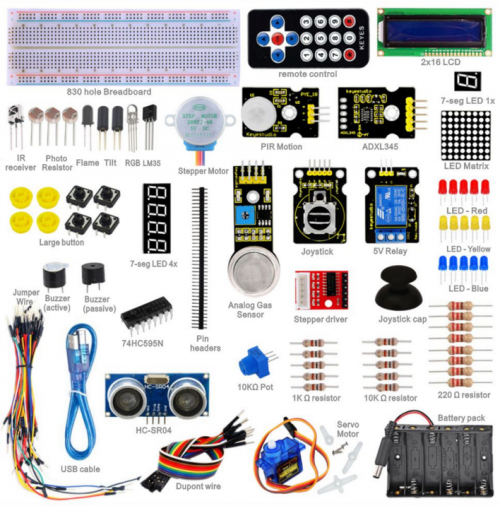](https://wiki.keyestudio.com/File:741.png)

## Kit Introduction

Arduino advanced study kit walks you through the basics of using the Arduino in a hands-on way. You'll learn through building several creative projects. The kit includes a selection of the most common and useful electronic components with a book of 28 projects. Starting the basics of electronics, to more complex projects, the kit will help you control the physical world with sensor and actuators.

## Introduction of keyestudio REV4 Board


[](https://wiki.keyestudio.com/File:0069-2G.png)

### Overview

Keyestudio REV4 is a microcontroller board based on the ATmega328. It has 14 digital input/output pins (of which 6 can be used as PWM outputs), 6 analog inputs, a 16 MHz ceramic resonator, a USB connection, a power jack, an ICSP header, and a reset button. It contains everything needed to support the microcontroller; simply connect it to a computer with a USB cable or power it with a AC-to-DC adapter or battery to get started.

The REV4 differs from all preceding boards in that it does not use the FTDI USB-to-serial driver chip. Instead, it features the Atmega16U2 programmed as a USB-to-serial converter.

### Parameters

- 1. Microcontroller core: AVRmega328P-PU ( Processing speed 20MIPS)
- 2. Working voltage: +5V
- 3. External input voltage：+7V~+12V（suggest）
- 4. External input voltage ( extremum ): +6V≤ Vin ≤ ＋20V
- 5. Digital signal I/O interface: 14 ( 6 PWM input interface)
- 6. Analog signal input interface: 6
- 7. DC I/O interface current: 40mA
- 8. Flash capacity: 32KB( other 2k used in hootloader)
- 9. SRAM static storage capacity
- 10. EEPROM storage capacity: 512bytes
- 11. Clock frequency：16MHZ

### User

- 1 | Download the Arduino Environment

Get the latest version from the [download page](https://www.arduino.cc/en/Main/Software).
When the download finishes, unzip the downloaded file. Make sure to preserve the folder structure. Double-click the folder to open it. There should be a few files and sub-folders inside.

- 2 | Connect the Board

The Arduino Uno, Mega, Duemilanove and Arduino Nano automatically draw power from either the USB connection to the computer or an external power supply. If you're using an Arduino Diecimila, you'll need to make sure that the board is configured to draw power from the USB connection. The power source is selected with a jumper, a small piece of plastic that fits onto two of the three pins between the USB and power jacks. Check that it's on the two pins closest to the USB port.
Connect the Arduino board to your computer using the USB cable. The green power LED (labelled PWR) should go on.

- 3 | Install the drivers

Installing drivers for the [Arduino Uno](https://www.arduino.cc/en/Main/ArduinoBoardUno) or [Arduino Mega 2560](https://www.arduino.cc/en/Main/ArduinoBoardMega2560) with Windows 7, Vista, or XP:
Plug in your board and wait for Windows to begin it's driver installation process. After a few moments, the process will fail, despite its best efforts Click on the Start Menu, and open up the Control Panel.
While in the Control Panel, navigate to System and Security. Next, click on System. Once the System window is up, open the Device Manager.
Look under Ports (COM & LPT). You should see an open port named "Arduino UNO (COMxx)". If there is no COM & LPT section, look under "Other Devices" for "Unknown Device".
Right click on the "Arduino UNO (COmxx)" port and choose the "Update Driver Software" option.
Next, choose the "Browse my computer for Driver software" option.
Finally, navigate to and select the driver file named "arduino.inf", located in the "Drivers" folder of the Arduino Software download (not the "FTDI USB Drivers" sub-directory). If you are using an old version of the IDE (1.0.3 or older), choose the Uno driver file named "Arduino UNO.inf"
Windows will finish up the driver installation from there.

See also: [step-by-step screenshots for installing the Uno under Windows XP](https://www.arduino.cc/en/Guide/UnoDriversWindowsXP). Installing drivers for the [Arduino Duemilanove](https://www.arduino.cc/en/Main/ArduinoBoardDuemilanove), [Nano](https://www.arduino.cc/en/Main/ArduinoBoardNano), or [Diecimila](https://www.arduino.cc/en/Main/ArduinoBoardDiecimila) with Windows7, Vista, or XP: When you connect the board, Windows should initiate the driver installation process (if you haven't used the computer with an Arduino board before). On Windows Vista, the driver should be automatically downloaded and installed. (Really, it works!) On Windows XP, the Add New Hardware wizard will open: When asked Can Windows connect to Windows Update to search for software? select No, not this time. Click next. Select Install from a list or specified location (Advanced) and click next. Make sure that Search for the best driver in these locations is checked; uncheck Search removable media; check Include this location in the search and browse to the drivers/FTDI USB Drivers directory of the Arduino distribution. (The latest version of the drivers can be found on the [FTDI website](http://www.ftdichip.com/Drivers/VCP.htm).) Click next. The wizard will search for the driver and then tell you that a "USB Serial Converter" was found. Click finish. The new hardware wizard will appear again. Go through the same steps and select the same options and location to search. This time, a "USB Serial Port" will be found. You can check that the drivers have been installed by opening the Windows Device Mananger (in the Hardware tab of System control panel). Look for a "USB Serial Port" in the Ports section; that's the Arduino board.

- 4 | Launch the Arduino application

Double-click the Arduino application. (Note: if the Arduino software loads in the wrong language, you can change it in the preferences dialog. See the [environment page](https://www.arduino.cc/en/Guide/Environment) for details.)

- 5 | Open the blink example

Open the LED blink example sketch: File > Examples > 1.Basics > Blink.
[](https://wiki.keyestudio.com/File:743.png)

- 6 | Select your board

You'll need to select the entry in the Tools > Board menu that corresponds to your Arduino.
[](https://wiki.keyestudio.com/File:744.png)

**Selecting an Arduino Uno**
For Duemilanove Arduino boards with an ATmega328 (check the text on the chip on the board), select Arduino Duemilanove or Nano w/ ATmega328. Previously, Arduino boards came with an ATmega168; for those, select Arduino Diecimila, Duemilanove, or Nano w/ ATmega168. (Details of the board menu entries are available on the [environment page](https://www.arduino.cc/en/Guide/Environment).)

- 7 | Select your serial port

Select the serial device of the Arduino board from the Tools | Serial Port menu. This is likely to be COM3 or higher (COM1and COM2 are usually reserved for hardware serial ports). To find out, you can disconnect your Arduino board and re-open the menu; the entry that disappears should be the Arduino board. Reconnect the board and select that serial port.

- 8 | Upload the program

Now, simply click the "Upload" button in the environment. Wait a few seconds - you should see the RX and TX leds on the board flashing. If the upload is successful, the message "Done uploading." will appear in the status bar. (Note: If you have an Arduino Mini, NG, or other board, you'll need to physically present the reset button on the board immediately before pressing the upload button.)
[](https://wiki.keyestudio.com/File:745.png)

A few seconds after the upload finishes, you should see the pin 13 (L) LED on the board start to blink (in orange). If it does, congratulations! You've gotten Arduino up-and-running. If you have problems, please see the [troubleshooting suggestions](https://www.arduino.cc/en/Guide/Troubleshooting). You might also want to look at: the [examples](https://www.arduino.cc/en/Tutorial/HomePage) for using various sensors and actuators the [reference](https://www.arduino.cc/en/Reference/HomePage) for the Arduino language The text of the Arduino getting started guide is licensed under a [Creative Commons Attribution-ShareAlike 3.0 License](https://creativecommons.org/licenses/by-sa/3.0/). Code samples in the guide are released into the public domain.

## Introduction of keyestudio Mega 2560 R3 board


[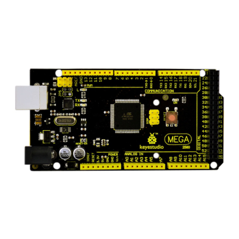](https://wiki.keyestudio.com/File:746.png)

### Introduction

Keyestudio Mega (core to ATmega2560) is a development board (used with16MHz crystal oscillator ) of microcontroller. There 54 groups of  I/O (input/output ) digital ends (of which 14 group to do PWM output), 16 groups of simulation analogy input ends and 4 groups of UART (hardwareserial ports) in it . Because its bootloader, process can be downloaded directly with the USB and you don’t need to use other external programmer. And its power can be supplied by the USB, or the AC-to-DC adapter and battery can be also as an external power supply.

Opening source code and using C language developed status in Java concept (cross platform) make a rapid growth of Arduino peripheral module and application. The main reason to attract Artist to use Arduino is that they can quickly use all kinds of software communication such as Arduino language and Flash or Processing and so on. and make multimedia interactive works. Development interface of Arduino IDE is based on the principle of opening source code, which you can download freely used in the thematic making, school teaching, television controlling, interactive works and so on.

### Design of Power Supply

There are two choices (direct power supply trough USB or external power supply) for the power supply system of Arduino Mega, and they can be Automatic switched. External power supply can be AC-to-DC adapter or battery. Lit rang of voltage of this control board is 6V~12V, but if the supplied voltage is greater than 12V, the voltage stabilizing device will be likely overheated and overheat protection and damaging Arduino MEGA will be more likely to occur. So we suggest the power supply should be 6.5~12V in operation and recommended supply is 7.5 or 9V.

### Summary

Microcontroller:ATmega2560
Operating Voltage:5V
Input Voltage (recommended):7-12V
Input Voltage (limits):6-20V
Digital I/O Pins:54 (of which 15 provide PWM output)
Analog Input Pins:16
DC Current per I/O Pin: 40 mA
DC Current for 3.3V Pin:50 mA
Flash Memory:256 KB of which 8 KB used by bootloader
SRAM:8 KB
EEPROM:4 KB
Clock Speed:16 MHz

### Procedure for Installing Arduino Driver

To download the Arduino developing software on the web address: [http:/arduino.cc/en/Main/Software](https://www.arduino.cc/en/Main/Software). The downloaded file is arduino-1.0.zip,a compressed folder, to decompress it to the hard disk.

When 2560R3 Developing Board is connected to the Windows through the USB line, Windows will prompt a new USB device is found, then it will lead us into the "found new hardware wizard" window.

The next step is to install 2560R3 driver required, selecting the option of "install from a list or specific location (Senior)" and click "next" button:
To put the driver into the driver directory of Arduino 1.0 installation directory, and we need to specify this directory to be the searched directory when installing the driver.

Click "next" button, Windows begins to find and install Arduino driving procedure.
If all goes well, we will see the success interface as follows:

After the installation of Arduino driver is successful, we can find the corresponding Arduino serial port in the Windows device manager:

Well, the next is to test driver installation.
Testing code:
[](https://wiki.keyestudio.com/File:747.png)

Copy the code above to Arduino status , select the model 2560 and port, and then upload the code. To wait a moment and the results came out, then you will see the LED flashing at D13 of your 2560r3 board and the time interval is 1s, and then we know that is ok.

## Components List

| No.  | Product Name                           | Quantity | Picture                                                      |
| ---- | -------------------------------------- | -------- | ------------------------------------------------------------ |
| 1    | LED - Blue                             | 5        | [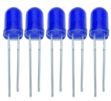](https://wiki.keyestudio.com/File:761.png) |
| 2    | LED - Red                              | 5        | [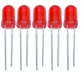](https://wiki.keyestudio.com/File:762.png) |
| 3    | LED - Yellow                           | 5        | [](https://wiki.keyestudio.com/File:763.png) |
| 4    | LED - RGB                              | 1        | [](https://wiki.keyestudio.com/File:764.png) |
| 5    | 220 Ω resistor                         | 8        | [](https://wiki.keyestudio.com/File:765.png) |
| 6    | 10K Ω resistor                         | 5        | [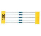](https://wiki.keyestudio.com/File:766.png) |
| 7    | 1K Ω resistor                          | 5        | [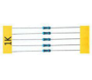](https://wiki.keyestudio.com/File:767.png) |
| 8    | 10K Ω Pot                              | 1        | [](https://wiki.keyestudio.com/File:768.png) |
| 9    | Buzzer (active)                        | 1        | [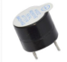](https://wiki.keyestudio.com/File:769.png) |
| 10   | Buzzer (passive)                       | 1        | [](https://wiki.keyestudio.com/File:7610.png) |
| 11   | Large button switch                    | 4        | [](https://wiki.keyestudio.com/File:QQ图片20200107084244.png) |
| 12   | Ball tilt sensor                       | 2        | [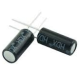](https://wiki.keyestudio.com/File:7612.png) |
| 13   | Photo Resistor                         | 3        | [](https://wiki.keyestudio.com/File:7613a.png)  [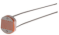](https://wiki.keyestudio.com/File:7613b.png)  [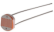](https://wiki.keyestudio.com/File:7613c.png) |
| 14   | Flame sensor                           | 1        | [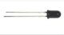](https://wiki.keyestudio.com/File:7614.png) |
| 15   | LM35 Temp Sensor                       | 1        | [](https://wiki.keyestudio.com/File:7615.png) |
| 16   | IC 74HC595N 16-pin DIP                 | 1        | [](https://wiki.keyestudio.com/File:7616.png) |
| 17   | 7-seg LED 1x module                    | 1        | [](https://wiki.keyestudio.com/File:7617.png) |
| 18   | 7-seg LED 4x module                    | 1        | [](https://wiki.keyestudio.com/File:7618.png) |
| 19   | 8*8 LED Matrix                         | 1        | [](https://wiki.keyestudio.com/File:7619.png) |
| 20   | 2x16 LCD display                       | 1        | [](https://wiki.keyestudio.com/File:7620.png) |
| 21   | IR receiver                            | 1        | [](https://wiki.keyestudio.com/File:7621.png) |
| 22   | IR remote control                      | 1        | [](https://wiki.keyestudio.com/File:7622.png) |
| 23   | Servo Motor                            | 1        | [](https://wiki.keyestudio.com/File:7623.png) |
| 24   | Stepper driver module                  | 1        | [](https://wiki.keyestudio.com/File:7624.png) |
| 25   | Stepper Motor                          | 1        | [](https://wiki.keyestudio.com/File:7625.png) |
| 26   | Joystick module                        | 1        | [](https://wiki.keyestudio.com/File:7626.png) |
| 27   | Relay module                           | 1        | [](https://wiki.keyestudio.com/File:7627.png) |
| 28   | PIR Motion Sensor                      | 1        | [](https://wiki.keyestudio.com/File:7628.png) |
| 29   | Analog Gas Sensor                      | 1        | [](https://wiki.keyestudio.com/File:7629.png) |
| 30   | ADXL345 Three Axis Acceleration Module | 1        | [](https://wiki.keyestudio.com/File:7630.png) |
| 31   | HC-SR04 Ultrasonic Sensor              | 1        | [](https://wiki.keyestudio.com/File:7631.png) |
| 32   | Pin headers                            | 40       | [](https://wiki.keyestudio.com/File:7632.png) |
| 33   | 830 hole Breadboard                    | 1        | [](https://wiki.keyestudio.com/File:7633.png) |
| 34   | Dupont connector wires                 | 10       | [](https://wiki.keyestudio.com/File:7634.png) |
| 35   | Jumper Wire                            | 30       | [](https://wiki.keyestudio.com/File:7635.png) |
| 36   | 6-cell AA Battery pack                 | 1        | [](https://wiki.keyestudio.com/File:7636.png) |
| 37   | USB cable                              | 1        | [](https://wiki.keyestudio.com/File:7637.png) |
| 38   | Resistance color ring meter            | 1        | [](https://wiki.keyestudio.com/File:80-56.png) |

## Project Details

### Project 1: Hello World

**Introduction**

As for starters, we will begin with something simple. In this project, you only need an Arduino and a USB cable to start the "Hello World!" experiment. This is a communication test of your Arduino and PC, also a primer project for you to have your first try of the Arduino world!

**Hardware Required**

1. Arduino board x1
2. USB cable x1


**Sample Code**
After installing driver for Arduino, let's open Arduino software and compile code that enables Arduino to print "Hello World!" under your instruction. Of course, you can compile code for Arduino to continuously echo "Hello World!" without instruction. A simple If () statement will do the instruction trick. With the onboard LED connected to pin 13, we can instruct the LED to blink first when Arduino gets an instruction and then print "Hello World!”.

```
//////////////////////////////////////////////////////////
int val;//define variable val
int ledpin=13;// define digital interface 13
void setup()
{
  Serial.begin(9600);// set the baud rate at 9600 to match the software set up. When connected to a specific device, (e.g. bluetooth), the baud rate needs to be the same with it.
  pinMode(ledpin,OUTPUT);// initialize digital pin 13 as output. When using I/O ports on an Arduino, this kind of set up is always needed.
}
void loop()
{
  val=Serial.read();// read the instruction or character from PC to Arduino, and assign them to Val.
  if(val=='R')// determine if the instruction or character received is “R”.
  {  // if it’s “R”,    
    digitalWrite(ledpin,HIGH);// set the LED on digital pin 13 on. 
    delay(500);
    digitalWrite(ledpin,LOW);// set the LED on digital pin 13 off.    delay(500);
    Serial.println("Hello World!");// display“Hello World！”string.
  }
}
////////////////////////////////////////////////////////////////
```

**Result**


[](https://wiki.keyestudio.com/File:748.png)
Click serial port monitor,Input R,LED 13 will blink once,PC will receive information from Arduino: Hello World


[](https://wiki.keyestudio.com/File:749.png)
After you choosing the right port，the experiment should be easy for you!


### Project 2: LED blinking


[](https://wiki.keyestudio.com/File:7410.png)

**Introduction**

Blinking LED experiment is quite simple. In the "Hello World!" program, we have come across LED. This time, we are going to connect an LED to one of the digital pins rather than using LED13, which is soldered to the board. Except an Arduino and an USB cable, we will need extra parts as below:

**Hardware Required**

1. Red M5 LED*1
2. 220Ω resistor*1
3. Breadboard*1
4. Breadboard jumper wires* several


We follow below diagram from the experimental schematic link. Here we use digital pin 10. We connect LED to a 220 ohm resistor to avoid high current damaging the LED.

**Connection for REV4**


[](https://wiki.keyestudio.com/File:0074-1G.png)

**Connection for 2560 R3**


[](https://wiki.keyestudio.com/File:7412.png)

**Sample Code**

```
//////////////////////////////////////////////////////////
int ledPin = 10; // define digital pin 10.
void setup()
{
pinMode(ledPin, OUTPUT);// define pin with LED connected as output.
}
void loop()
{
digitalWrite(ledPin, HIGH); // set the LED on.
delay(1000); // wait for a second.
digitalWrite(ledPin, LOW); // set the LED off.
delay(1000); // wait for a second
}
//////////////////////////////////////////////////////////
```

**Result**
After downloading this program, in the experiment, you will see the LED connected to pin 10 turning on and off, with an interval approximately one second. The blinking LED experiment is now completed. Thank you!

### Project 3: PWM


[](https://wiki.keyestudio.com/File:7413.png)

**Introduction**

PWM, short for Pulse Width Modulation, is a technique used to encode analog signal level into digital ones. A computer cannot output analog voltage but only digital voltage values such as 0V or 5V. So we use a high resolution counter to encode a specific analog signal level by modulating the duty cycle of PMW. The PWM signal is also digitalized because in any given moment, fully on DC power supply is either 5V (ON), or 0V (OFF). The voltage or current is fed to the analog load (the device that uses the power) by repeated pulse sequence being ON or OFF. Being on, the current is fed to the load; being off, it's not. With adequate bandwidth, any analog value can be encoded using PWM. The output voltage value is calculated via the on and off time. Output voltage = (turn on time/pulse time) * maximum voltage value


[](https://wiki.keyestudio.com/File:7414.png)

PWM has many applications: lamp brightness regulating, motor speed regulating, sound making, etc. The following are the three basic parameters of PMW:


[](https://wiki.keyestudio.com/File:Pwm.png)

1. The amplitude of pulse width (minimum / maximum)
2. The pulse period (The reciprocal of pulse frequency in 1 second)
3. The voltage level（such as：0V-5V）

There are 6 PMW interfaces on Arduino, namely digital pin 3, 5, 6, 9, 10, and 11. In previous experiments, we have done "button-controlled LED", using digital signal to control digital pin, also one about potentiometer. This time, we will use a potentiometer to control the brightness of the LED.

**Hardware Required**

1. Potentiometer*1
2. Red M5 LED*1
3. 220Ω resistor
4. Breadboard*1
5. Breadboard jumper wires*several


The input of potentiometer is analog, so we connect it to analog port, and LED to PWM port. Different PWM signal can regulate the brightness of the LED.

**Connection for REV4**


[](https://wiki.keyestudio.com/File:0074-2G.png)

**Connection for 2560 R3**


[](https://wiki.keyestudio.com/File:7417.png)

**Sample Code**

In the program compiling process, we will use the analogWrite (PWM interface, analog value) function. In this experiment, we will read the analog value of the potentiometer and assign the value to PWM port, so there will be corresponding change to the brightness of the LED. One final part will be displaying the analog value on the screen. You can consider this as the "analog value reading" project adding the PWM analog value assigning part. Below is a sample program for your reference.

```
//////////////////////////////////////////////////////////
int potpin=0;// initialize analog pin 0
int ledpin=11;//initialize digital pin 11（PWM output）
int val=0;// Temporarily store variables' value from the sensor
void setup()
{
pinMode(ledpin,OUTPUT);// define digital pin 11 as “output”
Serial.begin(9600);// set baud rate at 9600
// attention: for analog ports, they are automatically set up as “input”
}
void loop()
{
val=analogRead(potpin);// read the analog value from the sensor and assign it to val
Serial.println(val);// display value of val
analogWrite(ledpin,val/4);// turn on LED and set up brightness（maximum output of PWM is 255）
delay(10);// wait for 0.01 second
}
//////////////////////////////////////////////////////////
```


[](https://wiki.keyestudio.com/File:7418.png)

**Result**
After downloading the program, when we rotate the potentiometer knob, we can see changes of the displaying value, also obvious change of the LED brightness on the breadboard.

### Project 4: Traffic light


[](https://wiki.keyestudio.com/File:7419.png)

**Introduction**

In the previous program, we have done the LED blinking experiment with one LED. Now, it’s time to up the stakes and do a bit more complicated experiment-traffic lights. Actually, these two experiments are similar. While in this traffic lights experiment, we use 3 LEDs with different color other than 1 LED.

**Hardware Required**

1. Arduino board *1
2. USB cable *1
3. Red M5 LED*1
4. Yellow M5 LED*1
5. Green M5 LED*1
6. 220Ω resistor *3
7. Breadboard*1
8. Breadboard jumper wires* several


**Connection for REV4**


[](https://wiki.keyestudio.com/File:0074-3G.png)

**Connection for 2560 R3**


[](https://wiki.keyestudio.com/File:7421.png)

**Sample Code**

Since it is a simulation of traffic lights, the blinking time of each LED should be the same with those in traffic lights system. In this program, we use Arduino delay () function to control delay time, which is much simpler than C language.

```
//////////////////////////////////////////////////////////
int redled =10; // initialize digital pin 8.
int yellowled =7; // initialize digital pin 7.
int greenled =4; // initialize digital pin 4.
void setup()
{
pinMode(redled, OUTPUT);// set the pin with red LED as “output”
pinMode(yellowled, OUTPUT); // set the pin with yellow LED as “output”
pinMode(greenled, OUTPUT); // set the pin with green LED as “output”
}
void loop()
{
digitalWrite(greenled, HIGH);//// turn on green LED
delay(5000);// wait 5 seconds
digitalWrite(greenled, LOW); // turn off green LED
for(int i=0;i<3;i++)// blinks for 3 times
{
delay(500);// wait 0.5 second
digitalWrite(yellowled, HIGH);// turn on yellow LED
delay(500);// wait 0.5 second
digitalWrite(yellowled, LOW);// turn off yellow LED
} 
delay(500);// wait 0.5 second
digitalWrite(redled, HIGH);// turn on red LED
delay(5000);// wait 5 second
digitalWrite(redled, LOW);// turn off red LED
}
//////////////////////////////////////////////////////////
```


**Result**

When the uploading process is completed, we can see traffic lights of our own design. Note: this circuit design is very similar with the one in LED chase effect. The green light will be on for 5 seconds, and then off., followed by the yellow light blinking for 3 times, and then the red light on for 5 seconds, forming a cycle. Cycle then repeats. Experiment is now completed, thank you.

### Project 5: LED chasing effect


[](https://wiki.keyestudio.com/File:7422.png)

**Introduction** We often see billboards composed of colorful LEDs. They are constantly changing to form various effects. In this experiment, we compile a program to simulate chase effect.

**Hardware Required**

1. Led x6
2. 220Ω resistor x6
3. Colorful breadboard wires


**Connection for REV4**
[](https://wiki.keyestudio.com/File:0074-4G.png)

**Connection for 2560 R3**
[](https://wiki.keyestudio.com/File:7424.png)


**Sample Code**

```
//////////////////////////////////////////////////////////
int BASE = 2 ;  // the I/O pin for the first LED
int NUM = 6;   // number of LEDs

void setup()
{
   for (int i = BASE; i < BASE + NUM; i ++) 
   {
     pinMode(i, OUTPUT);   // set I/O pins as output
   }
}

void loop()
{
   for (int i = BASE; i < BASE + NUM; i ++) 
   {
     digitalWrite(i, LOW);    // set I/O pins as “low”, turn off LEDs one by one.
     delay(200);        // delay
   }
   for (int i = BASE; i < BASE + NUM; i ++) 
   {
     digitalWrite(i, HIGH);    // set I/O pins as “high”, turn on LEDs one by one
     delay(200);        // delay
   }  
}
//////////////////////////////////////////////////////////
```


**Result**

You can see the LEDs blink by sequence.

### Project 6: Button-controlled LED


[](https://wiki.keyestudio.com/File:7425.png)

**Introduction**

I/O port means interface for INPUT and OUTPUT. Up until now, we have only used its OUTPUT function. In this experiment, we will try to use the input function, which is to read the output value of device connecting to it. We use 1 button and 1 LED using both input and output to give you a better understanding of the I/O function. Button switches, familiar to most of us, are a switch value (digital value) component. When it's pressed, the circuit is in closed (conducting) state.


**Hardware Required**

1. Button switch*1
2. Red M5 LED*1
3. 220Ω resistor*1
4. 10KΩ resistor*1
5. Breadboard*1
6. Breadboard jumper wires*several


**Connection for REV4**


[](https://wiki.keyestudio.com/File:0074-5G.png)

**Connection for 2560 R3**


[](https://wiki.keyestudio.com/File:7427.png)

**Sample Code**

Now, let's begin the compiling. When the button is pressed, the LED will be on. After the previous study, the coding should be easy for you. In this program, we add a statement of judgment. Here, we use an if () statement. Arduino IDE is based on C language, so statements of C language such as while, switch etc. can certainly be used for Arduino program. When we press the button, pin 7 will output high level. We can program pin 11 to output high level and turn on the LED. When pin 7 outputs low level, pin 11 also outputs low level and the LED remains off.

```
//////////////////////////////////////////////////////////
int ledpin=11;// initialize pin 11
int inpin=7;// initialize pin 7
int val;// define val
void setup()
{
pinMode(ledpin,OUTPUT);// set LED pin as “output”
pinMode(inpin,INPUT);// set button pin as “input”
}
void loop()
{
val=digitalRead(inpin);// read the level value of pin 7 and assign if to val
if(val==LOW)// check if the button is pressed, if yes, turn on the LED
{ digitalWrite(ledpin,LOW);}
else
{ digitalWrite(ledpin,HIGH);}
}
//////////////////////////////////////////////////////////
```


**Result**

When the button is pressed, LED is on, otherwise, LED remains off. After the above process, the button controlled LED experiment is completed. The simple principle of this experiment is widely used in a variety of circuit and electric appliances. You can easily come across it in your every day life. One typical example is when you press a certain key of your phone, the backlight will be on.

### Project 7: Active buzzer


[](https://wiki.keyestudio.com/File:7428.png)

**Introduction** Active buzzer is widely used on computer, printer, alarm, electronic toy, telephone, timer etc as a sound making element. It has an inner vibration source. Simply connect it with 5V power supply, it can buzz continuously. 

**Hardware Required**

1. Buzzer*1
2. Key *1
3. Breadboard*1
4. Breadboard jumper wires*several


**Connection for REV4**


[](https://wiki.keyestudio.com/File:0074-6G.png)

**Connection for 2560 R3**


[](https://wiki.keyestudio.com/File:7430.png)

When connecting the circuit, pay attention to the positive & the negative poles of the buzzer. In the photo, you can see there are red and black lines. When the circuit is finished, you can begin programming.

**Sample Code**

Program is simple. You control the buzzer by outputting high/low level. 

```
//////////////////////////////////////////////////////////
int buzzer=8;// initialize digital IO pin that controls the buzzer
void setup() 
{ 
  pinMode(buzzer,OUTPUT);// set pin mode as “output”
} 
void loop() 
{
digitalWrite(buzzer, HIGH); // produce sound
}
//////////////////////////////////////////////////////////
```


**Result**

After downloading the program, the buzzer experiment is completed. You can see the buzzer is ringing.

### Project 8: Passive Buzzer


[](https://wiki.keyestudio.com/File:7431.png)

**Introduction** We can use Arduino to make many interactive works of which the most commonly used is acoustic-optic display. All the previous experiment has something to do with LED. However, the circuit in this experiment can produce sound. Normally, the experiment is done with a buzzer or a speaker while buzzer is simpler and easier to use. The buzzer we introduced here is a passive buzzer. It cannot be actuated by itself, but by external pulse frequencies. Different frequencies produce different sounds. We can use Arduino to code the melody of a song, which is actually quite fun and simple.

**Hardware Required**
1.Passive buzzer*1

2. Key *1
3. Breadboard*1
4. Breadboard jumper wires* several


**Connection for REV4**


[](https://wiki.keyestudio.com/File:0074-7G.png)

**Connection for 2560 R3**


[](https://wiki.keyestudio.com/File:7433.png)


**Sample Code**

```
//////////////////////////////////////////////////////////
int buzzer=8;// select digital IO pin for the buzzer
void setup() 
{ 
pinMode(buzzer,OUTPUT);// set digital IO pin pattern, OUTPUT to be output 
} 
void loop() 
{ unsigned char i,j;//define variable
while(1) 
{ for(i=0;i<80;i++)// output a frequency sound
{ digitalWrite(buzzer,HIGH);// sound
delay(1);//delay1ms 
digitalWrite(buzzer,LOW);//not sound
delay(1);//ms delay 
} 
for(i=0;i<100;i++)// output a frequency sound
{ digitalWrite(buzzer,HIGH);// sound
digitalWrite(buzzer,LOW);//not sound
delay(2);//2ms delay 
}} } 
//////////////////////////////////////////////////////////
```


**Result**
After downloading the program, buzzer experiment is finished.

### Project 9: RGB LED


[](https://wiki.keyestudio.com/File:7434.png)

**Introduction**

Tricolor principle to display various colors
PWM controlling ports to display full color
Can be driven directly by Arduino PWM interfaces

[](https://wiki.keyestudio.com/File:7435.png)

**Hardware Required**
Arduino controller × 1
USB cable × 1
Full-color LED module × 1

**Connection for REV4**


[](https://wiki.keyestudio.com/File:0074-8G.png)

**Connection for 2560 R3**


[](https://wiki.keyestudio.com/File:7437.png)


**Sample Code**

```
//////////////////////////////////////////////////////////
int redpin = 11; //select the pin for the red LED
int bluepin =10; // select the pin for the blue LED
int greenpin =9;// select the pin for the green LED

int val;

void setup() {
  pinMode(redpin, OUTPUT);
  pinMode(bluepin, OUTPUT);
  pinMode(greenpin, OUTPUT);
  Serial.begin(9600);
}

void loop() 
{
for(val=255; val>0; val--)
  {
   analogWrite(11, val);
   analogWrite(10, 255-val);
   analogWrite(9, 128-val);
   delay(1); 
  }
for(val=0; val<255; val++)
  {
   analogWrite(11, val);
   analogWrite(10, 255-val);
   analogWrite(9, 128-val);
   delay(1); 
  }
 Serial.println(val, DEC);
}
//////////////////////////////////////////////////////////
```


**Result**
Directly copy the above code into arduino IDE, and click upload [](https://wiki.keyestudio.com/File:7438.png), wait a few seconds, you can see a full-color LED.

### Project 10: Photo resistor


[](https://wiki.keyestudio.com/File:7439.png)

**Introduction**

After completing all the previous experiments, we acquired some basic understanding and knowledge about Arduino application. We have learned digital input and output, analog input and PWM. Now, we can begin the learning of sensors applications. Photo resistor (Photovaristor) is a resistor whose resistance varies according to different incident light strength. It's made based on the photoelectric effect of semiconductor. If the incident light is intense, its resistance reduces; if the incident light is weak, the resistance increases. Photovaristor is commonly applied in the measurement of light, light control and photovoltaic conversion (convert the change of light into the change of electricity). Photo resistor is also being widely applied to various light control circuit, such as light control and adjustment, optical switches etc.
[](https://wiki.keyestudio.com/File:7440.png)

We will start with a relatively simple experiment regarding photovaristor application. Photovaristor is an element that changes its resistance as light strenth changes. So we will need to read the analog values. We can refer to the PWM experiment, replacing the potentiometer with photovaristor. When there is change in light strength, there will be corresponding change on the LED.

**Hardware Required**
Photo resistor*1
Red M5 LED*1
10KΩresistor*1
220Ωresistor*1
Bread board*1
Bread board jumper wires*several

**Connection for REV4**


[](https://wiki.keyestudio.com/File:0074-9G.png)

**Connection for 2560 R3**
[](https://wiki.keyestudio.com/File:7442.png)

**Sample Code**

After the connection, let's begin the program compiling. The program is similar to the one of PWM. For change detail, please refer to the sample program below. 

```
//////////////////////////////////////////////////////////
int potpin=0;// initialize analog pin 0, connected with photovaristor
int ledpin=11;// initialize digital pin 11, output regulating the brightness of LED
int val=0;// initialize variable va
void setup()
{
pinMode(ledpin,OUTPUT);// set digital pin 11 as “output”
Serial.begin(9600);// set baud rate at “9600”
}
void loop()
{
val=analogRead(potpin);// read the analog value of the sensor and assign it to val
Serial.println(val);// display the value of val
analogWrite(ledpin,val);// turn on the LED and set up brightness（maximum output value 255）
delay(10);// wait for 0.01 
}
//////////////////////////////////////////////////////////
```

**Result**
After downloading the program, you can change the light strength around the photovaristor and see corresponding brightness change of the LED. Photovaristors has various applications in our everyday life. You can make other interesting interactive projects base on this one.

### Project 11: Flame Sensor

**Introduction**
Flame sensor (Infrared receiving triode) is specially used on robots to find the fire source. This sensor is of high sensitivity to flame. Below is a photo of it.


[](https://wiki.keyestudio.com/File:7443.png)

**Working principle**
Flame sensor is made based on the principle that infrared ray is highly sensitive to flame. It has a specially designed infrared receiving tube to detect fire, and then convert the flame brightness to fluctuating level signal. The signals are then input into the central processor and be dealt with accordingly.

**Sensor connection**
The shorter lead of the receiving triode is for negative, the other one for positive. Connect negative to 5V pin, positive to resistor; connect the other end of the resistor to GND, connect one end of a jumper wire to a clip which is electrically connected to sensor positive, the other end to analog pin. As shown below:


[](https://wiki.keyestudio.com/File:7444.png)

**Hardware Required**

1. Flame sensor *1
2. Buzzer *1
3. 10K resistor x1
4. Breadboard jumper wires: several


**Experiment connection**
1）Connecting buzzer:
Connect the controller board, prototype board, breadboard and USB cable according to the Arduino tutorial. Connect the buzzer to digital pin 8.

2）Connecting flame sensor:
Connect the sensor to analog pin 0.

**Connection for REV4**


[](https://wiki.keyestudio.com/File:0074-10G.png)

**Connection for 2560 R3**


[](https://wiki.keyestudio.com/File:7446.png)

**Experiment principle**
When it's approaching a fire, the voltage value the analog port reads differs. If you use a multimeter, you can know when there is no fire approaching, the voltage it reads is around 0.3V; when there is fire approaching, the voltage it reads is around 1.0V, tthe nearer the fire, the higher the voltage. So in the beginning of the program, you can initialize voltage value i (no fire value); Then, continuously read the analog voltage value j and obtain difference value k=j-i; compare k with 0.6V (123 in binary) to determine whether or not there is a fire approaching; if yes, the buzzer will buzz.

**Sample Code**

```
////////////////////////////////////////////////////////////////
int flame=0;// select analog pin 0 for the sensor
 int Beep=9;// select digital pin 9 for the buzzer
 int val=0;// initialize variable
 void setup() 
{
  pinMode(Beep,OUTPUT);// set LED pin as “output”
 pinMode(flame,INPUT);// set buzzer pin as “input”
 Serial.begin(9600);// set baud rate at “9600”
 } 
void loop() 
{ 
  val=analogRead(flame);// read the analog value of the sensor 
  Serial.println(val);// output and display the analog value
  if(val>=600)// when the analog value is larger than 600, the buzzer will buzz
  {  
   digitalWrite(Beep,HIGH); 
   }else 
   {  
     digitalWrite(Beep,LOW); 
    }
   delay(500); 
}
////////////////////////////////////////////////////////////////
```


**Result**
This program can simulate an alarm when there is a fire. Everything is normal when there is no fire; when there is, the alarm will be set off immediately.

### Project 12: LM35 temperature sensor


[](https://wiki.keyestudio.com/File:7447.png)

**Introduction**
LM35 is a common and easy-to-use temperature sensor. It does not require other hardware. You just need an analog port to make it work. The difficulty lies in compiling the code to convert the analog value it reads to celsius temperature.


[](https://wiki.keyestudio.com/File:7448.png)

**Hardware Required**

1. LM35*1
2. Breadboard*1
3. Breadboard jumper wires*several


**Connection for REV4**


[](https://wiki.keyestudio.com/File:0074-11G.png)

**Connection for 2560 R3**


[](https://wiki.keyestudio.com/File:7450.png)


**Sample Code**

```
//////////////////////////////////////////////////////////
int potPin = 0; // initialize analog pin 0 for LM35 temperature sensor
void setup()
{
Serial.begin(9600);// set baud rate at”9600”
}
void loop()
{
int val;// define variable
int dat;// define variable
val=analogRead(0);// read the analog value of the sensor and assign it to val
dat=(125*val)>>8;// temperature calculation formula
Serial.print("Tep:");// output and display characters beginning with Tep
Serial.print(dat);// output and display value of dat
Serial.println("C");// display “C” characters
delay(500);// wait for 0.5 second
}
//////////////////////////////////////////////////////////
```


**Result**

After downloading the program, you can open the monitoring window to see current temperature.
[](https://wiki.keyestudio.com/File:7451.png)

### Project 13: Tilt switch


[](https://wiki.keyestudio.com/File:7452.png)

**Introduction**
Tilt switch controlling the ON and OFF of LED

**Hardware Required**

1. Ball switch*1 2. Led *1
2. 220Ω resistor*1
3. 10kΩ resistor*1
4. Breadboard jumper wires:several


**Connection for REV4**


[](https://wiki.keyestudio.com/File:0074-12G.png)

**Connection for 2560 R3**


[](https://wiki.keyestudio.com/File:7454.png)

Connect the controller board, shield, breadboard and USB cable according to Arduino tutorial. Connect the LED to digital pin 8, ball switch to analog pin 5. **Experiment principle**
When one end of the switch is below horizontal position, the switch is on. The voltage of the analog port is about 5V (1023 in binary). The LED will be on. When the other end of the switch is below horizontal position, the switch is off. The voltage of the analog port is about 0V (0 in binary). The LED will be off. In the program, we determine whether the switch is on or off according to the voltage value of the analog port, whether it's above 2.5V (512 in binary) or not.

**Sample Code**

```
////////////////////////////////////////////////////////// 
void setup() 
{ 
  pinMode(8,OUTPUT);// set digital pin 8 as “output” 
} 
void loop() 
{ 
int i;// define variable i 
while(1) 
{ 
  i=analogRead(5);// read the voltage value of analog pin 5 
  if(i>512)// if larger that 512（2.5V） 
  { 
    digitalWrite(8,LOW);// turn on LED 
  } 
  else// otherwise 
  { 
    digitalWrite(8,HIGH);// turn off LED 
  } 
 } 
}
//////////////////////////////////////////////////////////
```

**Result**

Hold the breadboard with your hand. Tilt it to a certain extent, the LED will be on. If there is no tilt, the LED will be off. The principle of this experiment can be applied to relay control. Experiment completed. Thank you!

### Project 14: IR remote control


[](https://wiki.keyestudio.com/File:7455.png)

**Introduction**
What is an infrared receiver? The signal from the infrared remote controller is a series of binary pulse code. To avoid interference from other infrared signals during the wireless transmission, the signal is pre-modulate at a specific carrier frequency and then send out by a infrared emission diode. The infrared receiving device needs to filter out other wave and receive signal at that specific frequency and modulate it back to binary pulse code, known as demodulation. Working principal The built-in receiver converts the light signal it received from the sender into feeble electrical signal. The signal will be amplified by the IC amplifier.
After automatic gain control, band-pass filtering, demodulation, wave shaping, it returns to the original code. The code is then input to the code identification circuit by the receiver's signal output pin.
The pin and the connection of the infrared receiving head
Pin and wiring of infrared receiver


[](https://wiki.keyestudio.com/File:7456.png)

Infrared receiver has 3 pins.
When you use it, connect VOUT to analog pin, GND to GND, VCC to +5V.

2. Infrared remote control experiment


**Hardware Required**
Infrared remote controller x1
Infrared receiver x1
LED x6
220Ω resistor x6
Multi-color breadboard wires x several

**Connection**
First, connect the controller board; then connect the infrared receiver as the above mentioned, connect VOUT to digital pin 11, connect the LEDs with resistors and connect the resisters to pin 2,3,4,5,6,7. 

**Connection for REV4**


[](https://wiki.keyestudio.com/File:0074-13G.png)

**Connection for 2560 R3**


[](https://wiki.keyestudio.com/File:7458.png)

**Experiment principle**

If you want to decode code of a remote controller, you must first know how it's coded. The coding method we use here is NEC protocol. Below is a brief introduction. ·NEC protocol:
Features：
(1) 8 bit address and 8 bit command length
(2) address and command are transmitted twice for reliability
(3) pulse distance modulation
(4) carrier frequency of 38 KHZ 
(5) bit time of 1.125ms or 2.25ms

Protocol is as below:

• Definition of logical 0 and 1 is as below


[](https://wiki.keyestudio.com/File:7459.png)

• Pulse transmitted when button is pressed and immediately released


[](https://wiki.keyestudio.com/File:7460.png)

The picture above shows a typical pulse train of the NEC protocol. With this protocol the LSB is transmitted first. In this case Address $59 and Command $16 is transmitted. A message is started by a 9ms AGC burst, which was used to set the gain of the earlier IR receivers. This AGC burst is then followed by a 4.5ms space, which is then followed by the address and command. Address and Command are transmitted twice. The second time all bits are inverted and can be used for verification of the received message. The total transmission time is constant because every bit is repeated with its inverted length. If you are not interested in this reliability, you can ignore the inverted values, or you can expend the Address and Command to 16 bits each!
• Pulse transmitted when button is pressed and released after a period of time


[](https://wiki.keyestudio.com/File:7461.png)

A command is transmitted only once, even when the key on the remote control remains pressed. Every 110ms a repeat code is transmitted for as long as the key remains down. This repeat code is simply a 9ms AGC pulse followed by a 2.25ms space and a 560µs burst. 

·Repeat pulse


[](https://wiki.keyestudio.com/File:7462.png)

Note: when the pulse enters the integrated receiver, there will be decoding, signal amplifying and wave shaping process. So you need to make sure the level of the output is just the opposite from that of the signal sending end. That is when there is no infrared signal, the output end is in high level; when there is infrared signal, the output end is in low level. You can see the pulse of the receiving end in the oscilloscope. Try to better understand the program base on what you see.

**Sample Code**

```
//////////////////////////////////////////////////////////
#include <IRremote.h>
int RECV_PIN = 11;
int LED1 = 2;
int LED2 = 3;
int LED3 = 4;
int LED4 = 5;
int LED5 = 6;
int LED6 = 7;
long on1  = 0x00FFA25D;
long off1 = 0x00FFE01F;
long on2 = 0x00FF629D;
long off2 = 0x00FFA857;
long on3 = 0x00FFE21D;
long off3 = 0x00FF906F;
long on4 = 0x00FF22DD;
long off4 = 0x00FF6897;
long on5 = 0x00FF02FD;
long off5 = 0x00FF9867;
long on6 = 0x00FFC23D;
long off6 = 0x00FFB047;
IRrecv irrecv(RECV_PIN);
decode_results results;
// Dumps out the decode_results structure.
// Call this after IRrecv::decode()
// void * to work around compiler issue
//void dump(void *v) {
//  decode_results *results = (decode_results *)v
void dump(decode_results *results) {
  int count = results->rawlen;
  if (results->decode_type == UNKNOWN) 
    {
     Serial.println("Could not decode message");
    } 
  else 
   {
    if (results->decode_type == NEC) 
      {
       Serial.print("Decoded NEC: ");
      } 
    else if (results->decode_type == SONY) 
      {
       Serial.print("Decoded SONY: ");
      } 
    else if (results->decode_type == RC5) 
      {
       Serial.print("Decoded RC5: ");
      } 
    else if (results->decode_type == RC6) 
      {
       Serial.print("Decoded RC6: ");
      }
     Serial.print(results->value, HEX);
     Serial.print(" (");
     Serial.print(results->bits, DEC);
     Serial.println(" bits)");
   }
     Serial.print("Raw (");
     Serial.print(count, DEC);
     Serial.print("): ");
 for (int i = 0; i < count; i++) 
     {
      if ((i % 2) == 1) {
      Serial.print(results->rawbuf[i]*USECPERTICK, DEC);
     } 
    else  
     {
      Serial.print(-(int)results->rawbuf[i]*USECPERTICK, DEC);
     }
    Serial.print(" ");
     }
      Serial.println("");
     }
void setup()
 {
  pinMode(RECV_PIN, INPUT);   
  pinMode(LED1, OUTPUT);
  pinMode(LED2, OUTPUT);
  pinMode(LED3, OUTPUT);
  pinMode(LED4, OUTPUT);
  pinMode(LED5, OUTPUT);
  pinMode(LED6, OUTPUT);  
  pinMode(13, OUTPUT);
  Serial.begin(9600);
   irrecv.enableIRIn(); // Start the receiver
 }
int on = 0;
unsigned long last = millis();

void loop() 
{
  if (irrecv.decode(&results)) 
   {
    // If it's been at least 1/4 second since the last
    // IR received, toggle the relay
    if (millis() - last > 250) 
      {
       on = !on;
//       digitalWrite(8, on ? HIGH : LOW);
       digitalWrite(13, on ? HIGH : LOW);
       dump(&results);
      }
    if (results.value == on1 )
       digitalWrite(LED1, HIGH);
    if (results.value == off1 )
       digitalWrite(LED1, LOW); 
    if (results.value == on2 )
       digitalWrite(LED2, HIGH);
    if (results.value == off2 )
       digitalWrite(LED2, LOW); 
    if (results.value == on3 )
       digitalWrite(LED3, HIGH);
    if (results.value == off3 )
       digitalWrite(LED3, LOW);
    if (results.value == on4 )
       digitalWrite(LED4, HIGH);
    if (results.value == off4 )
       digitalWrite(LED4, LOW); 
    if (results.value == on5 )
       digitalWrite(LED5, HIGH);
    if (results.value == off5 )
       digitalWrite(LED5, LOW); 
    if (results.value == on6 )
       digitalWrite(LED6, HIGH);
    if (results.value == off6 )
       digitalWrite(LED6, LOW);        
    last = millis();      
irrecv.resume(); // Receive the next value
  }
}
//////////////////////////////////////////////////////////
```

**Program function** Decode the coded pulse signal emitted by the remote controller; execute corresponding action according to the results of the decoding. In this way, you will be able to control your device with remote controller. 

**Result**


[](https://wiki.keyestudio.com/File:7463.png)
Note：add IRremote folder into installation directory \Arduino\compiler libraries, or you will not be able to compile. Infrared remote library :[https://github.com/z3t0/Arduino-IRremote](https://github.com/shirriff/Arduino-IRremote)

### Project 15: Analog value reading


[](https://wiki.keyestudio.com/File:7464.png)

**Introduction**
Introduction In this experiment, we will begin the learning of analog I/O interfaces. On an Arduino, there are 6 analog interfaces numbered from 0 to 5. These 6 interfaces can also be used as digital ones numbered as 14-19. After a brief introduction, let's begin our project. Potentiometer used here is a typical output component of analog value that is familiar to us. 

**Hardware Required**
Potentiometer *1
Breadboard*1
Breadboard jumper wires * several

**Connection**
In this experiment, we will convert the resistance value of the potentiometer to analog ones and display it on the screen. This is an application we need to master well for our future experiments. Connection circuit as below: 

**Connection for REV4**


[](https://wiki.keyestudio.com/File:0074-14G.png)

**Connection for 2560 R3**


[](https://wiki.keyestudio.com/File:7466.png)

We use the analog interface 0.
The analog interface we use here is interface 0.

**Sample Code**

The program compiling is simple. An analogRead () Statement can read the value of the interface. The A/D acquisition of Arduino 328 is in 10 bits, so the value it reads is among 0 to 1023. One difficulty in this project is to display the value on the screen, which is actually easy to learn. First, we need to set the baud rate in voidsetup (). Displaying the value is a communication between Arduino and PC, so the baud rate of the Arduino should match the the one in the PC's software set up. Otherwise, the display will be messy codes or no display at all. In the lower right corner of the Arduino software monitor window, there is a button for baud rate set up. The set up here needs to match the one in the program. The statement in the program is Serial.begin(); enclosed is the baud rate value, followed by statement for displaying. You can either use Serial.print() or Serial.println() statement. 

```
//////////////////////////////////////////////////////////
int potpin=0;// initialize analog pin 0
int ledpin=13;// initialize digital pin 13
int val=0;// define val, assign initial value 0
void setup()
{
pinMode(ledpin,OUTPUT);// set digital pin as “output”
Serial.begin(9600);// set baud rate at 9600
}
void loop()
{
digitalWrite(ledpin,HIGH);// turn on the LED on pin 13
delay(50);// wait for 0.05 second
digitalWrite(ledpin,LOW);// turn off the LED on pin 13
delay(50);// wait for 0.05 second
val=analogRead(potpin);// read the analog value of analog pin 0, and assign it to val 
Serial.println(val);// display val’s value
}
//////////////////////////////////////////////////////////
```


**Result**
The sample program uses the built-in LED connected to pin 13. Each time the device reads a value, the LED blinks. Below is the analog value it reads.


[](https://wiki.keyestudio.com/File:7467.png)

When you rotate the potentiometer knob, you can see the displayed value changes. The reading of analog value is a very common function since most sensors output analog value. After calculation, we can have the corresponding value we need. The experiment is now completed, thank you.

### Project 16: 74HC595


[](https://wiki.keyestudio.com/File:7468.png)

**Introduction**
To put it simply, 74HC595 is a combination of 8-digit shifting register, memorizer and equipped with tri-state output. Here, we use it to control 8 LEDs. You may wonder why use a 74HC595 to control LED? Well, think about how many I/O it takes for an Arduino to control 8 LEDs? Yes, 8. For an Arduino 168, it has only 20 I/O including analog ports. So, to save port resources, we use 74HC595 to reduce the number of ports it needs. Using 74HC595 enables us to use 3 digital I/O port to control 8 LEDs!

**Hardware Required**
74HC595 chip*1
Red M5 LED*4
Green M5 LED*4
220Ω resistor*8
Breadboard*1
Breadboard jumper wires*several
Note: for pin 13 OE port of 74HC595, it needs to connect to GND

**Connection for REV4**


[](https://wiki.keyestudio.com/File:0074-15G.png)

**Connection for 2560 R3**


[](https://wiki.keyestudio.com/File:7470.png)

The circuit may seem complicated, but once you give it a good look, you will find it easy!

**Sample Code**
The program compiling is simple. An analogRead () Statement can read the value of the interface. The A/D acquisition of Arduino 328 is in 10 bits, so the value it reads is among 0 to 1023. One difficulty in this project is to display the value on the screen, which is actually easy to learn. First, we need to set the baud rate in voidsetup (). Displaying the value is a communication between Arduino and PC, so the baud rate of the Arduino should match the the one in the PC's software set up. Otherwise, the display will be messy codes or no display at all. In the lower right corner of the Arduino software monitor window, there is a button for baud rate set up. The set up here needs to match the one in the program. The statement in the program is Serial.begin(); enclosed is the baud rate value, followed by statement for displaying. You can either use Serial.print() or Serial.println() statement. 

```
//////////////////////////////////////////////////////////
int data = 2;// set pin 14 of 74HC595as data input pin SI 
int clock = 5;// set pin 11 of 74hc595 as clock pin SCK
int latch = 4;// set pin 12 of 74hc595 as output latch RCK 
int ledState = 0;
const int ON = HIGH;
const int OFF = LOW;
void setup()
{
pinMode(data, OUTPUT);
pinMode(clock, OUTPUT);
pinMode(latch, OUTPUT);
}
void loop()
{
for(int i = 0; i < 256; i++)
{
updateLEDs(i);
delay(500);
}
}
void updateLEDs(int value)
{
digitalWrite(latch, LOW);//
shiftOut(data, clock, MSBFIRST, ~value);// serial data “output”, high level first
digitalWrite(latch, HIGH);// latch
}
//////////////////////////////////////////////////////////
```


**Result**
After downloading the program, you can see 8 LEDs displaying 8-bit binary number.

### Project 17: 1-digit LED segment display


[](https://wiki.keyestudio.com/File:7471.png)

**Introduction**
LED segment displays are common for displaying numerical information. It's widely applied on displays of electromagnetic oven, full automatic washing machine, water temperature display, electronic clock etc. It is necessary that we learn how it works.

LED segment display is a semiconductor light-emitting device. Its basic unit is a light-emitting diode (LED). LED segment display can be divided into 7-segment display and 8-segment display according to the number of segments. 8-segment display has one more LED unit ( for decimal point display) than 7-segment one. In this experiment, we use a 8-segment display. According to the wiring method of LED units, LED segment displays can be divided into display with common anode and display with common cathode. Common anode display refers to the one that combine all the anodes of LED units into one common anode (COM).

For the common anode display, connect the common anode (COM) to +5V. When the cathode level of a certain segment is low, the segment is on; when the cathode level of a certain segment is high, the segment is off. For the common cathode display, connect the common cathode (COM) to GND. When the anode level of a certain segment is high, the segment is on; when the anode level of a certain segment is low, the segment is off.

Common cathode 7-segment display


[](https://wiki.keyestudio.com/File:7472.png)

Each segment of the display consists of an LED.  So when you use it, you also need use a current-limiting resistor. Otherwise, LED will be burnt out. In this experiment, we use a common cathode display. As we mentioned above, for common cathode display, connect the common cathode (COM) to GND. When the anode level of a certain segment is high, the segment is on; when the anode level of a certain segment is low, the segment is off.

**Hardware Required**
Eight-segment display*1
220Ω resistor*8
Breadboard*1
Breadboard jumper wires*several

**Connection for REV4**


[](https://wiki.keyestudio.com/File:0074-16G.png)

**Connection for 2560 R3**


[](https://wiki.keyestudio.com/File:7474.png)


**Sample Code**
There are seven segments for numerical display, one for decimal point display. Corresponding segments will be turned on when displaying certain numbers. For example, when displaying number 1, b and c segments will be turned on. We compile a subprogram for each number, and compile the main program to display one number every 2 seconds, cycling display number 0 ~ 9. The displaying time for each number is subject to the delay time, the longer the delay time, the longer the displaying time. 

```
//////////////////////////////////////////////////////////
// set the IO pin for each segment
int a=7;// set digital pin 7 for segment a
int b=6;// set digital pin 6 for segment b
int c=5;// set digital pin 5 for segment c
int d=10;// set digital pin 10 for segment d
int e=11;// set digital pin 11 for segment e
int f=8;// set digital pin 8 for segment f
int g=9;// set digital pin 9 for segment g
int dp=4;// set digital pin 4 for segment dp
void digital_0(void) // display number 5
{
unsigned char j;
digitalWrite(a,HIGH);
digitalWrite(b,HIGH);
digitalWrite(c,HIGH);
digitalWrite(d,HIGH);
digitalWrite(e,HIGH);
digitalWrite(f,HIGH);
digitalWrite(g,LOW);
digitalWrite(dp,LOW);
}
void digital_1(void) // display number 1
{
unsigned char j;
digitalWrite(c,HIGH);// set level as “high” for pin 5, turn on segment c
digitalWrite(b,HIGH);// turn on segment b
for(j=7;j<=11;j++)// turn off other segments
digitalWrite(j,LOW);
digitalWrite(dp,LOW);// turn off segment dp
}
void digital_2(void) // display number 2
{
unsigned char j;
digitalWrite(b,HIGH);
digitalWrite(a,HIGH);
for(j=9;j<=11;j++)
digitalWrite(j,HIGH);
digitalWrite(dp,LOW);
digitalWrite(c,LOW);
digitalWrite(f,LOW);
}
void digital_3(void) // display number 3
{digitalWrite(g,HIGH);
digitalWrite(a,HIGH);
digitalWrite(b,HIGH);
digitalWrite(c,HIGH);
digitalWrite(d,HIGH);
digitalWrite(dp,LOW);
digitalWrite(f,LOW);
digitalWrite(e,LOW);
}
void digital_4(void) // display number 4
{digitalWrite(c,HIGH);
digitalWrite(b,HIGH);
digitalWrite(f,HIGH);
digitalWrite(g,HIGH);
digitalWrite(dp,LOW);
digitalWrite(a,LOW);
digitalWrite(e,LOW);
digitalWrite(d,LOW);
}
void digital_5(void) // display number 5
{
unsigned char j;
digitalWrite(a,HIGH);
digitalWrite(b, LOW);
digitalWrite(c,HIGH);
digitalWrite(d,HIGH);
digitalWrite(e, LOW);
digitalWrite(f,HIGH);
digitalWrite(g,HIGH);
digitalWrite(dp,LOW);
}
void digital_6(void) // display number 6
{
unsigned char j;
for(j=7;j<=11;j++)
digitalWrite(j,HIGH);
digitalWrite(c,HIGH);
digitalWrite(dp,LOW);
digitalWrite(b,LOW);
}
void digital_7(void) // display number 7
{
unsigned char j;
for(j=5;j<=7;j++)
digitalWrite(j,HIGH);
digitalWrite(dp,LOW);
for(j=8;j<=11;j++)
digitalWrite(j,LOW);
}
void digital_8(void) // display number 8
{
unsigned char j;
for(j=5;j<=11;j++)
digitalWrite(j,HIGH);
digitalWrite(dp,LOW);
}
void digital_9(void) // display number 5
{
unsigned char j;
digitalWrite(a,HIGH);
digitalWrite(b,HIGH);
digitalWrite(c,HIGH);
digitalWrite(d,HIGH);
digitalWrite(e, LOW);
digitalWrite(f,HIGH);
digitalWrite(g,HIGH);
digitalWrite(dp,LOW);
}
void setup()
{
int i;// set variable
for(i=4;i<=11;i++)
pinMode(i,OUTPUT);// set pin 4-11as “output”
}
void loop()
{
while(1)
{
digital_0();// display number 0
delay(1000);// wait for 1s
digital_1();// display number 1
delay(1000);// wait for 1s
digital_2();// display number 2
delay(1000); // wait for 1s
digital_3();// display number 3
delay(1000); // wait for 1s
digital_4();// display number 4
delay(1000); // wait for 1s
digital_5();// display number 5
delay(1000); // wait for 1s
digital_6();// display number 6
delay(1000); // wait for 1s
digital_7();// display number 7
delay(1000); // wait for 1s
digital_8();// display number 8
delay(1000); // wait for 1s
digital_9();// display number 9
delay(1000); // wait for 1s
}
}
//////////////////////////////////////////////////////////
```


**Result**
LED segment display displays number 0 to 9.

### Project 18: 4-digit LED segment display

**Introduction**
In this experiment, we use an Arduino to drive a common anode, 4-digit, 7-segment LED display. For LED display, current-limiting resistors are indispensable. There are two wiring method for Current-limiting resistor. One is to connect one resistor for each anode, 4 in totals for d1-d4 anode. An advantage for this method is that it requires fewer resistors, only 4. But it cannot maintain consistent brightness, 1 the brightest, 8, the least bright. Another method is to connect one resistor to each pin. It guarantees consistent brightness, but requires more resistors. In this experiment, we use 8 220Ω resistors (we use 220Ω resistors because no 100Ω resistor available. If you use 100Ω, the displaying will be brighter).

**Connection**

[](https://wiki.keyestudio.com/File:7475.png)

For 4-digit displays, there are 12 pins in total. When you place the decimal point downward , the pin on the lower left part is refer to as 1, the upper left part 12. 


[](https://wiki.keyestudio.com/File:7476.png)

Manual for LED segment display
[](https://wiki.keyestudio.com/File:7477.png)


**Connection for REV4**
[](https://wiki.keyestudio.com/File:0074-17G.png)

**Connection for 2560 R3**
[](https://wiki.keyestudio.com/File:7479.png)

**Sample Code**
There are seven segments for numerical display, one for decimal point display. Corresponding segments will be turned on when displaying certain numbers. For example, when displaying number 1, b and c segments will be turned on. We compile a subprogram for each number, and compile the main program to display one number every 2 seconds, cycling display number 0 ~ 9. The displaying time for each number is subject to the delay time, the longer the delay time, the longer the displaying time. 

```
//////////////////////////////////////////////////////////
// display 1234 
	// select pin for cathode
	int a = 1;
	int b = 2;
	int c = 3;
	int d = 4;
	int e = 5;
	int f = 6;
	int g = 7;
	int dp = 8;
	// select pin for anode
	int d4 = 9;
	int d3 = 10;
	int d2 = 11;
	int d1 = 12;
	// set variable
	long n = 1230;
	int x = 100;
	int del = 55;  // fine adjustment for clock
	 
	void setup()
	{
	  pinMode(d1, OUTPUT);
	  pinMode(d2, OUTPUT);
	  pinMode(d3, OUTPUT);
	  pinMode(d4, OUTPUT);
	  pinMode(a, OUTPUT);
	  pinMode(b, OUTPUT);
	  pinMode(c, OUTPUT);
	  pinMode(d, OUTPUT);
	  pinMode(e, OUTPUT);
	  pinMode(f, OUTPUT);
	  pinMode(g, OUTPUT);
	  pinMode(dp, OUTPUT);
	}
/////////////////////////////////////////////////////////////
void loop()
{
 Display(1, 1);
 Display(2, 2);
 Display(3, 3);
 Display(4, 4);

}
///////////////////////////////////////////////////////////////
void WeiXuan(unsigned char n)//
{
    switch(n)
     {
	case 1: 
	  digitalWrite(d1,LOW);
 	  digitalWrite(d2, HIGH);
	  digitalWrite(d3, HIGH);
	  digitalWrite(d4, HIGH);   
	 break;
	 case 2: 
	  digitalWrite(d1, HIGH);
 	  digitalWrite(d2, LOW);
	  digitalWrite(d3, HIGH);
	  digitalWrite(d4, HIGH); 
	    break;
	  case 3: 
	    digitalWrite(d1,HIGH);
 	   digitalWrite(d2, HIGH);
	   digitalWrite(d3, LOW);
	   digitalWrite(d4, HIGH); 
	    break;
	  case 4: 
	   digitalWrite(d1, HIGH);
 	   digitalWrite(d2, HIGH);
	   digitalWrite(d3, HIGH);
	   digitalWrite(d4, LOW); 
	    break;
        default :
           digitalWrite(d1, HIGH);
	   digitalWrite(d2, HIGH);
	   digitalWrite(d3, HIGH);
	   digitalWrite(d4, HIGH);
        break;
	  }
}
void Num_0()
{
  digitalWrite(a, HIGH);
  digitalWrite(b, HIGH);
  digitalWrite(c, HIGH);
  digitalWrite(d, HIGH);
  digitalWrite(e, HIGH);
  digitalWrite(f, HIGH);
  digitalWrite(g, LOW);
  digitalWrite(dp,LOW);
}
void Num_1()
{
  digitalWrite(a, LOW);
  digitalWrite(b, HIGH);
  digitalWrite(c, HIGH);
  digitalWrite(d, LOW);
  digitalWrite(e, LOW);
  digitalWrite(f, LOW);
  digitalWrite(g, LOW);
  digitalWrite(dp,LOW);
}
void Num_2()
{
  digitalWrite(a, HIGH);
  digitalWrite(b, HIGH);
  digitalWrite(c, LOW);
  digitalWrite(d, HIGH);
  digitalWrite(e, HIGH);
  digitalWrite(f, LOW);
  digitalWrite(g, HIGH);
  digitalWrite(dp,LOW);
}
void Num_3()
{
  digitalWrite(a, HIGH);
  digitalWrite(b, HIGH);
  digitalWrite(c, HIGH);
  digitalWrite(d, HIGH);
  digitalWrite(e, LOW);
  digitalWrite(f, LOW);
  digitalWrite(g, HIGH);
  digitalWrite(dp,LOW);
}
void Num_4()
{
  digitalWrite(a, LOW);
  digitalWrite(b, HIGH);
  digitalWrite(c, HIGH);
  digitalWrite(d, LOW);
  digitalWrite(e, LOW);
  digitalWrite(f, HIGH);
  digitalWrite(g, HIGH);
  digitalWrite(dp,LOW);
}
void Num_5()
{
  digitalWrite(a, HIGH);
  digitalWrite(b, LOW);
  digitalWrite(c, HIGH);
  digitalWrite(d, HIGH);
  digitalWrite(e, LOW);
  digitalWrite(f, HIGH);
  digitalWrite(g, HIGH);
  digitalWrite(dp,LOW);
}
void Num_6()
{
  digitalWrite(a, HIGH);
  digitalWrite(b, LOW);
  digitalWrite(c, HIGH);
  digitalWrite(d, HIGH);
  digitalWrite(e, HIGH);
  digitalWrite(f, HIGH);
  digitalWrite(g, HIGH);
  digitalWrite(dp,LOW);
}
void Num_7()
{
  digitalWrite(a, HIGH);
  digitalWrite(b, HIGH);
  digitalWrite(c, HIGH);
  digitalWrite(d, LOW);
  digitalWrite(e, LOW);
  digitalWrite(f, LOW);
  digitalWrite(g, LOW);
  digitalWrite(dp,LOW);
}
void Num_8()
{
  digitalWrite(a, HIGH);
  digitalWrite(b, HIGH);
  digitalWrite(c, HIGH);
  digitalWrite(d, HIGH);
  digitalWrite(e, HIGH);
  digitalWrite(f, HIGH);
  digitalWrite(g, HIGH);
  digitalWrite(dp,LOW);
}
void Num_9()
{
  digitalWrite(a, HIGH);
  digitalWrite(b, HIGH);
  digitalWrite(c, HIGH);
  digitalWrite(d, HIGH);
  digitalWrite(e, LOW);
  digitalWrite(f, HIGH);
  digitalWrite(g, HIGH);
  digitalWrite(dp,LOW);
}
void Clear()  // clear the screen
{
  digitalWrite(a, LOW);
  digitalWrite(b, LOW);
  digitalWrite(c, LOW);
  digitalWrite(d, LOW);
  digitalWrite(e, LOW);
  digitalWrite(f, LOW);
  digitalWrite(g, LOW);
  digitalWrite(dp,LOW);
}
void pickNumber(unsigned char n)// select number
{
  switch(n)
  {
   case 0:Num_0();
   break;
   case 1:Num_1();
   break;
   case 2:Num_2();
   break;
   case 3:Num_3();
   break;
   case 4:Num_4();
   break;
   case 5:Num_5();
   break;
   case 6:Num_6();
   break;
   case 7:Num_7();
   break;
   case 8:Num_8();
   break;
   case 9:Num_9();
   break;
   default:Clear();
   break; 
  }
}
void Display(unsigned char x, unsigned char Number)//  take x as coordinate and display number
{
  WeiXuan(x);
  pickNumber(Number);
 delay(1);
 Clear() ; // clear the screen
}
//////////////////////////////////////////////////////////
```

**Result**
Download the above code to the controller board and see the result. The experiment result displays 1234 on the display. Note: if it’s not displaying correctly, check the wiring. Thank you.

### Project 19: 8*8 LED matrix


[](https://wiki.keyestudio.com/File:7480.png)

**Introduction**
With low-voltage scanning, LED dot-matrix displays have advantages such as power saving, long service life, low cost, high brightness, wide angle of view, long visual range, waterproof, and numerous specifications. LED dot-matrix displays can meet the needs of different applications and thus have a broad development prospect. This time, we will conduct an LED dot-matrix experiment to experience its charm firsthand.

**Hardware required**
1 * REV4 board
1 * 8*8 dot-matrix
8 * Resistor (220Ω)
1 * Breadboard
2 * 74HC595
1 * USB cable
Jumper wires

**Circuit connection**
The external view of a dot-matrix is shown as follows:


[](https://wiki.keyestudio.com/File:7481.png)

The display principle of the 8*8 dot-matrix:
The 8*8 dot-matrix is made up of sixty-four LEDs, and each LED is placed at the cross point of a row and a column. When the electrical level of a certain row is 1 and the electrical level of acertain column is 0, the corresponding LED will light up. If you want to light the LED on the first dot, you should set pin 9 to high level and pin 13 to low level. If you want to light LEDs on the first row, you should set pin 9 to high level and pins 13, 3, 4, 10, 6, 11, 15 and 16 to low level. If you want to light the LEDs on the first column, set pin 13 to low level and pins 9, 14, 8, 12, 1, 7, 2 and 5 to high level.

The internal view of a dot-matrix is shown as follows:


[](https://wiki.keyestudio.com/File:7482.png)

The principle of 74HC595 has been previously illustrated. One chip is used to control the rows of the dot-matrix while the other chip is used to control the columns.

Connect circuit as shown in the following diagram:

**Connection for REV4**


[](https://wiki.keyestudio.com/File:0074-18G.png)

**Connection for 2560 R3**


[](https://wiki.keyestudio.com/File:7484.png)


**Sample Code for displaying “0”**


```
//////////////////////////////////////////////////////////
// set an array to store character of “0”
unsigned char Text[]={0x00,0x1c,0x22,0x22,0x22,0x22,0x22,0x1c};
void Draw_point(unsigned char x,unsigned char y)// point drawing function
{ clear_();
   digitalWrite(x+2, HIGH);
   digitalWrite(y+10, LOW);
   delay(1);
}
void show_num(void)// display function, call point drawing function
{
  unsigned char i,j,data;
  for(i=0;i<8;i++)
  {
    data=Text[i];
    for(j=0;j<8;j++)
    {
      if(data & 0x01)Draw_point(j,i);
      data>>=1;
    }  
  }
}
void setup(){ 
int i = 0 ; 
for(i=2;i<18;i++) 
 { 
   pinMode(i, OUTPUT); 
  }  
  clear_(); 
}
void loop()
{ show_num();    
} 
void clear_(void)// clear screen
{for(int i=2;i<10;i++)
  digitalWrite(i, LOW);
  for(int i=0;i<8;i++)
  digitalWrite(i+10, HIGH);
}

//////////////////////////////////////////////////////////
```


**Result**
Burn the program into REV4 board The dot-matrix will display 0.

### Project 20: 1602 LCD


[](https://wiki.keyestudio.com/File:7485.png)

**Introduction**
In this experiment, we use an Arduino to drive the 1602 LCD. 1602 LCD has wide applications. In the beginning, 1602 LCD uses a HD44780 controller. Now, almost all 1602 LCD module uses a compatible IC, so their features are basically the same. 

1602LCD main parameters:

- Display capacity: 16 × 2 characters.
- Chip operating voltage: 4.5 ~ 5.5V.
- Working current: 2.0mA (5.0V).
- Optimum working voltage of the module is 5.0V.
- Character size: 2.95 * 4.35 (W * H) mm.

Pin description of 1602 LCD

| No.  | Mark | Pin description          | No.  | Mark | Pin description           |
| ---- | ---- | ------------------------ | ---- | ---- | ------------------------- |
| 1    | VSS  | Power GND                | 9    | D2   | Date I/O                  |
| 2    | VDD  | Power positive           | 10   | D3   | Date I/O                  |
| 3    | VL   | LCD voltage bias signal  | 11   | D4   | Date I/O                  |
| 4    | RS   | Select data/command(V/L) | 12   | D5   | Date I/O                  |
| 5    | R/W  | Select read/write(H/L)   | 13   | D6   | Date I/O                  |
| 6    | E    | Enable signal            | 14   | D7   | Date I/O                  |
| 7    | D0   | Date I/O                 | 15   | BLA  | Back light power positive |
| 8    | D1   | Date I/O                 | 16   | BLK  | Back light power negative |

Interface description:

1. two power sources, one for module power, another one for back light, generally use 5V. In this project, we use 3.3V for back light.
2. VL is the pin for adjusting contrast ratio; it usually connects a potentiometer(no more than 5KΩ) in series for its adjustment. In this experiment, we use a 1KΩ resistor. For its connection, it has 2 methods, namely high potential and low potential. Here, we use low potential method; connect the resistor and then the GND.
3. RS is a very common pin in LCD. It's a selecting pin for command/data. When the pin is in high level, it's in data mode; when it's in low level, it's in command mode.
4. RW pin is also very common in LCD. It's a selecting pin for read/write. When the pin is in high level, it's in read operation; when it's in low level, it's in write operation.
5. E pin is also very common in LCD. Usually, when the signal in the bus is stabilized, it sends out a positive pulse requiring read operation. When this pin is in high level, the bus is not allowed to have any change.
6. D0-D7 is 8-bit bidirectional parallel bus, used for command and data transmission.
7. BLA is anode for back light; BLK, cathode for back light.


4 basic operations of 1602LCD:

| Read status   | input | RS=L, R/W=H, E=H                              | output | D0-D7=status word |
| ------------- | ----- | --------------------------------------------- | ------ | ----------------- |
| Write command | input | RS=L, R/W=H, D0-D7=command code, E=high pulse | output | none              |
| Read data     | input | RS=H, R/W=H, E=H                              | output | D0-D7=data        |
| Write data    | input | RS=H, R/W=L, D0-D7=data, E=high pulse)        | output | none              |

**Hardware required**
1 * Controller board
1 * 1602 LCD
1 * potentiometer
1 * Breadboard
1 * USB cable
Jumper wires


**Connection & sample program**
1602 can directly communicate with Arduino. According to the product manual, it has two connection methods, namely 8-bit connection and 4-bit connection.

**8-bit connection method:**


[](https://wiki.keyestudio.com/File:7486.png)


**Connection for REV4**


[](https://wiki.keyestudio.com/File:0074-19G.png)

**Connection for 2560 R3**


[](https://wiki.keyestudio.com/File:7488.png)


**Sample code A:**

```
//////////////////////////////////////////////////////////
int DI = 12;
int RW = 11;
int DB[] = {3, 4, 5, 6, 7, 8, 9, 10};// use array to select pin for bus
int Enable = 2;

void LcdCommandWrite(int value) {
// define all pins
int i = 0;
for (i=DB[0]; i <= DI; i++) // assign value for bus
{
   digitalWrite(i,value & 01);// for 1602 LCD, it uses D7-D0( not D0-D7) for signal identification; here, it’s used for signal inversion. 
   value >>= 1;
}
digitalWrite(Enable,LOW);
delayMicroseconds(1);
digitalWrite(Enable,HIGH);
delayMicroseconds(1);  // wait for 1ms
digitalWrite(Enable,LOW);
delayMicroseconds(1);  // wait for 1ms
}

void LcdDataWrite(int value) {
// initialize all pins
int i = 0;
digitalWrite(DI, HIGH);
digitalWrite(RW, LOW);
for (i=DB[0]; i <= DB[7]; i++) {
   digitalWrite(i,value & 01);
   value >>= 1;
}
digitalWrite(Enable,LOW);
delayMicroseconds(1);
digitalWrite(Enable,HIGH);
delayMicroseconds(1);
digitalWrite(Enable,LOW);
delayMicroseconds(1);  // wait for 1ms
}

void setup (void) {
int i = 0;
for (i=Enable; i <= DI; i++) {
   pinMode(i,OUTPUT);
}
delay(100);
// initialize LCD after a brief pause
// for LCD control
LcdCommandWrite(0x38);  // select as 8-bit interface, 2-line display, 5x7 character size 
delay(64);                      
LcdCommandWrite(0x38);  // select as 8-bit interface, 2-line display, 5x7 character size 
delay(50);                      
LcdCommandWrite(0x38);  // select as 8-bit interface, 2-line display, 5x7 character size             
delay(20);                      
LcdCommandWrite(0x06);  // set input mode
                         // auto-increment, no display of shifting
delay(20);                      
LcdCommandWrite(0x0E);  // display setup
                         // turn on the monitor, cursor on, no flickering
delay(20);                      
LcdCommandWrite(0x01);  // clear the scree, cursor position returns to 0
delay(100);                      
LcdCommandWrite(0x80);  //  display setup
                         //  turn on the monitor, cursor on, no flickering

delay(20);                      
}

void loop (void) {
  LcdCommandWrite(0x01);  // clear the scree, cursor position returns to 0  
  delay(10); 
  LcdCommandWrite(0x80+3); 
  delay(10);                     
  // write in welcome message 
  LcdDataWrite('W');
  LcdDataWrite('e');
  LcdDataWrite('l');
  LcdDataWrite('c');
  LcdDataWrite('o');
  LcdDataWrite('m');
  LcdDataWrite('e');
  LcdDataWrite(' ');
  LcdDataWrite('t');
  LcdDataWrite('o');
  delay(10);
  LcdCommandWrite(0xc0+1);  // set cursor position at second line, second position
  delay(10); 
  LcdDataWrite('g');
  LcdDataWrite('e');
  LcdDataWrite('e');
  LcdDataWrite('k');
  LcdDataWrite('-');
  LcdDataWrite('w');
  LcdDataWrite('o');
  LcdDataWrite('r');
  LcdDataWrite('k');
  LcdDataWrite('s');
  LcdDataWrite('h');
  LcdDataWrite('o');
  LcdDataWrite('p');
  delay(5000);
  LcdCommandWrite(0x01);  // clear the screen, cursor returns to 0  
  delay(10);
  LcdDataWrite('I');
  LcdDataWrite(' ');
  LcdDataWrite('a');
  LcdDataWrite('m');
  LcdDataWrite(' ');
  LcdDataWrite('h');
  LcdDataWrite('o');
  LcdDataWrite('n');
  LcdDataWrite('g');
  LcdDataWrite('y');
  LcdDataWrite('i');
  delay(3000);
  LcdCommandWrite(0x02); // set mode as new characters replay old ones, where there is no new ones remain the same
  delay(10);
  LcdCommandWrite(0x80+5); // set cursor position at first line, sixth position
  delay(10);  
  LcdDataWrite('t');
  LcdDataWrite('h');
  LcdDataWrite('e');
  LcdDataWrite(' ');
  LcdDataWrite('a');
  LcdDataWrite('d');
  LcdDataWrite('m');
  LcdDataWrite('i');
  LcdDataWrite('n');
  delay(5000);
}

//////////////////////////////////////////////////////////
```

**4-bit connection method:**

When using this module, 8-bit connection uses all the digital pins of the Arduino, leaving no pin for sensors. What then? We can use 4-bit connection. Connection circuit: Connection for R3:


[](https://wiki.keyestudio.com/File:7489.png)

Connection for 2560 R3:


[](https://wiki.keyestudio.com/File:7490.png)

After the connection, upload below code to the controller board and see how it goes.

**Sample code B:**

```
//////////////////////////////////////////////////////////
int LCD1602_RS=12;   
int LCD1602_RW=11;   
int LCD1602_EN=10;   
int DB[] = { 6, 7, 8, 9};
char str1[]="Welcome to";
char str2[]="geek-workshop";
char str3[]="this is the";
char str4[]="4-bit interface";

void LCD_Command_Write(int command)
{
int i,temp;
digitalWrite( LCD1602_RS,LOW);
digitalWrite( LCD1602_RW,LOW);
digitalWrite( LCD1602_EN,LOW);

temp=command & 0xf0;
for (i=DB[0]; i <= 9; i++)
{
   digitalWrite(i,temp & 0x80);
   temp <<= 1;
}

digitalWrite( LCD1602_EN,HIGH);
delayMicroseconds(1);
digitalWrite( LCD1602_EN,LOW);

temp=(command & 0x0f)<<4;
for (i=DB[0]; i <= 10; i++)
{
   digitalWrite(i,temp & 0x80);
   temp <<= 1;
}

digitalWrite( LCD1602_EN,HIGH);
delayMicroseconds(1); 
digitalWrite( LCD1602_EN,LOW);
}

void LCD_Data_Write(int dat)
{
int i=0,temp;
digitalWrite( LCD1602_RS,HIGH);
digitalWrite( LCD1602_RW,LOW);
digitalWrite( LCD1602_EN,LOW);

temp=dat & 0xf0;
for (i=DB[0]; i <= 9; i++)
{
   digitalWrite(i,temp & 0x80);
   temp <<= 1;
}

digitalWrite( LCD1602_EN,HIGH);
delayMicroseconds(1);
digitalWrite( LCD1602_EN,LOW);

temp=(dat & 0x0f)<<4;
for (i=DB[0]; i <= 10; i++)
{
   digitalWrite(i,temp & 0x80);
   temp <<= 1;
}

digitalWrite( LCD1602_EN,HIGH);
delayMicroseconds(1); 
digitalWrite( LCD1602_EN,LOW);
}

void LCD_SET_XY( int x, int y )
{
  int address;
  if (y ==0)    address = 0x80 + x;
  else          address = 0xC0 + x;
  LCD_Command_Write(address); 
}

void LCD_Write_Char( int x,int y,int dat)
{
  LCD_SET_XY( x, y ); 
  LCD_Data_Write(dat);
}

void LCD_Write_String(int X,int Y,char *s)
{
    LCD_SET_XY( X, Y );    // address setup 
    while (*s)             // write character string
    {
      LCD_Data_Write(*s);   
      s ++;
    }
}

void setup (void) 
{
  int i = 0;
  for (i=6; i <= 12; i++) 
   {
     pinMode(i,OUTPUT);
   }
  delay(100);
  LCD_Command_Write(0x28);// 4 wires, 2 lines 5x7
  delay(50); 
  LCD_Command_Write(0x06);
  delay(50); 
  LCD_Command_Write(0x0c);
  delay(50); 
  LCD_Command_Write(0x80);
  delay(50); 
  LCD_Command_Write(0x01);
  delay(50); 

}

void loop (void)
{
   LCD_Command_Write(0x01);
   delay(50);
   LCD_Write_String(3,0,str1);// line 1, start at the fourth address
   delay(50);
   LCD_Write_String(1,1,str2);// line 2, start at the second address
   delay(5000);
   LCD_Command_Write(0x01);
   delay(50);
   LCD_Write_String(0,0,str3);
   delay(50);
   LCD_Write_String(0,1,str4);
   delay(5000);
   
}
//////////////////////////////////////////////////////////
```

### Project 21: 9g servo control


[](https://wiki.keyestudio.com/File:7491.png)

**Introduction**
Servomotor is a position control rotary actuator. It mainly consists of housing, circuit board, core-less motor, gear and position sensor. The receiver or MCU outputs a signal to the servomotor. The motor has a built-in reference circuit that gives out reference signal, cycle of 20ms and width of 1.5ms. The motor compares the acquired DC bias voltage to the voltage of the potentiometer and outputs a voltage difference. The IC on the circuit board will decide the rotate direction accordingly and drive the core-less motor. The gear then pass the force to the shaft. The sensor will determine if it has reached the commanded position according to the feedback signal. Servomotors are used in control systems that requires to have and maintain different angles. When the motor speed is definite, the gear will  cause the potentiometer to  rotate. When the voltage difference reduces to zero, the motor stops. Normally, the rotation angle range is among 0-180 degrees.

Servomotor comes with many specifications. But all of them have three connection wires, distinguished by brown, red, orange colors(different brand may have different color). Brown one is for GND, red one for power positive, orange one for signal line.


[](https://wiki.keyestudio.com/File:7492.png)

The rotate angle of the servo motor is controlled by regulating the duty cycle of the PWM(Pulse-Width Modulation) signal. The standard cycle of the PWM signal is 20ms（50Hz）. Theoretically, the width is distributed between 1ms-2ms, but in fact, it's between 0.5ms-2.5ms. The width corresponds the rotate angle from 0° to 180°. But note that for different brand motor, the same signal may have different rotate angle. 


[](https://wiki.keyestudio.com/File:7493.png)
After some basic knowledge, let's learn how to control a servomotor. For this experiment, you only need a servomotor and several jumper wires.

**Hardware required**
9G servo motor*1
Breadboard jumper wire*several

**Connection & sample program**
There are two ways to control a servomotor with Arduino. One is to use a common digital sensor port of Arduino to produce square wave with different duty cycle to simulate PWM signal and use that signal to control the positioning of the motor. Another way is to directly use the Servo function of the Arduino to control the motor. In this way, the program will be easier but it can only control two-contact motor because for the servo function, only digital pin 9 ang 10 can be used. The Arduino drive capacity is limited. So if you need to control more than one motor, you will need external power.

**Method 1**

**Connection for REV4**


[](https://wiki.keyestudio.com/File:7494.png)

**Connection for 2560 R3**


[](https://wiki.keyestudio.com/File:7495.png)

Connect the motor to digital pin 9. Compile a program to control the motor to rotate to the commanded angle input by the user and display the angle on the screen.

**Sample code A:**

```
//////////////////////////////////////////////////////////
int servopin=9;// select digital pin 9 for servomotor signal line
int myangle;// initialize angle variable
int pulsewidth;// initialize width variable
int val;
void servopulse(int servopin,int myangle)// define a servo pulse function
{
pulsewidth=(myangle*11)+500;// convert angle to 500-2480 pulse width
digitalWrite(servopin,HIGH);// set the level of servo pin as “high”
delayMicroseconds(pulsewidth);// delay microsecond of pulse width
digitalWrite(servopin,LOW);// set the level of servo pin as “low”
delay(20-pulsewidth/1000);
}
void setup()
{
pinMode(servopin,OUTPUT);// set servo pin as “output”
Serial.begin(9600);// connect to serial port, set baud rate at “9600”
Serial.println("servo=o_seral_simple ready" ) ;
}
void loop()// convert number 0 to 9 to corresponding 0-180 degree angle, LED blinks corresponding number of time
{
val=Serial.read();// read serial port value
if(val>='0'&&val<='9')
{
val=val-'0';// convert characteristic quantity to numerical variable
val=val*(180/9);// convert number to angle
Serial.print("moving servo to ");
Serial.print(val,DEC);
Serial.println();
for(int i=0;i<=50;i++) // giving the servo time to rotate to commanded position
{
servopulse(servopin,val);// use the pulse function
}
}
}
//////////////////////////////////////////////////////////
```

**Method 2:**

Let's first take a look at the Arduino built-in servo function and some of its common statements.

1. attach（interface）——select pin for servo, can only use pin 9 or 10.
2. write（angle）——used to control the rotate angle of the servo, can set the angle among 0 degree to 180 degree.
3. read（）——used to read the angle of the servo, consider it a function to read the value in the write() function.

4、attached（）——determine whether the parameter of the servo is sent to the servo pin.
5、detach（）—— disconnect the servo and the pin, and the pin(digital pin 9 or 10) can be used for PWM port.
Note: Note: the written form of the above statements are " servo variable name. specific statement ()", e.g. myservo. Attach (9).
Still, connect the servo to pin 9.

**Sample code B:**

```
//////////////////////////////////////////////////////////
#include <Servo.h>
/* define a header file. Special attention here, you can call the servo function directly from Arduino's software menu  bar Sketch>Importlibrary>Servo, or input 
#include <Servo.h>. Make sure there is a space between #include and  <Servo.h>. Otherwise, it will cause compile error.*/
Servo myservo;// define servo variable name
void setup()
{
myservo.attach(9);// select servo pin(9 or 10)
}
void loop()
{
myservo.write(90);// set rotate angle of the motor
}
//////////////////////////////////////////////////////////
```

Above are the two methods to control the servo. You can choose either one according to your liking or actual need. 


### Project 22: 5V Stepper Motor


[](https://wiki.keyestudio.com/File:7496.png)
**Introduction**
A stepper motor is an electromechanical device which converts electrical pulses into discrete mechanical movements. The shaft or spindle of a stepper motor rotates in discrete step increments when electrical command pulses are applied to it in the proper sequence. The motors rotation has several direct relationships to these applied input pulses. The sequence of the applied pulses is directly related to the direction of motor shafts rotation. The speed of the motor shafts rotation is directly related to the frequency of the input pulses and the length of rotation is directly related to the number of input pulses applied.One of the most significant advantages of a stepper motor is its ability to be accurately controlled in an open loop system. Open loop control means no feedback information about position is needed. This type of control eliminates the need for expensive sensing and feedback devices such as optical encoders. Your position is known simply by keeping track of the input step pulses.

**Features**

The rotation angle of the motor is proportional to the input pulse.
The motor has full torque at standstill(if the windings are energized)
Precise positioning and repeatability of movement since good stepper motors have an accuracy of – 5% of a step and this error is non cumulative from one step to the next.
Excellent response to starting/stopping/reversing.
Very reliable since there are no contact brushes in the motor. Therefore the life of the motor is simply dependant on the life of the bearing.
The motors response to digital input pulses provides open-loop control, making the motor simpler and less costly to control.
It is possible to achieve very low speed synchronous rotation with a load that is directly coupled to the shaft.
A wide range of rotational speeds can be realized as the speed is proportional to the frequency of the input pulses.
Stepper motor 28BYJ-48 Parameters
Model: 28BYJ-48
Rated voltage: 5VDC
Number of Phase: 4
Speed Variation Ratio: 1/64
Stride Angle: 5.625° /64
Frequency : 100Hz
DC resistance: 50Ω±7%(25℃)
Idle In-traction Frequency : > 600Hz
Idle Out-traction Frequency : > 1000Hz
In-traction Torque >34.3mN.m(120Hz)
Self-positioning Torque >34.3mN.m
Friction torque : 600-1200 gf.cm
Pull in torque : 300 gf.cm
Insulated resistance >10MΩ(500V)
Insulated electricity power: 600VAC/1mA/1s
Insulation grade: A
Rise in Temperature <40K(120Hz)
Noise <35dB(120Hz,No load,10cm)


**Circuit connection**

**Connection for REV4**
[](https://wiki.keyestudio.com/File:7497.png)

**Connection for 2560 R3**
[](https://wiki.keyestudio.com/File:7498.png)


**Sample code**

```
//////////////////////////////////////////////////////////
#include <Stepper.h>   
#define STEPS 100  
Stepper stepper(STEPS, 8, 9, 10, 11);  
int previous = 0;  
void setup()
{
  stepper.setSpeed(90);
 }   
 void loop()
 {    
   int val = analogRead(0);      
   stepper.step(val - previous);     
   previous = val;
 }

//////////////////////////////////////////////////////////
```


### Project 23: PIR Motion Sensor


[](https://wiki.keyestudio.com/File:7499.png)

**Introduction**
Pyroelectric infrared motion sensor can detect infrared signals from a moving person or moving animal, and output switching signals. It can be applied to a variety of occasions to detect the movement of human body. Conventional pyroelectric infrared sensors require body pyroelectric infrared detector, professional chip, complex peripheral circuit, so the size is bigger, with complex circuit, and lower reliability. Now we launch this new pyroelectric infrared motion sensor, specially designed for Arduino. It uses an integrated digital body pyroelectric infrared sensor, has smaller size, higher reliability, lower power consumption and simpler peripheral circuit. **Specification:**
Input Voltage: 3.3 ~ 5V, 6V Maximum Working Current: 15uA Working Temperature: -20 ~ 85 ℃ Output Voltage: High 3V, low 0V Output Delay Time (High Level): About 2.3 to 3 Seconds Detection angle: 100 ° Detection distance: 7 meters Output Indicator LED (When output HIGH, it will be ON) Pin limit current: 100mA Size: 30*20mm Weight: 4g

**Circuit connection**

**Connection for REV4**
[](https://wiki.keyestudio.com/File:74100.png)

**Connection for 2560 R3**
[](https://wiki.keyestudio.com/File:74101.png)


**Sample code**

```
//////////////////////////////////////////////////////////
byte sensorPin = 3;
byte indicator = 13;
void setup()
{
  pinMode(sensorPin,INPUT);
  pinMode(indicator,OUTPUT);
  Serial.begin(9600);
}

void loop()
{
  byte state = digitalRead(sensorPin);
  digitalWrite(indicator,state);
  if(state == 1)Serial.println("Somebody is in this area!");
  else if(state == 0)Serial.println("No one!");
  delay(500);
}
//////////////////////////////////////////////////////////
```

### Project 24: Analog Gas Sensor


**Introduction**

This analog gas sensor - MQ2 is used in gas leakage detecting equipment in consumer electronics and industrial markets. This sensor is suitable for detecting LPG, I-butane, propane, methane, alcohol, Hydrogen and smoke. It has high sensitivity and quick response. In addition, the sensitivity can be adjusted by the potentiometer. 

**Specification:**

Power supply: 5V Interface type: Analog Wide detecting scope Quick response and High sensitivity Simple drive circuit Stable and long lifespan Size: 49.7*20mm Weight: 8g

**Circuit connection**

**Connection for REV4**


**Connection for 2560 R3**


**Sample code**

```
void setup()
{
    Serial.begin(9600); //Set serial baud rate to 9600 bps
}

void loop()
{
    int val;
    val=analogRead(0);//Read Gas value from analog 0
    Serial.println(val,DEC);//Print the value to serial port
    delay(100);
}
```

### Project 25: ADXL345 Three Axis Acceleration Module


**Introduction**

The ADXL345 is a small, thin, low power, 3-axis MEMS accelerometer with high resolution (13-bit) measurement at up to +-16 g. Digital output data is formatted as 16-bit twos complement and is accessible through either a SPI (3- or 4-wire) or I2C digital interface. The ADXL345 is well suited to measures the static acceleration of gravity in tilt-sensing applications, as well as dynamic acceleration resulting from motion or shock. Its high resolution (4 mg/LSB) enables measurement of inclination changes less than 1.0 degrees. 

**Specification**

2.0-3.6VDC Supply Voltage Ultra Low Power: 40uA in measurement mode, 0.1uA in standby@ 2.5V Tap/Double Tap Detection Free-Fall Detection SPI and I2C interfaces Size: 30*20mm Weight: 3g.

**Circuit connection**

**Connection for REV4**


**Connection for 2560 R3**


**Sample code**

```
/*
The circuit:
 VCC: 5V
 GND: ground
 SCL: REV4 SLC
 SDA: REV4 SDA
 This example code is in the public domain.
*/

#include <Wire.h>// Registers for ADXL345

#define ADXL345_ADDRESS (0xA6 >> 1)  // address for device is 8 bit but shift to the
                                     // right by 1 bit to make it 7 bit because the
                                     // wire library only takes in 7 bit addresses
#define ADXL345_REGISTER_XLSB (0x32)

int accelerometer_data[3];
// void because this only tells the cip to send data to its output register
// writes data to the slave's buffer

void i2c_write(int address, byte reg, byte data) 
{
  // Send output register address
  Wire.beginTransmission(address);
  // Connect to device
  Wire.write(reg);
  // Send data
  Wire.write(data); //low byte
  Wire.endTransmission();
}

// void because using pointers
// microcontroller reads data from the sensor's input register

void i2c_read(int address, byte reg, int count, byte* data) 
{
  // Used to read the number of data received
  int i = 0;
  // Send input register address
  Wire.beginTransmission(address);
  // Connect to device
  Wire.write(reg);
  Wire.endTransmission();
  // Connect to device
  Wire.beginTransmission(address);
  // Request data from slave
  // Count stands for number of bytes to request
  Wire.requestFrom(address, count);
  while(Wire.available()) // slave may send less than requested
  {
    char c = Wire.read(); // receive a byte as character
    data[i] = c;
    i++;
  }
  Wire.endTransmission();
}

void init_adxl345() 
{
  byte data = 0;

  i2c_write(ADXL345_ADDRESS, 0x31, 0x0B);   // 13-bit mode  +_ 16g
  i2c_write(ADXL345_ADDRESS, 0x2D, 0x08);   // Power register

  i2c_write(ADXL345_ADDRESS, 0x1E, 0x00);   // x
  i2c_write(ADXL345_ADDRESS, 0x1F, 0x00);   // Y
  i2c_write(ADXL345_ADDRESS, 0x20, 0x05);   // Z
 
  // Check to see if it worked!
  i2c_read(ADXL345_ADDRESS, 0X00, 1, &data);
  if(data==0xE5)
    Serial.println("it work Success");
  else
    Serial.println("it work Fail");
}

void read_adxl345() 
{
  byte bytes[6];
  memset(bytes,0,6);

  // Read 6 bytes from the ADXL345
  i2c_read(ADXL345_ADDRESS, ADXL345_REGISTER_XLSB, 6, bytes);
  // Unpack data
  for (int i=0;i<3;++i) 
  {
    accelerometer_data[i] = (int)bytes[2*i] + (((int)bytes[2*i + 1]) << 8);
  }
}
// initialise and start everything

void setup() 
{
  Wire.begin();
  Serial.begin(9600);
  for(int i=0; i<3; ++i) 
  {
    accelerometer_data[i]  = 0;
  }
  init_adxl345();
}

void loop() 
{
  read_adxl345();
  Serial.print("ACCEL: ");
  Serial.print(float(accelerometer_data[0])*3.9/1000);//3.9mg/LSB scale factor in 13-bit mode
  Serial.print("\t");
  Serial.print(float(accelerometer_data[1])*3.9/1000);
  Serial.print("\t");
  Serial.print(float(accelerometer_data[2])*3.9/1000);
  Serial.print("\n");
  delay(100);
}
```

### Project 26: HC-SR04 Ultrasonic Sensor


**Introduction**

The HC-SR04 Ultrasonic Sensor is a very affordable proximity/distance sensor that has been used mainly for object avoidance in various robotics projects. It essentially gives your Arduino eyes / spacial awareness and can prevent your robot from crashing or falling off a table. It has also been used in turret applications, water level sensing, and even as a parking sensor. This simple project will use the HC-SR04 sensor with an Arduino and a Processing sketch to provide a neat little interactive display on your computer screen. 

**Specification**

Working Voltage: DC 5V Working Current: 15mA Working Frequency: 40Hz Max Range: 4m Min Range: 2cm Measuring Angle: 15 degree Trigger Input Signal: 10µS TTL pulse Echo Output Signal Input TTL lever signal and the range in proportion Size: 46*20.4mm Weight: 9g

**Circuit connection**

**Connection for REV4**


**Connection for 2560 R3**


**Sample code**

VCC to arduino 5v
GND to arduino GND
Echo to Arduino pin 7
Trig to Arduino pin 8

```
#define echoPin 7 // Echo Pin
#define trigPin 8 // Trigger Pin
#define LEDPin 13 // Onboard LED

int maximumRange = 200; // Maximum range needed
int minimumRange = 0; // Minimum range needed
long duration, distance; // Duration used to calculate distance

void setup() 
{
   Serial.begin (9600);
   pinMode(trigPin, OUTPUT);
   pinMode(echoPin, INPUT);
   pinMode(LEDPin, OUTPUT); // Use LED indicator (if required)
}

void loop() 
{
/* The following trigPin/echoPin cycle is used to determine the
 distance of the nearest object by bouncing soundwaves off of it. */ 
   digitalWrite(trigPin, LOW); 
   delayMicroseconds(2); 

   digitalWrite(trigPin, HIGH);
   delayMicroseconds(10); 
 
   digitalWrite(trigPin, LOW);
   duration = pulseIn(echoPin, HIGH);
 
   //Calculate the distance (in cm) based on the speed of sound.
   distance = duration/58.2;
 
   if (distance >= maximumRange || distance <= minimumRange)
   {
     /* Send a negative number to computer and Turn LED ON to indicate "out of range" */
       Serial.println("-1");
       digitalWrite(LEDPin, HIGH); 
   }
   else 
   {
   /* Send the distance to the computer using Serial protocol, and
 turn LED OFF to indicate successful reading. */
       Serial.println(distance);
       digitalWrite(LEDPin, LOW); 
   }
 
   //Delay 50ms before next reading.
   delay(50);
}
```

### Project 27: Joystick Module


**Introduction**

Lots of robot projects need joystick. This module provides an affordable solution. By simply connecting to two analog inputs, the robot is at your commands with X, Y control. It also has a switch that is connected to a digital pin. This joystick module can be easily connected to Arduino by IO Shield. This module is for Arduino(V5) with cables supplied. 

**Specification**

Supply Voltage: 3.3V to 5V Interface: Analog x2, Digital x1 Size: 40*28mm Weight: 12g

**Circuit connection**

**Connection for REV4**


**Connection for 2560 R3**


**Sample code**

```
int JoyStick_X = 0; //x
int JoyStick_Y = 1; //y
int JoyStick_Z = 3; //key

void setup() 
{
  pinMode(JoyStick_Z, INPUT); 
  Serial.begin(9600); // 9600 bps
}

void loop() 
{
  int x,y,z;
  x=analogRead(JoyStick_X);
  y=analogRead(JoyStick_Y);
  z=digitalRead(JoyStick_Z);
  Serial.print(x ,DEC);
  Serial.print(",");
  Serial.print(y ,DEC);
  Serial.print(",");
  Serial.println(z ,DEC);
  delay(100);
}
```

### Project 28: 5V Relay Module


**Introduction**

This single relay module can be used in interactive projects. This module uses SONGLE 5v high-quality relay. It can also be used to control lighting, electrical and other equipment. The modular design makes it easy to expand with the Arduino board (not included). The Relay output is by a light-emitting diode. It can be controlled through digital IO port, such as solenoid valves, lamps, motors and other high current or high voltage devices.

**Specification**

Type: Digital Rated current: 10A (NO) 5A (NC) Maximum switching voltage: 150VAC 24VDC Digital interface Control signal: TTL level Rated load: 8A 150VAC (NO) 10A 24VDC (NO), 5A 250VAC (NO/NC) 5A 24VDC (NO/NC) Maximum switching power: AC1200VA DC240W (NO) AC625VA DC120W (NC) Contact action time: 10ms 

Size: 40*28mm 

Weight: 15g

**Circuit connection**

**Connection for REV4**


**Connection for 2560 R3**


**Sample code**

```
int Relay = 8;

void setup()
{
   pinMode(13, OUTPUT);         //Set Pin13 as output
   digitalWrite(13, HIGH);     //Set Pin13 High
   pinMode(Relay, OUTPUT);     //Set Pin3 as output
}

void loop()
{
   digitalWrite(Relay, HIGH);   //Turn off relay
   delay(2000);
   digitalWrite(Relay, LOW);    //Turn on relay
   delay(2000);
}
```

# 3.Resources

**Video**

http://video.keyestudio.com/KS0074/

**PDF**

https://fs.keyestudio.com/KS0074-KS0075-KS0076

# 4.Buy from

**Official Website**

No Board http://www.keyestudio.com/keyestudio-advanced-study-kit-for-arduino-no-board.html

With REV4 http://www.keyestudio.com/keyestudio-super-learning-kit-for-arduino-with-uno-r3.html

With 2560 R3 http://www.keyestudio.com/keyestudio-super-learning-kit-for-arduino-with-2560-r3.html
